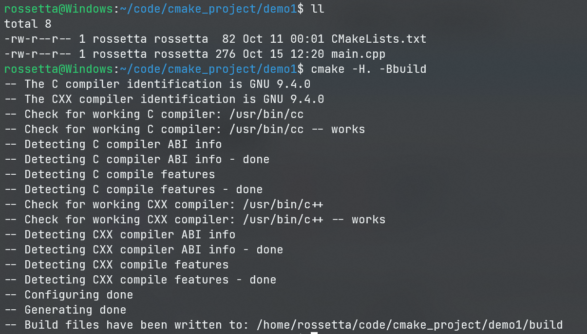
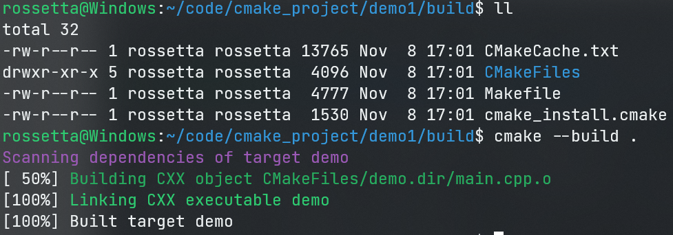
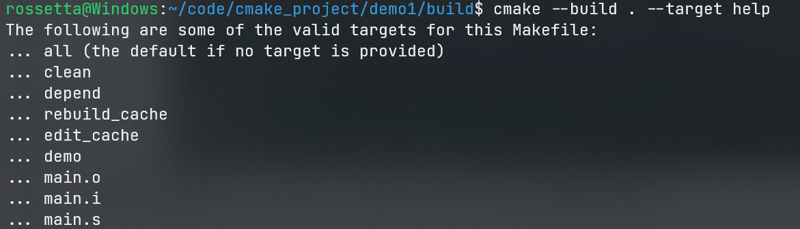
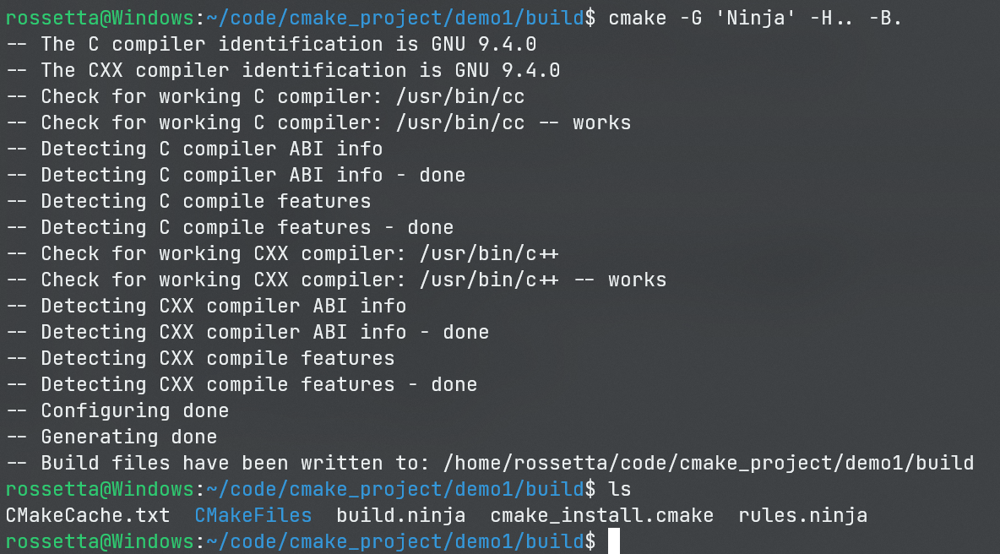
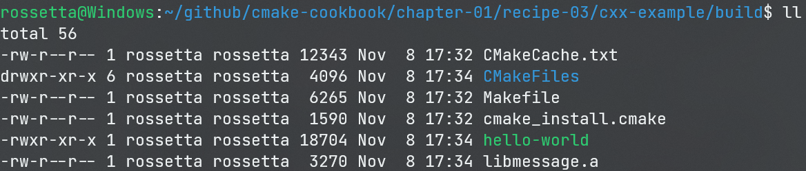
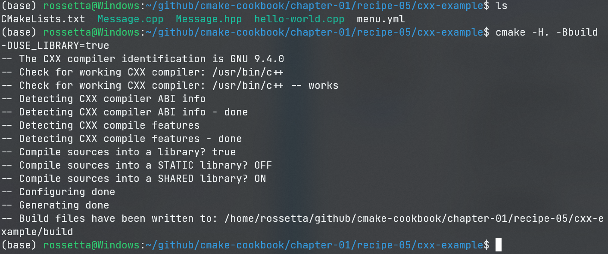

# CMake-Cookbook

> Date：2022年11月8日
>
> Author：Rossetta

## CMake命令行命令记录

[1.指定当前目录下搜寻CMakeLists.txt文件，并生成编译配置到build目录下 -H -B](#config)

[2.指定当前目录进行编译 --build](#build)

[3.指定生成器 -G](#generator)

[4.设置逻辑变量或路径 -D](#option)

[5.指定编译器](#compiler)

[6.指定编译类型](#build type)


## 一、从可执行文件到库

### 1.1 CMake生成和编译

```shell
-rw-r--r-- 1 rossetta rossetta 13765 Nov  8 16:49 CMakeCache.txt
drwxr-xr-x 5 rossetta rossetta  4096 Nov  8 16:49 CMakeFiles
-rw-r--r-- 1 rossetta rossetta  4777 Nov  8 16:49 Makefile
-rw-r--r-- 1 rossetta rossetta  1530 Nov  8 16:49 cmake_install.cmake
-rwxr-xr-x 1 rossetta rossetta 17320 Nov  8 16:49 demo
```

- `Makefile`: `make`将运行指令来构建项目。
- `CMakeFiles`：包含临时文件的目录，CMake用于检测操作系统、编译器等。此外，根据所选的生成器，它还包含特定的文件。
- `cmake_install.cmake`：处理安装规则的CMake脚本，在项目安装时使用。
- `CMakeCache.txt`：如文件名所示，CMake缓存。CMake在重新运行配置时使用这个文件。

1. **创建build文件夹，生成CMake生成文件**<a name="config"></a>

```shell
cmake -H. -Bbuild			//-H指定当前目录下搜索CMakeLists.txt，并将CMake生成文件放入build文件夹中

/*******************/

mkdir build
cd build
cmake ..
```



2. **进行编译**<a name="build"></a>

```shell
cmake --build . //选择当前目录进行编译，自动选择编译工具

/***************/

make						//使用GNU make进行构建编译
```



**额外的，可使用`cmake --build . --target <target-name>`指定当前可生成的目标**



- **all**(或Visual Studio generator中的ALL_BUILD)是默认目标，将在项目中构建所有目标。
- **clean**，删除所有生成的文件。
- **rebuild_cache**，将调用CMake为源文件生成依赖(如果有的话)。
- **edit_cache**，这个目标允许直接编辑缓存。

对于更复杂的项目，通过测试阶段和安装规则，CMake将生成额外的目标：

- **test**(或Visual Studio generator中的**RUN_TESTS**)将在CTest的帮助下运行测试套件。
- **install**，将执行项目安装规则。
- **package**，此目标将调用CPack为项目生成可分发的包。

-----------

### 1.2 CMake生成器

CMake是一个构建系统生成器，可以使用单个CMakeLists.txt为不同平台上的不同工具集配置项目。您可以在CMakeLists.txt中描述构建系统必须运行的操作，以配置并编译代码。CMake只会告诉自动编译工具如何进行编译，而不进行实际的编译操作。

不同的构建系统中，需要使用不同自动编译工具。

可以使用`cmake --help`查看当前平台支持的生成器。

使用`cmake -G <Generator>`配置生成器，如图使用`Ninja`作为编译工具<a name="generator"></a>



其中，`build.ninja`和`rules.ninja`：包含Ninja的所有的构建语句和构建规则。

-------------

### 1.3 构建静态链接库和动态链接库

```cmake
# set minimum cmake version
cmake_minimum_required(VERSION 3.5 FATAL_ERROR)

# project name and language
project(recipe-03 LANGUAGES CXX)

# generate a library from sources 将Message.hpp和Message.cpp编译成静态库message
add_library(message
  STATIC
    Message.hpp
    Message.cpp
  )

add_executable(hello-world hello-world.cpp) # 添加一个main函数入口，可执行文件

target_link_libraries(hello-world message)	# 可执行文件中链接了静态库message
```

进行配置生成编译后，得到的目录为



其中，对`message`通过前加`lib`，后加后缀名`.a`，生成了静态库

CMake接受其他值作为`add_library`的第二个参数的有效值，我们来看下本书会用到的值：

- **STATIC**：用于创建静态库，即编译文件的打包存档，以便在链接其他目标时使用，例如：可执行文件。
- **SHARED**：用于创建动态库，即可以动态链接，并在运行时加载的库。可以在`CMakeLists.txt`中使用`add_library(message SHARED Message.hpp Message.cpp)`从静态库切换到动态共享对象(DSO)。
- **OBJECT**：可将给定`add_library`的列表中的源码编译到目标文件，不将它们归档到静态库中，也不能将它们链接到共享对象中。如果需要一次性创建静态库和动态库，那么使用对象库尤其有用。我们将在本示例中演示。
- **MODULE**：又为DSO组。与`SHARED`库不同，它们不链接到项目中的任何目标，不过可以进行动态加载。该参数可以用于构建运行时插件。

CMake还能够生成特殊类型的库，这不会在构建系统中产生输出，但是对于组织目标之间的依赖关系，和构建需求非常有用：

- **IMPORTED**：此类库目标表示位于项目外部的库。此类库的主要用途是，对现有依赖项进行构建。因此，`IMPORTED`库将被视为不可变的。我们将在本书的其他章节演示使用`IMPORTED`库的示例。参见: https://cmake.org/cmake/help/latest/manual/cmakebuildsystem.7.html#imported-targets
- **INTERFACE**：与`IMPORTED`库类似。不过，该类型库可变，没有位置信息。它主要用于项目之外的目标构建使用。我们将在本章第5节中演示`INTERFACE`库的示例。参见: https://cmake.org/cmake/help/latest/manual/cmake-buildsystem.7.html#interface-libraries
- **ALIAS**：顾名思义，这种库为项目中已存在的库目标定义别名。不过，不能为`IMPORTED`库选择别名。参见: https://cmake.org/cmake/help/latest/manual/cmake-buildsystem.7.html#alias-libraries

---------

### 1.4 用条件句控制编译

```cmake
cmake_minimum_required(VERSION 3.5 FATAL_ERROR)
project(recipe-04 LANGUAGES CXX)

set(USE_LIBRARY OFF) #设置逻辑变量USE_LIBRARY为OFF
message(STATUS "Compile sources into a library? ${USE_LIBRARY}") #打印语句

set(BUILD_SHARED_LIBS OFF) #调用add_library并省略第二个参数时，默认会生成静态库
list(APPEND _sources Message.hpp Message.cpp) #引入一个变量`_sources`，包括`Message.hpp`和`Message.cpp`

#条件控制逻辑，如果USE_LIBRARY为真值，则先生成静态库，否则直接使用源文件进行编译
if(USE_LIBRARY)
    # add_library will create a static library
    # since BUILD_SHARED_LIBS is OFF
    add_library(message ${_sources})
    add_executable(hello-world hello-world.cpp)
    target_link_libraries(hello-world message)
else()
    add_executable(hello-world hello-world.cpp ${_sources})
endif()

```

**注意：`else()`或者`endif()`需要加上括号，作用是可以指出变量的使用范围，如`else(USE_LIBRARY)`**

#### 1.4.1 逻辑真假的表示方法

- 如果将逻辑变量设置为以下任意一种：`1`、`ON`、`YES`、`true`、`Y`或非零数，则逻辑变量为`true`
- 如果将逻辑变量设置为以下任意一种：`0`、`OFF`、`NO`、`false`、`N`、`IGNORE、NOTFOUND`、空字符串，或者以`-NOTFOUND`为后缀，则逻辑变量为`false`

---------

### 1.5 外部设置选项

#### 1.5.1 option()

使得可通过外部命令行控制逻辑变量，控制编译系统的行为

`option(<option_variable> "prompt string" <default_logical_value>)`

```cmake
set(USE_LIBRARY OFF)

#替换为

option(USELIBRARY "Compile sources into a library" OFF) #设定选项默认为OFF

#然后通过cmake命令的-D选项，将信息传递给CMakeLists.txt来切换是否生成库
```

`cmake -D USE_LIBRARY=ON`<a name="option"></a>



#### 1.5.2 cmake_dependent_option()

解决选项之间依赖的情况，示例中，我们提供生成静态库或动态库的选项。但是，如果没有将USE_LIBRARY逻辑设置为ON，则此选项没有任何意义。

```cmake
include(CMakeDependentOption) #!!!包含模块来使用cmake_dependent_option命令

# second option depends on the value of the first
cmake_dependent_option(
    MAKE_STATIC_LIBRARY "Compile sources into a static library" OFF
    "USE_LIBRARY" ON
    )
# third option depends on the value of the first
cmake_dependent_option(
    MAKE_SHARED_LIBRARY "Compile sources into a shared library" ON
    "USE_LIBRARY" ON
    )
```

#### 1.5.3 模块扩展

cmake通过模块扩展来增加语法功能，详见[cmake-modules(7) — CMake 3.25.0-rc4 Documentation](https://cmake.org/cmake/help/latest/manual/cmake-modules.7.html)

--------

### 1.6 指定编译器

通过逻辑变量来设置编译器<a name="compiler"></a>，`CMAKE_<LANG>_COMPILER`，其中`<LANG>`可以是任何支持的语言，如`CXX`，`C`等。

```shell
cmake -DCMAKE_CXX_COMPILER=clang++ .. #使用clang++编译器对上一目录生成构建配置
```

查找可用的编译器和其标志<a name="compiler"></a>

`cmake --system-information information.txt`

CMake提供了额外的变量来与编译器交互：

- `CMAKE_<LANG>_COMPILER_LOADED`:如果为项目启用了语言`<LANG>`，则将设置为`TRUE`。
- `CMAKE_<LANG>_COMPILER_ID`:编译器标识字符串，编译器供应商所特有。例如，`GCC`用于GNU编译器集合，`AppleClang`用于macOS上的Clang, `MSVC`用于Microsoft Visual Studio编译器。注意，不能保证为所有编译器或语言定义此变量。
- `CMAKE_COMPILER_IS_GNU<LANG>`:如果语言`<LANG>`是GNU编译器集合的一部分，则将此逻辑变量设置为`TRUE`。注意变量名的`<LANG>`部分遵循GNU约定：C语言为`CC`, C++语言为`CXX`, Fortran语言为`G77`。
- `CMAKE_<LANG>_COMPILER_VERSION`:此变量包含一个字符串，该字符串给定语言的编译器版本。版本信息在`major[.minor[.patch[.tweak]]]`中给出。但是，对于`CMAKE_<LANG>_COMPILER_ID`，不能保证所有编译器或语言都定义了此变量。

```cmake
cmake_minimum_required(VERSION 3.5 FATAL_ERROR)
project(recipe-06 LANGUAGES C CXX)
message(STATUS "Is the C++ compiler loaded ${CMAKE_CXX_COMPILER_LOADED}")

#打印编译器的信息
if(CMAKE_CXX_COMPILER_LOADED)
    message(STATUS "The C++ compiler ID is: ${CMAKE_CXX_COMPILER_ID}")
    message(STATUS "Is the C++ from GNU? ${CMAKE_COMPILER_IS_GNUCXX}")
    message(STATUS "The C++ compiler version is: ${CMAKE_CXX_COMPILER_VERSION}")
endif()

message(STATUS "Is the C compiler loaded? ${CMAKE_C_COMPILER_LOADED}")
if(CMAKE_C_COMPILER_LOADED)
    message(STATUS "The C compiler ID is: ${CMAKE_C_COMPILER_ID}")
    message(STATUS "Is the C from GNU? ${CMAKE_COMPILER_IS_GNUCC}")
    message(STATUS "The C compiler version is: ${CMAKE_C_COMPILER_VERSION}")
endif()
```

--------

### 1.7 指定编译类型

1. **Debug**：用于在没有优化的情况下，使用带有调试符号构建库或可执行文件。
2. **Release**：用于构建的优化的库或可执行文件，不包含调试符号。
3. **RelWithDebInfo**：用于构建较少的优化库或可执行文件，包含调试符号。
4. **MinSizeRel**：用于不增加目标代码大小的优化方式，来构建库或可执行文件。

通过`cmake -D CMAKE_BUILD_TYPE=Debug ..`指定<a name="build type"></a>

----

### 1.8 设置编译标志选项

```cmake
#分平台创建一个编译标志选项变量
list(APPEND flags "-fPIC" "-Wall")
if(NOT WIN32)
  list(APPEND flags "-Wextra" "-Wpedantic")
endif()

#对target使用编译标志选项
target_compile_options(geometry
  PRIVATE
    ${flags}
  )
```

编译选项具有三个级别的可见性：

- **PRIVATE**，编译选项会应用于给定的目标，不会传递给与目标相关的目标。我们的示例中， 即使`compute-areas`将链接到`geometry`库，`compute-areas`也不会		 继承`geometry`目标上设置的编译器选项。
- **INTERFACE**，给定的编译选项将只应用于指定目标，并传递给与目标相关的目标。
- **PUBLIC**，编译选项将应用于指定目标和使用它的目标。

以private方式添加编译选项，不会影响全局CMake变量`CMAKE_<LANG>_FLAGS_<CONFIG>`，如`CMAKE_CXX_FLAGS_DEBUG`，并能更细粒度控制在哪些目标上使用哪些选项。

`cmake -D CMAKE_CXX_FLAGS="-fno-exceptions"`可进行**全局设置**

**推荐使用target_compile_options()对每个目标进行更细颗粒度的控制**

----------

### 1.9 为语言设定标准

```cmake
set_target_properties(recv
  PROPERTIES
   CXX_STANDARD 14
   CXX_EXTENSIONS OFF
   CXX_STANDARD_REQUIRED ON
   POSITION_INDEPENDENT_CODE 1
)

```


- **CXX_STANDARD**会设置我们想要的标准。
- **CXX_EXTENSIONS**告诉CMake，只启用`ISO C++`标准的编译器标志，而不使用特定编译器的扩展。
- **CXX_STANDARD_REQUIRED**指定所选标准的版本。如果这个版本不可用，CMake将停止配置并出现错误。当这个属性被设置为`OFF`时，CMake将寻找下一个标准的最新版本，直到一个合适的标志。这意味着，首先查找`C++14`，然后是`C++11`，然后是`C++98`。（译者注：目前会从`C++20`或`C++17`开始查找）

-----------

### 1.10 cmake流程控制 

* if-else-endif 
* foreach-endforeach 
* while-endwhile 
* break

**根据源文件设置/获取目标属性**

- `set_source_files_properties(file PROPERTIES property value)`，它将属性设置为给定文件的传递值。与目标非常相似，文件在CMake中也有属性，允许对构建系统进行非常细粒度的控制。源文件的可用属性列表可以在这里找到: https://cmake.org/cmake/help/v3.5/manual/cmake-properties.7.html#source-file-properties 。
- `get_source_file_property(VAR file property)`，检索给定文件所需属性的值，并将其存储在CMake`VAR`变量中。

**`foreach()`的四种使用方式:**

- `foreach(loop_var arg1 arg2 ...)`: 其中提供循环变量和显式项列表。当为`sources_with_lower_optimization`中的项打印编译器标志集时，使用此表单。注意，如果项目列表位于变量中，则必须显式展开它；也就是说，`${sources_with_lower_optimization}`必须作为参数传递。
- 通过指定一个范围，可以对整数进行循环，例如：`foreach(loop_var range total)`或`foreach(loop_var range start stop [step])`。
- 对列表值变量的循环，例如：`foreach(loop_var IN LISTS [list1[...]])` 。参数解释为列表，其内容就会自动展开。
- 对变量的循环，例如：`foreach(loop_var IN ITEMS [item1 [...]])`。参数的内容没有展开。
