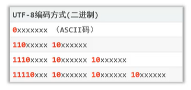

# 编码与乱码

> 日期：2022年10月10日

## 常见的编码

* ASCII (American Standard Code for Information Interchange): 美国标准信息交换码，使用一个字节表示且**首位都是0**

* GBK (汉字内码扩展规范，国标): 包含了2万多个中文字符，包括亚洲的简体中文、繁体中文、日语、韩语。GBK中一个汉字使用两个字节存储，同时兼容ASCII，**汉字的首位都是1**

* GB2312，中国官方规定的简体中文汉字字符集（GB2312和BIG5是非兼容的）

* BIG5，中国官方规定的繁体中文汉字字符集

* Unicode (统一码，也叫万国码): 可以容纳世界上所有的文字符号的字符集

  * UTF-32: 统一4个字节表示一个字符（过于占用空间）
  * UTF-8: 可变长编码方案，共分为4个字节长度区（1字节、2字节、3字节、4字节），兼容ASCII编码，其中英文字符和数字占一个字节，汉字占3个字节，不同的字节长度区通过前缀进行区分以便解码

  

