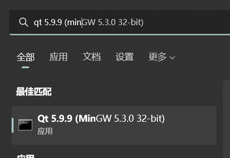
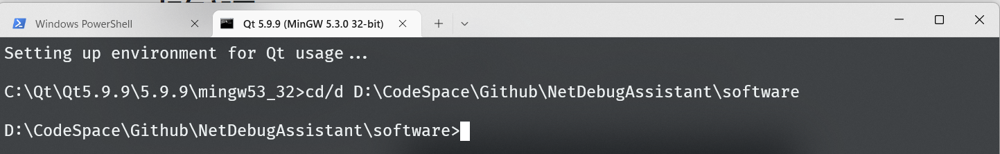
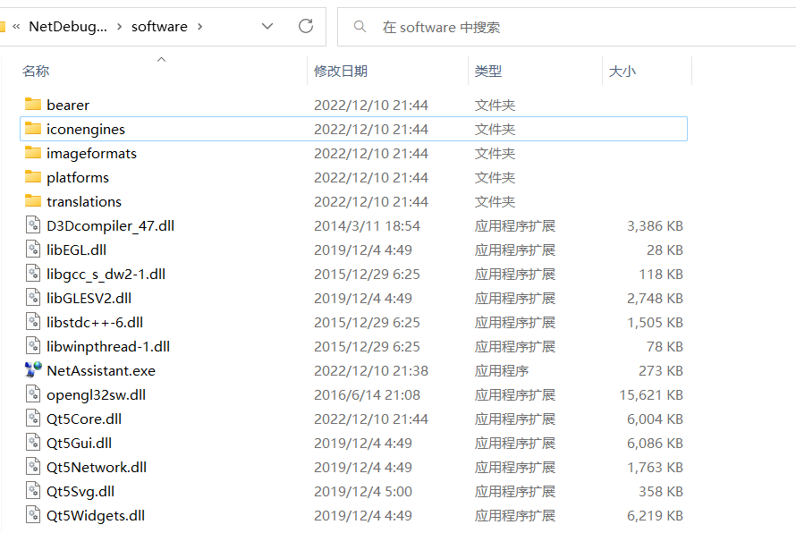

## 一、打包部署

1. 将编译模式转为`Release`并设置好输出文件夹，进行编译
2. （可选）在`.pro`工程文件中设置应用图标，添加`RC_ICONS = xxx.ico`
3. 从编译好的文件夹中复制最终的`xxx.exe`可执行文件到一个空目录下，注意不要包含中文路径
4. 选择和编译器版本对应的Qt控制台，如下

5. 打开控制台，使用`cd/d $abs_path`进入`xxx.exe`所在的绝对路径下

6. 运行`windeployqt xxx.exe`进行部署，此操作将会把Qt程序的依赖动态库及文件复制到当前目录下

7. （可选）使用Inno Setup安装软件生成`Setup.exe`安装程序 [官网地址](http://www.jrsoftware.org/isdl.php#stable)