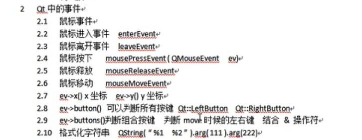
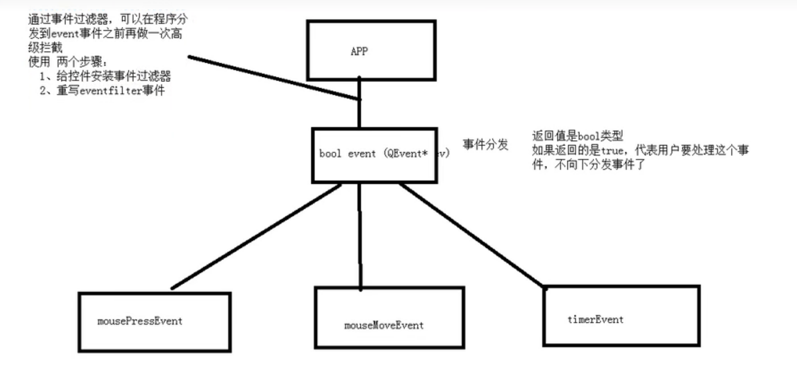
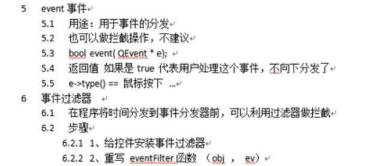
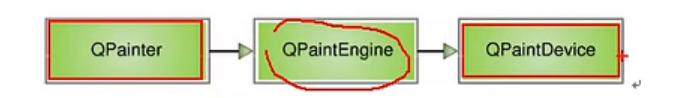
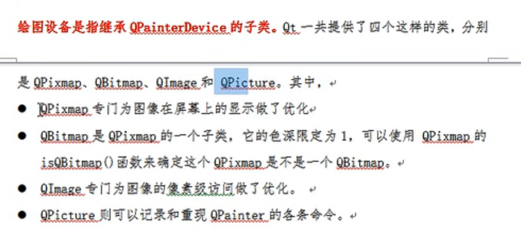

# 事件

> Date：2022年10月6日



通过重写QWidget中的虚函数实现自己的鼠标事件

* #### 使用定时器的两种方法

1. `startTimer`+`timerEvent`

   ```c++
   startTimer(1000); //启动一个间隔为1000ms的定时器
   
   virtual void timerEvent(QTimerEvent *event) override;	//重写定时器时间，当定时器到达时间时会执行
   ```

2. 槽函数

```cpp
QTimer *timer = new QTimer(this);
timer->setInterval(1000);

connect(timer, &QTimer::timeout, this [=]() {
    //槽函数
});
```

----------

## QEvent分发事件



```c++
class myLabel : public QLabel {
  // ...
protected:
	virtual bool event(QEvent *e) override;    	
};

bool myLabel::event(QEvent *e) {
    if (e->type() == QEvent::MouseButtonPress) {
        QMouseEvent *ev = static_cast<QMouseEvent *>(e);
        //鼠标事件进行拦截 处理
        qDebug() << QString::fromLocal8Bit("Event函数中，鼠标按下了...");
        
        return true;	//用户自己处理，不向下分发，mousePressEvent函数不会再被调用
    }
    
    //其余事件交给父类处理，默认处理
    return QLabel::event(e);
}
```

其中，安装事件过滤器的操作为`installEventFilter`

```c++
bool eventFilter(QObject *obj, QEvent *e)	//其中obj代表控件，e代表事件，对控件obj发生的事件e进行拦截
{
    if (obj == ui->label) {
        if (e->type() == QEvent::MouseButtonPress) {
			QMouseEvent *ev = static_case<QMouseEvent *>(e);
            // ....
            return true;
        }
    }
    return 	QWidget::eventFilter(obj, e);
}
```



## QPainter绘图事件

#### 通过事件进行绘图

```c++
virtual void Widget::paintEvent(QPaintEvent *) {
    QPainter painter(this);	//this为QPaintDevice对象，代表在此部件内进行画图
    
    //设置画笔
    QPen pen;
    pen.setColor(QColor(255, 0, 0));
    pen.setStyle(Qt::DotLine);
    
    //设置画刷（填充)
    QBrush brush(Qt::green);
    painter.setBrush(brush);
    
    //画图
    painter->drawLine();
    painter->drawEllipse();
    painter->drawRect();
    
    //高级设置
    painter->setRenderHint(QPainter::Antialiasing);	//设置渲染模式（抗锯齿等）
    
    //painter状态保存恢复
	painter.drawRect(QRect(0, 0, 100, 100));	// 起始位置(0, 0), 宽高为(100, 100)
	painter.save();								// 保存画家状态
	painter.translate(100, 0);					// 起始位置平移100
	painter.drawRect(QRect(0, 0, 100, 100));	// 起始位置(100, 0), 宽高为(100, 100)
	painter.restore();							// 恢复画家状态
	painter.drawRect(QRect(0, 0, 100, 100));	// 起始位置(0, 0), 宽高为(100, 100)
    
    //利用画家画图
    painter.drawPixmap(x, y, resource_loc);

}
```

#### 如何手动调用painter更新画图？

repainter / update

什么时候使用repainter？

* 需要立即更新画面
* update被禁用
* widget被隐藏掉了

大部分时间，建议使用update来更新画面

---------

### 绘图引擎



QPainter是画笔

QPaintDevice是设备，如纸张、屏幕，是一个二维空间的抽象

QPaintEngine提供了画笔到设备的一个接口，从而使得可以使用同一种QPen来进行绘图，而不用关心具体的设备


其中，Qt提供了4个绘图设备



QImage可以访问图片中的像素

```c++
QImage img(300, 300, QImage::Format_RGB32);
img.fill(Qt::white);	//默认是黑色，将其填充为白色

QPainter painter(&img);	//设置绘图设备
painter.setPen(QPen(Qt::green));
painter.drawEllipse(QPoint(100, 100), 100, 100);

img.save("./img.png");
```

使用QPicture记录QPainter的指令

```cpp
/* 绘图并保存 */
QPicture pic;
QPainter painter;
painter.begin(&pic);

//...一顿操作
painter.setPen(QPen(Qt::cyan));

painter.end();
pic.save("./pic.ros");	//随便一个后缀名

/* 加载并重现 */
QPainter painter(this);
QPicture pic;
pic.load("./pic.ros");
painter.drawPicture(0, 0, pic);	//画出的图能保存之前QPainter的设置，如color = cyan
```

## QFile文件读取

```c++
QFile file(path);
file.open(QIODevice::ReadOnly);

//进行编码转换
QTextCodec *codec = QTextCodec::codecForName("gbk");	//设置一个格式为gbk的编解码转换器
QByteArray array = file.readAll();
codec->toUnicode(array);
```

## QFileInfo文件信息读取

```c++
QFileInfo info(path);
info.size();	//文件大小（字节数）
info.suffix();	//文件后缀
info.lastModified().toString("yyyy-MM-dd hh:mm:ss");	//最后修改时间，返回一个QDateTime，进行格式化后输出
```

