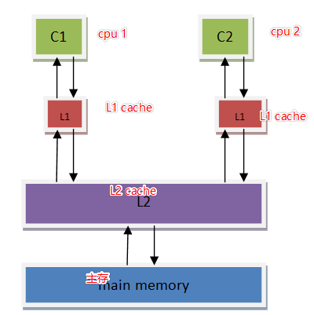

## 1、std::condition_variable

```cpp
std::condition_variable cond;
//...
std::unique_lock<std::mutex> ul(getMutex());
cond.wait(ul);		// 没有判断条件pred，只能靠notify进行唤醒
```

上述可能造成：

* 唤醒丢失：如果notify调用时，cond未进行wait阻塞，则唤醒丢失
* 虚假唤醒：尽管没有notify通知，接收者也可能被唤醒

#### 通过设置pred可有效防止唤醒丢失

唤醒时，通过设置`pred`使其满足条件，`cond`循环检查时，如果某一时刻发现已经满足条件了则会放开阻塞继续运行。

#### 通过设置pred可有限防止虚假唤醒

在等待的初始处理中，该线程锁定互斥锁，然后检查谓词`[]{return dataReady;}`（谓词：在计算机语言的环境下，谓词是指条件表达式的求值返回真或假的过程。）

- 如果谓词被评估为：
  - `true:` 线程继续工作
  - `false:` `cond.wait()`解锁互斥并将线程置于等待（阻塞）状态
- 如果条件变量`cond`处于等待状态并收到通知或被虚假唤醒，则会发生下面步骤：
  - 线程被解除阻塞，并重新获得互斥锁
  - 线程检查谓词
  - 如果谓词被评估为：
    - `true:` 线程继续其工作
    - `false:` `condVar.wait()`解锁互斥并将线程置于等待（阻塞）状态

#### 为何不能用atomic作为pred判断条件？（原子操作颗粒度太细）

```c++
std::unique_lock<std::mutex> l{lock}
while(![]{return dataReady.load();}) {
    //time window(1)
    condVar.wait(l);
}
```

如上所示，`cond.wait(ul, pred)`可以看作是一个循环，如果在`\\time window(1)`期间发送通知且`cond`并未处在`wait`状态，则会导致通知丢失。判断条件则不能同步，会导致死锁的发生。

其实就是保证while从开始判断dataReady到进入wait的状态是一体的互斥的，才能保证状态的同步（只有!dataReady才会去wait）

原子变量会导致在进入while循环后，并在wait之前dataReady改变了状态，从而破坏了状态的同步性质。

-------

#### 为什么会出现虚假唤醒？

todo

-------

## 2、std::unique_lock

#### adopt_lock到底是什么？

表明mutex已经被锁住了，不需要重复加锁，`lock_guard`只起到一个托管的作用。

```cpp
void test(std::mutex& m)
{
    m.lock();
    std::unique_lock<std::mutex> lg(m, std::adopt_lock);	// 告知lg不需要重复加锁
    // do something
    
    // 析构的时候通过lg保证将m解锁
}
```

`adopt_lock`的最大作用其实是

* 配合`std::lock`或者`std::scoped_lock`使用，告知函数`mutex`已经时上锁状态

* 防止对`mutex`重复加锁导致的死锁

* 通过配合`lock_guard`来保证离开作用域时能被RAII解锁。

#### defer_lock到底是什么？

用于通知函数当前mutex未上锁，即用于初始化一个没有锁的mutex


----------

## 3、std::memory_order

### 3.1 何为memory_order？

- c++的atomic使用总会配合各种各样的memory order进行使用，memory order控制了执行结果在多核中的可见顺序，，这个可见顺序与代码序不一定一致(第一句代码执行完成的结果不一定比第二句早提交到内存)，**其一是进行汇编的进行了指令优化重排，其二是cpu实际执行时乱序执行以及部分cpu架构上没有做到内存强一致性**(内存强一致性：可以简单的理解为，执行结果出现的顺序应该和指令顺序一样，不存在重排乱序),导致后面的代码执行完成的时候，前面的代码修改的内存却还没改变
- **<u>结果序</u>和<u>代码序</u>不一致不一定会导致问题，但在可能出现问题的场景下，就需要手动干预以避免问题**，汇编(软件)和cpu(硬件)都提供了相应的指令取进行干预控制，c++的atomic中的memory order可以看成是这些控制的封装，隐藏了底层，之所以有六种是因为这种控制是有代价，从松散到严格开销越来越高，在某些场景下，我们是允许部分重排的，只是对于小部分重排会导致问题的才需要加以控制，那么只需要衉一些低开销的控制即可，java也有类似的工具；
- **这种memory order的控制常见使用在多核的happened-before, synchronized with的模型下**，要做的事情就是管理好happened-before和synchronized with顺序，按照箭头的方式运行，
  [

-----

### 3.2 硬件的内存模型

现代CPU计算性能高于DRAM内存，故引入了多级cache等技术。**为了提高CPU的使用率，引入了CPU的乱序执行**。即：指令流并非是串行执行，可能在取值的同时预先做了下一个计算的指令。`cache, store buffer, invalidate queue`等技术的出现虽然有模型规约着最终执行结果的一致性，但是硬件加速技术会带来一定的代价，带来了**不同的内存一致性模型，从而导致多核下的可见顺序不同**。不同的内存一致性模型会影响它们的执行结果在多核中可见顺序的影响。

#### 3.2.1 顺序存储模型（sequential consistency model）




在这种模型下，多线程程序的运行所期望的执行情况是一致的，不会出现内存访问乱序的情况；
比如说以下的指令运行,会按照 S1->S2->L1->L2 运行完成，最终的r2的值会是NEW；
这便是SC(顺序模型)的特点,指令的执行行为于行为与UP（单核）上是一致的。

#### 3.2.2 完全存储定序（total store order）


为了提高CPU的性能，芯片设计人员在CPU中包含了一个存储缓存区（store buffer），**它的作用是为store（CPU写操作）指令提供缓冲，使得CPU不用等待存储器的响应。所以对于写而言，只要store buffer里还有空间，写就只需要1个时钟周期**（哪怕是ARM-A76的L1 cache，访问一次也需要3个cycles，所以store buffer的存在可以很好的减少写开销），但这也引入了一个访问乱序的问题。

* store指令会先将数据放入`store buffer`中，再写到L1 cache中。

```assembly
S1: store flag = set # write操作，如果cache不命中，或者只写到了store buffer中时，可能会推迟到S2之后
S2: load r1 = data # read操作，如果cache命中，可能会提升到S1之前
S3: store b = set
```

如果在顺序存储模型中，S1肯定会比S2先执行。**但是如果在加入了store buffer之后，S1将指令放到了store buffer后会立刻返回，这个时候会立刻执行S2。**S2是read指令，CPU必须等到数据读取到r1后才会继续执行。这样很可能S1的store flag=set指令还在store buffer上，而S2的load指令可能已经执行完（特别是data在cache上存在，而flag没在cache中的时候。这个时候CPU往往会先执行S2，这样可以减少等待时间）

`store buffer`要求执行FIFO，即写入的数据也必须按顺序发送到内存中。这种模型就叫做**完全存储定序（TSO）**，x86CPU中就是执行的这种内存模型。


**在多核情况下**，如上图所示，如果运行的是TSO模型，由于store buffer的存在，L1和S1的store指令会被先放到store buffer里面，然后CPU会继续执行后面的load指令。Store buffer中的数据可能还没有来得及往存储器中写，这个时候我们可能看到C1和C2的r1都为0的情况。这种乱序称之为store-load乱序，对于可能出现store-load乱序的场景，cpu提供了一些指令去控制怎么把这些数据同步到其它核，后面会介绍这些的工具。**本质上就是在数据还在`store buffer`的情况下，其他线程执行了读操作**

----

#### 3.2.3 部分存储定序（part store order）

基于TSO模型的`store buffer`为FIFO写数据到内存的情况，设计了PSO模型，即：只保证地址相关指令在`store buffer`中才会以FIFO的形式进行处理，对同一个相同的地址做store，才会有严格的执行顺序制约，其他的可以乱序处理。称之为部分存储定序 。


如上图，S1与S2是地址无关的store指令，cpu执行的时候都会将其推到store buffer中。如果这个时候flag在C1的cahe中存在，那么CPU会优先将S2的store执行完，然后等data缓存到C1的cache之后，再执行store data=NEW指令。

**由于PSO模型，flag会比data先被写入内存，先被另一个核进行读取，导致代码逻辑问题**

可能的执行顺序：S2->L1 >L2->S1, 这样在C1将data设置为NEW之前，C2已经执行完，r2最终的结果会为0，而不是我们期望的NEW，这样PSO带来的store-store乱序将会对我们的代码逻辑造成致命影响。

#### 3.2.4 `store buffer`控制工具

[

* `a = 1`和`c = 3`存在happened before关系，描述`a = 1`在`c = 3`之前执行
* 当使用PSO模型时，`store buffer`写入内存顺序不严格，可能发生`c`先被读取到内存中的情况

* 通过内存屏障`memory_barrier`可以将`store buffer`中的数据刷入到cache中，保证写顺序一致

```c++
int a = 0, c = 0;

void thread1() {
    a = 1;
    smp_mb(); // memory barrier
    c = 3;
}

void thread2() {
    while (c != 3);
    assert(a == 1);
}
```

​	`invalidate queue` --- todo

#### 3.2.5 宽松存储模型（relax memory order）

宽松存储模型RMO是在PSO模型的基础上，进一步放宽内存一致性的模型。不仅允许store-load、store-store乱序，还进一步允许load-load、load-store乱序。**只要是地址无关的指令，在读写访问的时候可以打乱所有的load/store顺序**。


在PSO模型里，由于S2可能会比S1先执行，从而会导致C2的r2寄存器获取到的data值为0。在RMO模型里，不仅会出现PSO的store-store乱序，C2本身执行指令的时候，由于L1与L2是地址无关的，所以L2可能先比L1执行，这样即使C1没有出现store-store乱序，C2本身的load-load乱序也会导致我们看到的r2为0。从上面的分析可以看出，RMO内存模型里乱序出现的可能性会非常大，这是一种乱序随可见的内存一致性模型， RM的很多微架构就是使用RMO模型，所以我们可以看到ARM提供的dmb内存指令有多个选项：

* LD --- load-load/load-store
* ST --- store-store/store-load
* SY --- any-any

---------

#### 3.2.6 内存模型总结

* 内存模型是硬件架构上的不同，包括SC（完全一致性），TSO（完全存储一致性），PSO（部分存储一致性），RMO（完全宽松）。

* 但是除此之外，cpu在执行的时候也会乱序，编译器在编译优化的时候是会对指令做重排，也会产生如上的内存模型。

* 基于上述内存模型带来的读写访问乱序问题，c++给我们封装了memory_order，让我们直接忽视硬件-cpu-指令这些运行细节，就只是从内存模型的角度去控制程序的运行。

-----------

### 3.3 c++中的memory_order

#### 3.3.1 memory order概要

> memory_order是提供不同的内存一致性模型的。

```c++
namespace std {
	typedef enum memory_order {
	      memory_order_relaxed,   // 无约束
	      memory_order_consume,	  // 与本原子变量相关的读约束
	      memory_order_acquire,	  // 读约束
     	  memory_order_release,   // 写约束
     	  memory_order_acq_rel,   // 读写约束
     	  memory_order_seq_cst	  // 完全约束
	} memory_order;
}
```

- **memory_order_seq_cst:** 顺序一致性模型，这个是默认提供的最强的一致性模型。这个选项语义上就是要求底层提供顺序一致性模型，对应顺序存储模型（SC），这个是默认提供的最强的一致性模型，在这种模型下不存在任何重排，可以解决一切问题。在底层实现上：程序的运行底层架构如果是非内存强一致模型，会使用cpu提供的内存屏障等操作保证强一致，在软件上，并要求代码进行编译的时候不能够做任何指令重排。
- **memory_order_release/acquire/consume:** 提供release、acquire或者consume, release语意的一致性保障。我们允许cpu或者编译器做一定的指令乱序重排，但是由于[TSO](#3.2.2 完全存储定序（total store order）), [PSO](#3.2.3 部分存储定序（part store order）)的存在，可能产生的store-load乱序store-store乱序导致问题，那么涉及到多核交互的时候，就需要手动使用release, acquire去避免这样的这个问题了，与memory_order_seq_cst最大的不同的是，其是对具体代码可能出现的乱序做具体解决而不是要求全部都不能重排。
- **memory_order_relaxed:** 提供松散一致性模型保障，不提供operation order保证。这种内存序使用在，完全放开，让编译器和cpu自由搞，如果cpu是SC的话，cpu层不会出现乱序，但是编译层做重排，结果也是无法保证的，很容易出问题，但可用在代码上没有乱序要求的场景或者没有多核交互的情况下，提升性能。

c++中通过`memory_order`对内存模型的**内存序**加以控制，则得到了**结果序**，即`memory_order`的作用为**对汇编上进行重排干预和硬件上乱序执行干预**和**执行结果在多核可见性上的控制**

-----

#### 3.3.2 memory order的具体使用实例

##### 写顺序保证

```cpp
std::atomic<bool> has_release;

// thread_2 
void release_software(int *data) {
    int a = 100;                // line 1
    int c = 200;                // line 2
    if (!data) {
        data = new int[100];    // line 3
    }

    has_release.store(true, std::memory_order_release); // line 4
}
```

std::memory_order_release功能如果用一句比较长的话来说，就是：**<u>在本行代码之前</u>，有任何写内存的操作，都是不能放到本行语句之后的。**简单地说，就是**写不后**。即，写语句不能调到本条语句之后。以这种形式通知编译器/CPU保证真正执行的时候，写语句不会放到has_release.store(true, std::memory_order_relese)之后。

尽管要求{1,2,3}代码的执行不能放到4的后面，**但是{1,2,3}本身是可以被乱序的**。比如按照{3,2,1,4}的顺序执行也是可以的，release可以认为是发布一个版本。也就是说，应该在发布之前做的，那么不能放到release之后。

##### 读顺序的保证

假设thread_1想要按照{line 1, line2}的顺序呈现给其他线程，比如thread_2。如果thread_2写法如下：

```cpp
std::atomic<bool> has_release;
int *data = nullptr;

// thread_1
void releae_software() {
    if (!data) {
        data = new int[100];                            // line 1
    }
    has_release.store(true, std::memory_order_release); // line 2

    //.... do something other.
}

// thread_use
void use_software() {
    // 检查是否已经发布了
    while (!has_release.load(std::memory_order_relaxed));
    // 即然已经发布，那么就从里面取值
    int x = *data;
}
```

在这里，thread_use的代码执行顺序依然是有可能被改变的。因为编译器和cpu在执行的时候，可能会针对thread_use进行代码的优化或者执行流程的变化。比如完全全有可能会被弄成：

```cpp
void use_software() {
    int x = *data;
    while (!has_release.load(std::memory_order_relax));
}
```

到这个时候，thread_use看到的顺序却完全不是thread_1想呈现出来的顺序。这个时候，需要改进一下thread_use -> thread_2。

```cpp
void acquire_software(void) {
    while (!has_release.load(std::memory_order_acquire));
    int x = *data;
}
```

std::memory_order_acquire表示的是，**<u>在本行之后</u>，后续的读操作都不能放到这条指令之前**。简单地可以写成读不前

##### 读顺序的削弱

有时候，std::memory_order_release和std::memory_order_acquire会波及无辜

```cpp
std::atomic<int> net_con{0};
std::atomic<int> has_alloc{0};
char buffer[1024];
char file_content[1024];

void release_thread(void) {
    sprintf(buffer, "%s", "something_to_read_tobuffer");

    // 这两个是与buffer完全无关的代码
    // net_con表示接收到的链接
    net_con.store(1, std::memory_order_release);
    // 标记alloc memory for connection
    has_alloc.store(1, std::memory_order_release);
}

void acquire_thread(void) {
    // 这个是与两个原子变量完全无关的操作。
    if (strstr(file_content, "auth_key =")) {
        // fetch user and password
    }

    while (!has_alloc.load(std::memory_order_acquire));
    bool v = has_alloc.load(std::memory_order_acquire);
    if (v) {
         net_con.load(std::memory_order_relaxed);
    }
```

仔细分析代码，可以看出，buffer与file_content的使用，**与两个原子变量就目前的这段简短的代码而言是没有任何联系的。按理说，这两部分的代码是可以放到任何位置执行的**。但是，由于使用了release-acquire，那么会导致的情况就是，buffer和file_content的访问都被波及。

两者的前面。这样无疑对性能会带来一定的影响。所以c++11这里又定义了sonsume和acquire，就是意图把与真正变量无关的代码剥离出去，让他们能够任意排列。不要被release-acquire误伤。其实就是对PSO模型进行约束

这就是std::memory_order_consume的语义是，**所有后续对本原子类型的操作，必须在本操作完成之后才可以执行。**简单点就是不得前。但是这个操作只能用来对读进行优化。也就是说release线程是不能使用这个的。也就是说，只能对读依赖的一方进行优化.

**注意：std::memory_order_acquire与std::memory_order_consume的区别在于：**

**std::memory_order_acquire是要求后面所有的读都不得提前。**
**std::memory_order_consume是要求后面依赖于本次形成读则不能乱序。 一个是针对所有的读，容易形成误伤。而consume只是要求依赖于consume这条语句的读写不得乱序。**

```cpp
// consume example
std::atomic<int*> global_addr{nullptr};

void func(int *data) {
    int *addr = global_addr.load(std::memory_order_consume);
    int d = *data;
    int f = *(data+1);
    if (addr) {
        int x = *addr;
    }
```

由于global_addr, addr, x形成了读依赖，那么这时候，这几个变量是不能乱序的。但是d,f是可以放到int *addr = global_addr.load(std::memory_order_consume);前面的。

而std::memory_order_acquire则要求d,f都不能放到int *addr = global_addr.load(std::memory_order_consume);的前面。这就是acquire与consume的区别。

##### 读写的加强

有时候，可能还需要对读写的顺序进行加强。想一下std::memory_order_release要求的是写不后，也就是后面对内存的写都不能放到本条写语句之后。 但是，有时候可能需要解决这种情况。假设我们需要响应一个硬件上的中断。硬件上的中断需要进行如下步骤。

```
- a.读寄存器地址1，取出数据checksum
- b.写寄存器地址2，表示对中断进行响应
- c.写flag，标记中断处理完成
```

由于读寄存器地址1与写flag,标记中断处理完成这两者之间的关系是读写关系。 并不能被std::memory_order_releaes约束。所以需要更强的约束来处理。

这里可以使用std::memory_order_acq_rel，即对本条语句的读写进行约束。即表示写不后，读不前同时生效。 那么就可以保证a, b, c三个操作不会乱序。

即std::memory_order_acq_rel可以同时表示写不后 && 读不前

##### 最强约束

std::memory_order_seq_cst表示最强约束。所有关于std::atomic的使用，如果不带函数。比如x.store or x.load，而是std::atomic a; a = 1这样，那么就是强一制性的。即在这条语句的时候 所有这条指令前面的语句不能放到后面，所有这条语句后面的语句不能放到前面来执行。

-------

### 3.4 汇编层的控制

上述都在讨论c++层和cpu层的控制，可以稍微了解一下汇编指令是如何要用什么东西做控制的, 在使用内存屏障的时候，会使用以下宏

```cpp
#define set_mb(var, value) do { var = value; mb(); } while (0)
#define mb() __asm__ __volatile__ ("" : : : "memory")
```

mb()对应的内联汇编上:

**volatile** 用于告诉编译器，严禁将此处的汇编语句与其它的语句重组合优化。即：原原本本按原来的样子处理这这里的汇编, 注意这个__volatile__与c/c++中的volatile是两个东西，c/c++中的volatile 告诉编译器不要将定义的变量优化掉；告诉编译器总是从缓存取被修饰的变量的值，而不是寄存器取值。

memory 强制 gcc 编译器假设 RAM 所有内存单元均被汇编指令修改，这样 cpu 中的 registers 和 cache 中已缓存的内存单元中的数据将作废。cpu 将不得不在需要的时候重新读取内存中的数据。这就阻止了 cpu 又将 registers, cache 中的数据用于去优化指令，而避免去访问内存。

"":::表示这是个空指令

在linux/include/asm-i386/system.h将mb()定义成如下:

```
#define mb() __asm__ __volatile__ ("lock; addl $0,0(%%esp)": : :"memory")
```

lock前缀表示将后面这句汇编语句：`addl $0,0(%%esp)`表示将数值0加到esp寄存器中，而该寄存器指向栈顶的内存单元。加上一个0，esp寄存器的数值依然不变。即这是一条无用的汇编 指令。在此利用这条无价值的汇编指令来配合lock指令，在__asm__,**volatile**,memory的作用下，用作cpu的内存屏障。

关于lock的作用请见2.2.4,其起内存作用的方式是将总线锁住，不给其它cpu进行读写，执行该条指令后，会将脏数据刷到主存，并使所有core的cache lines失效

以上是老版的mb()，后来又引入了新的mfence, lfence, sfence，如下，关于这三者也在[3.2.4 控制工具](#3.2.4 store buffer控制工具)中进行了详述

```c++
#define mb() 	asm volatile("mfence":::"memory")
#define rmb()	asm volatile("lfence":::"memory")
#define wmb()	asm volatile("sfence" ::: "memory")
```

