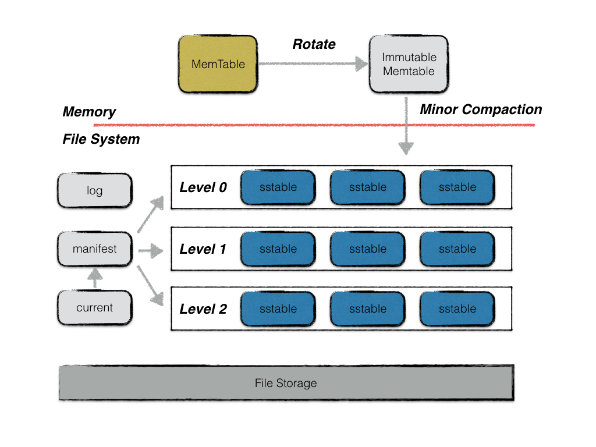

# leveldb基本概念

> leveldb是一个写性能十分优秀的存储引擎，是典型的LSM树(Log Structured-Merge Tree)实现。LSM树的核心思想就是放弃部分读的性能，换取最大的写入能力。
>
> LSM树写性能极高的原理，简单地来说就是尽量减少随机写的次数。对于每次写入操作，并不是直接将最新的数据驻留在磁盘中，而是将其拆分成（1）一次日志文件的顺序写（2）一次内存中的数据插入。leveldb正是实践了这种思想，将数据首先更新在内存中，当内存中的数据达到一定的阈值，将这部分数据真正刷新到磁盘文件中，因而获得了极高的写性能（顺序写60MB/s, 随机写45MB/s）。

## 一、架构

#### `MemTable`

* 驻留于内存中的可写表，存放数据
* leveldb的一次写入即写入数据到`MemTable`中
* 可由用户定义排序方法
* 底层由跳表实现，复杂度为`O(logn)`

#### `Immutable Memtable`

* 只读表，由`MemTable`转化而来，具备一样的结构
* 由后台进程转为`sstable`持久化到磁盘中

#### `sstable`

* 磁盘中存放数据的形式，不可修改
* 当内存中的`MemTable`到达一定大小之后就进行持久化
* 顺序写存在交集的内容，在后台进行conpaction压缩
* 逻辑分为几层level，即leveldb名字的由来

#### `log`

* 先写入日志，再写入内存
* 发生异常时进行恢复
* 保障了**用户写操作的原子性**

#### `manifest`

* 即`sstable`的清单
* 记录了每个level中所有文件的元数据：文件大小、最大key、最小key
* 用于记录每次compaction的versionEdit信息

#### `current`

* 记录当前的`manifest`文件名

---------

