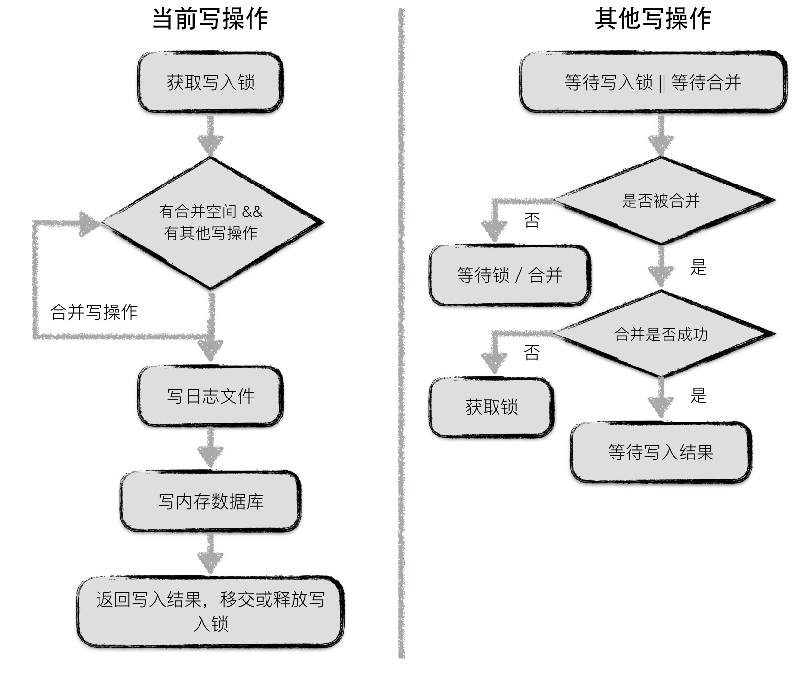

## 二、leveldb读写操作

### 2.1 写操作

#### 一次写操作分为

* 写入`log`
* 写入内存中的`MemTable`

#### 接口（原子性）

* put
* delete（通过put空键值对实现）
* 批量操作Batch

batch实例作为一次数据库操作的最小执行单元，其结构如下：

在MemTable中存放时，需要进行key值编码：internalKey

其中，sequence number代表数据库版本号，即更新次数

#### 多线程同时写入时，采用合并写提高性能

**第一个获取到写锁的写操作**

- 第一个写入操作获取到写入锁；
- 在当前写操作的数据量未超过合并上限，且有其他写操作pending的情况下，将其他写操作的内容合并到自身；
- 若本次写操作的数据量超过上限，或者无其他pending的写操作了，将所有内容统一写入日志文件，并写入到内存数据库中；
- 通知每一个被合并的写操作最终的写入结果，释放或移交写锁；

**其他写操作**：

- 等待获取写锁或者被合并；
- 若被合并，判断是否合并成功，若成功，则等待最终写入结果；反之，则表明获取锁的写操作已经oversize了，此时，该操作直接从上个占有锁的写操作中接过写锁进行写入；
- 若未被合并，则继续等待写锁或者等待被合并；

#### 由日志保证原子性

leveldb的任意一个写操作（无论包含了多少次写），其原子性都是由日志文件实现的。一个写操作中所有的内容会以一个日志中的一条记录record，作为最小单位写入。

考虑以下两种异常情况：

1. 写日志未开始，或写日志完成一半，进程异常退出 --> 抛弃数据异常日志；
2. 写日志完成，进程异常退出  --> 进行redo；

前者中可能存储一个写操作的部分写已经被记载到日志文件中，仍然有部分写未被记录，这种情况下，当数据库重新启动恢复时，读到这条日志记录时，发现数据异常，直接丢弃或退出，实现了写入的原子性保障。

后者，写日志已经完成，写入日志的数据未真正持久化，数据库启动恢复时通过redo日志实现数据写入，仍然保障了原子性。

-------

### 2.2 读操作

#### 接口

* 通过get获取数据（默认以当前数据库状态创建了snapshot，再读取）
* 创建snapshot，然后通过get读取数据

读取都是基于快照的。

#### 快照snapshot

> 数据库在某一个时刻的状态，用整型数表示

每一个序列号都可以作为一个状态快照，代表数据库的一个状态。

对同一个key的多次修改有多个序列号，有多个表项

当进行compaction的时候，将上述多条snapshot合并为一条。

利用快照能够保证并发操作一致性。

#### 读取

1. 先从`MemTable`中查找
2. 再从`ImmuTable`中查找
3. 从`sstable`中从低层到高层查找，找不到则返回Not Found

0层的文件比较特殊。由于0层的文件中可能存在key重合的情况，因此在0层中，文件编号大的sstable优先查找。理由是文件编号较大的sstable中存储的总是最新的数据。

非0层文件，一层中所有文件之间的key不重合，因此leveldb可以借助sstable的元数据（一个文件中最小与最大的key值）进行快速定位，每一层只需要查找一个sstable文件的内容。

