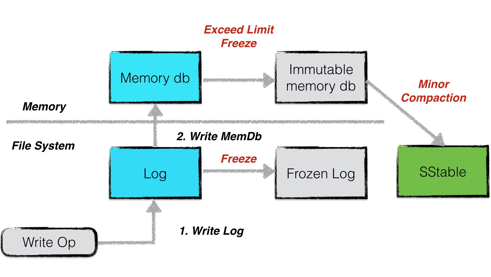
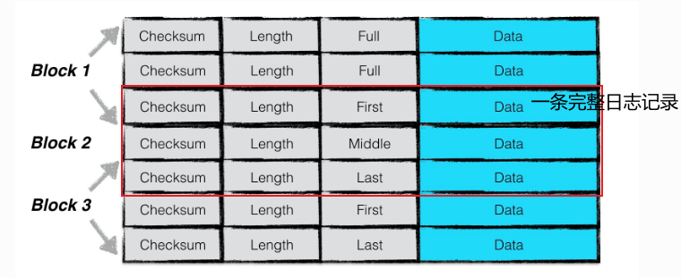
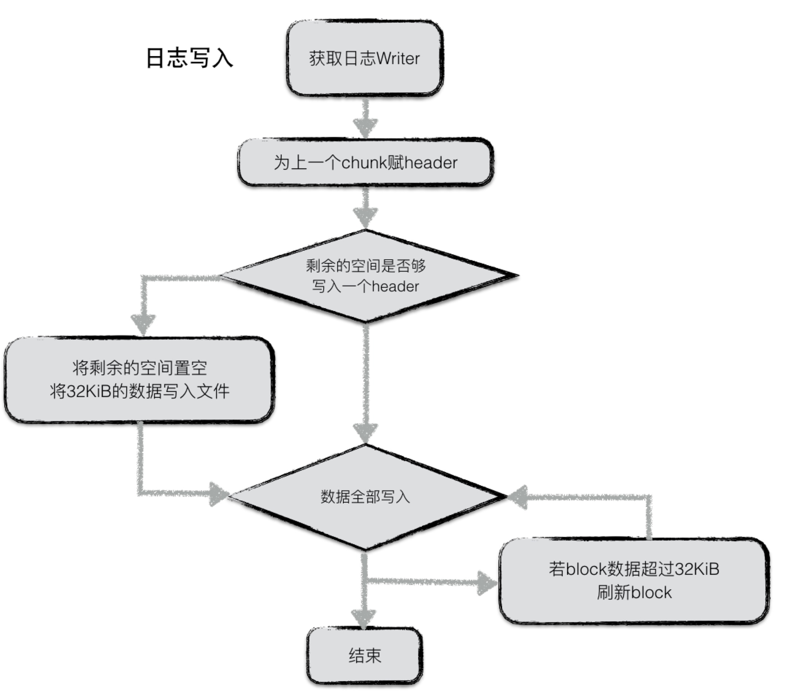
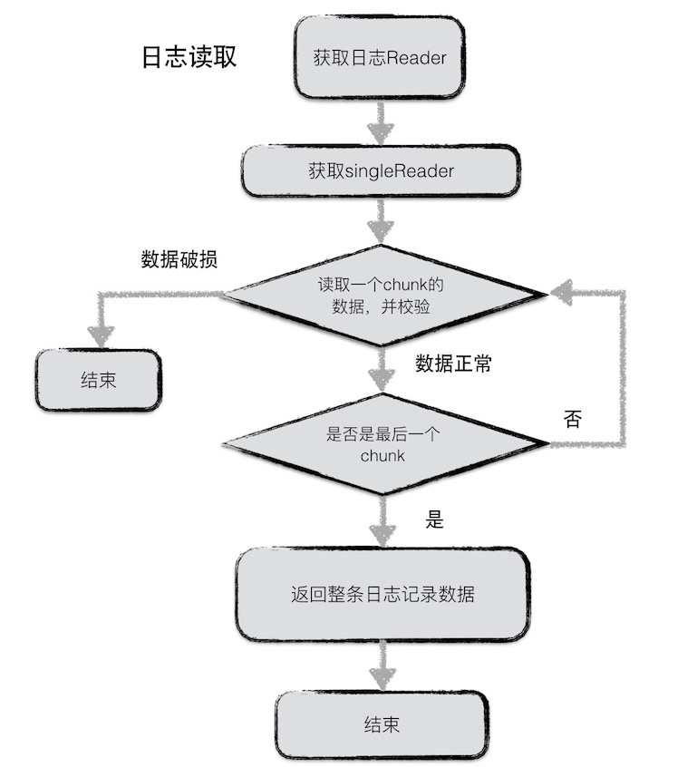

## 三、日志系统log

* 通过先写日志，再写`MemTable`的机制，防止了数据库的进程异常和系统掉电等发生的数据丢失问题。

* 其中，`MemTable`对应`Log`文件，`ImmutableTable`对应`Frozen Log`文件，当`ImmutableTable`被后台进程Minor Compaction持久化到磁盘中时，则将`Frozen Log`删除

----

### 3.1 日志结构

* Log --> Block --> chunk的结构分层，其中每个Block都有32KB
* 一个chunk即为一条表项，包含
  * 7字节头部：Checksum（4字节，校验码）、Length（2字节，长度）、Type（1字节，类型）
  * Type包括：Full，First，Middle，Last
* 一条日志（Record）包含多个chunk时，从First开始，Last结束；只有一个chunk，则类型为Full
* 一条日志的多个chunk可以跨Block进行写入

-----

### 3.2 日志内容（data部分）

日志的内容为包含batch编码的信息（Record：`Slice`）。

具体的格式为：

一条日志data的内容包含：

- Header
- Data

其中header中有（1）当前db的sequence number（2）本次日志记录中所包含的put/del操作的个数。

紧接着写入所有batch编码后的内容。有关batch的编码规则，可以见 [读写操作](https://leveldb-handbook.readthedocs.io/zh/latest/rwopt.html).

### 3.3 日志写

日志写入流程较为简单，在leveldb内部，实现了一个journal的writer。首先调用Next函数获取一个singleWriter，这个singleWriter的作用就是写入**一条journal记录**。

singleWriter开始写入时，标志着第一个chunk开始写入。在写入的过程中，不断判断writer中buffer的大小，若超过32KiB，将chunk开始到现在做为一个完整的chunk，为其计算header之后将整个chunk写入文件。与此同时reset buffer，开始新的chunk的写入。

若一条journal记录较大，则可能会分成几个chunk存储在若干个block中。

### 3.4 日志读

同样，日志读取也较为简单。为了避免频繁的IO读取，每次从文件中读取数据时，按block（32KiB）进行块读取。

每次读取一条日志记录，reader调用Next函数返回一个singleReader。singleReader每次调用Read函数就返回一个chunk的数据。每次读取一个chunk，都会检查这批数据的校验码、数据类型、数据长度等信息是否正确，若不正确，且用户要求严格的正确性，则返回错误，否则丢弃整个chunk的数据。

循环调用singleReader的read函数，直至读取到一个类型为Last的chunk，表示整条日志记录都读取完毕，返回。