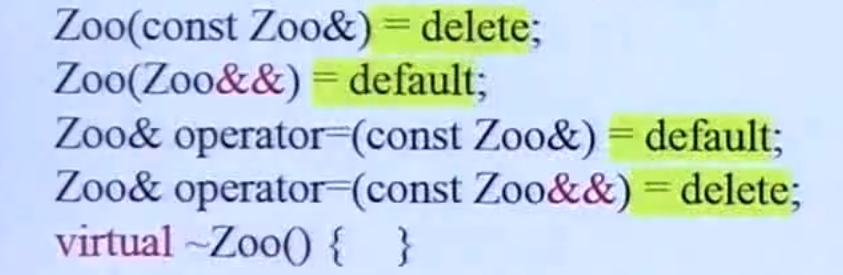
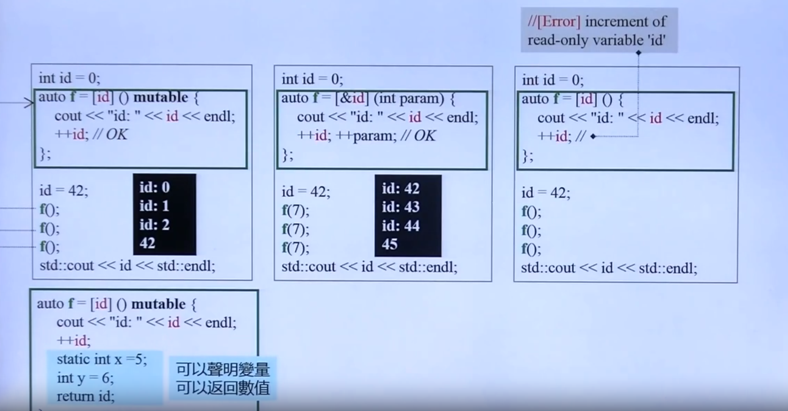
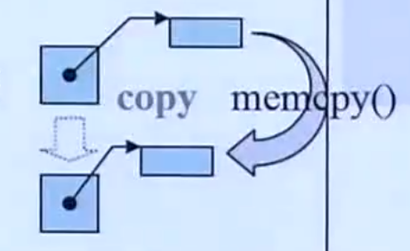
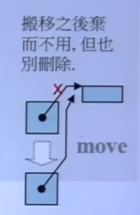

# c++11 标准

date：2022年04月29日

## 1、语言

### （1） initializer_list

**initializer_list的底层是array容器**

当调用大括号时，会生成一个initializer_list对象，用它会对类进行初始化的时候，如果类中定义了传入参数为initializer_list的ctor版本，就首先调用这个版本。

否则，编译器会将initializer_list中的参数一个个按顺序传入，进行ctor初始化

```cpp
#include <complex>
...
    complex<int> c{3, 4}; // 等价于complex<int> c(3, 4);
	// 因为complex没有initializer_list版本的ctor，会将{3, 4}按顺序传入，即使用了complex(int real, int imag);的构造函数版本
...
    
```

---------------

### （2） =default, =delete, =0（move ctor，move assign）

在big-three的基础上加入了move ctor和move assign成为了big-five

Tips：

- big-three的copy ctor、copy assign、dtor会由编译器生成默认合成版本的（synthesized version），如果没有声明任何构造函数也会生成一个=default版本的
- synthesized version的big-three做了什么事呢？**一般是调用了父类的ctor或者non-static 成员的ctor**
- synthesized version的big-three的行为模式是？**按位复制**
- 怎样的类需要自己定义big-three呢？**带有指针成员的类，防止浅拷贝**
- 什么时候会生成synthesized version的move ctor和move assign？**当类内没有定义自己的copy ctor和copy assign，且类内所有非static对象都是可以移动的**

```cpp
// X会合成一个move ctor和move assign
struct X {
    int value;
    std::string str;
};

// hasX中，X对象有合成的move ctor，所以hasX也是可以move的，有合成的move ctor
struct hasX {
    X x;
};

int main() {
    X x1, x2 = std::move(x1);	
    hasX has_x1, has_x2 = std::move(has_x1);
}
```


- 一般情况下，移动构造函数`Zoo(Zoo&&) noexcept;`应该声明为**不抛出异常的**，因为其没有分配新的资源，目的是为了防止编译器做额外的工作。
- 向move ctor和move assign传递的对象必须是**可析构的**，即**当其右值引用对象被销毁时，调用的析构函数不至于引发错误**，如在vector类中，通常是将三个指针置为空。
- 类似于move ctor，当有常量成员变量`const`或者引用成员变量时，无法进行move操作，此时move ctor和copy ctor皆为`delete`；或者类内成员变量**没有move ctor**。换言之，类内的所有成员都需要**可以被移动**
- 当一个类同时具有copy ctor和move ctor时，左值拷贝，右值移动；当一个类只有move ctor时，左值和右值都会被拷贝



#### =default

- 提供一个编译器的默认版本构造函数，一般不做任何事情或者继承父类
- 只能用于big-five上
- `Foo f; // 定义一个对象不提供任何参数`

#### =delete

- 向编译器表示没有这个函数版本
- 可以用于所有函数，但是不能二次定义，且除了big-five之外的成员函数没意义
- 用于copy ctor和copy assign防止对象的拷贝，用于dtor防止析构，但是一般不用，会报错
- 一般不直接把copy ctor和copy assign设置为delete版本，而是设为private，留一个后门给成员或者友元

#### =0

- 声明一个纯虚函数，且只能用于声明纯虚函数
- 纯虚函数表示将具体实现交给子类完成

--------

### （3）Alias Template

```cpp
template <typename T>
using MyVec = std::vector<T, MyAlloc<T>>;	// 为vector赋予一个别名

MyVec<int> vec;	// 相当于vector<int, MyAlloc<int>> vec;
```

Tips：

- typedef的局限：不接受模板参数，即最多写成`typedef std::vector<int, MyAlloc<int>> MyVec;`

- alias template可以传入模板模板参数作为container，[template template parameter](./面向对象.md)

----------------

### （4）Type Alias

通过using来代替typedef来获得更好的兼容性

```cpp
typedef void (*func)(int, int); // 定义一个函数指针func
using func = void (*)(int, int);
```

using的几种用法：

```cpp
using namespace std;
using std::cout;
using value_type = int;
```

------------

### （5）noexcept

声明一个函数**不会抛出异常**

```cpp
void foo() noexcept(expression); // 其中expression中是一个条件表达式，如果为true则不会发生异常
```

Tips：异常如果发生没有处理的话，会不断的向上抛出，直到最终调用了`std::terminate()`，其中调用的函数是`std::abort()`

#### noexcept和移动构造、移动赋值函数、析构函数的关系

**你需要对move ctor、move assign、dtor声明为noexcept。move ctor将会在vector扩容时被调用，如果没有声明为noexcept，编译器无法确保move ctor是否会发生异常，因此不会调用它**

只有vector和deque会发生扩容

--------------

### （6）override和final和decltype关键字

#### override

**子类可以对父类的virtual函数进行override，但是函数的签名必须一致**

用途：

- **声明**此函数为一个重写的函数，以此提醒编译器，如果和父类的签名不一致会进行报错

```cpp
class base {
    virtual void func(double i);
};

class derived : public base {
    virtual void func(int i) override; // 编译器会提醒需要一致的函数签名
}
```

#### final

用途：

- **声明**一个类为不可继承
- **声明**一个virtual函数为不可重写

```cpp
struct base1 final {};
struct derived1 : public base1 {}; // error... base1不可以进行继承

class base2 {
    virtual void func(int i) final;
};
class derived2 : public base2 {
    virtual void func(int i); // error... func不可以进行override
}

```

#### decltype

用途：

- 获得一个表达式的类型

```cpp
map<string, int> coll;
decltype(coll)::value_type elem;	// 通过decltype获得coll的类型，其作用域中的value_type
 
template <typename T1, typename T2>
auto add(T1 x, T2 y) -> decltype(x + y);	// 作为一个函数的返回值，来获得一个不好直接表达的类型，即T1+T2得到的类型，且保证在x和y声明之后出现，要使用后置返回类型

// 面对lambda，我们只有object而没有type，而一般的仿函数或者函数指针都有其类型
// 如果需要传入lambda的type，则需要通过decltype
auto cmp = [](const Person &i1, const Person &i2) {
    return i1 < i2;
};
std::set<Person, decltype(cmp)> pset;	// set所容纳的person对象，需要传入一个仿函数来声明如何对其进行比较排序
```

### （7） lambda

lambda得到的是一个函数对象或者仿函数，其格式如下

```cpp
auto f = [](int i) mutable_opt throwspec_opt -> retType_opt {
    // 函数体...
};

f(10);	// 进行函数调用
```

- `[]` 外部变量捕获列表，分为pass by value `[x]`和pass by reference `[&x]`
- `(int i) `形参列表
- `mutable`关键字（可选），如果需要改变捕获列表中的参数，则需要加上mutable关键字
- `throwspec`指定抛出的异常
- `retType`后置返回类型（可选的）
- `{}`函数体



Tips：在需要对unordered或者associate容器传入比较函数，哈希函数时，可以采用lambda的形式，传入的模板参数为lambda函数对象的类型，可以用类型推到`decltype`。同时因为，lambda表达式没有构造函数和赋值操作，所以容器对象必须传入一个lambda对象进行初始化，否则不能用lambda的类型进行其初始化。

```cpp
auto cmp = [](const object &o1, const object &o2) {
    return o1.value < o2.value;
};

unordered_set<object, decl(cmp)> coll(cmp);	// 必须对容器对象coll传入一个lambda对象cmp，因为其不会根据cmp的类型decltype(cmp)而调用构造函数
```

**通常用一个仿函数来进行上述的操作，比较直观，而不是lambda配合decltype类型推导**

-----------------

### （8） variadic template

> 利用variadic template可以实现函数的递归调用

使用`...`声明这是一包参数

- 在模板参数和函数形参中，`...`在前
- 在函数调用中，`...`在后
- 要直到一包参数的个数，使用`sizeof...(args)`
- `void func(const T& firstArg, const Types&... args)`中，一包参数args可以是0~任意多个

递归的思想一般都是重载函数的几个版本，递归基是没有参数的版本，函数不执行任何动作

```cpp
void print() {}	// 递归基

template <typename T, typename... Types>
void print(const T &firstArg, const Types&... args) {
    cout << firstArg << endl;
    print(args...);
}	// 不断将函数中的n个参数解为1 + n-1

```

特别的，参数为`const T &firstArg, const Types&... args`和版本1相对于参数为`const Types&... args`的版本2是**特化的版本**，换言之，如果版本1和版本2同时存在的话，会调用版本1

------------------

## 2、标准库

### （1）Rvalue和std::move()


* has identity and cannot be moved from - 这类表达式在 C++ 中被称为 lvalue（**左值**）。
* has identity and can be moved from - 这类表达式在 C++ 中被成为 xvalue（expiring value）（**到期值/将亡值**）。
* does not have identity and can be moved from - 这类表达式在 C++ 中被成为 prvalue（pure rvalue）（**纯右值**）。
* does not have identity and cannot be moved -C++ 中不存在这类表达式。

**Rvalue的定义：**

- 不能进行赋值的变量，如临时对象

当形参为一个Rvalue时，会调用其move ctor版本的构造函数，允许其他的变量来“偷”它的资源

**`std::move()`的定义：**

- 将一个左值转换成右值

**带指针的拷贝构造和移动构造区别（深拷贝和浅拷贝）：**





- 拷贝构造函数新建一块内存区，将数据和指针都拷贝过来，为深拷贝
- 移动构造函数建立新的指针，指向原来的数据区，同事将原来的指针置为`nullptr`（但不删除，而是交给其dtor来做），为浅拷贝

### (2) perfect forwarding

完美转发应用的场景：当函数接受了一个右值时，因为通过形参获取了一个名字，所以再调用函数进行传入时，就不会再是右值了，这时候需要通过`std::forward<T>()`进行完美转发，保留其右值的特性

```cpp
template<typename T>
    void print(T& t) {
        cout << "lvalue" << endl;
    }

    template<typename T>
    void print(T&& t) {
        cout << "rvalue" << endl;
    }

    template<typename T>
    void test_forward(T&& v) {
        print(v);	// 无论如何都得到lvalue，即使是传进来的v是rvalue，但是变成了named object失去了右值的特性
        print(std::forward<T>(v));	// 如果v是左值，就得到lvalue，v是右值，就得到rvalue
        print(std::move(v));	//	经过move后无论如何得到rvalue
    }

```

