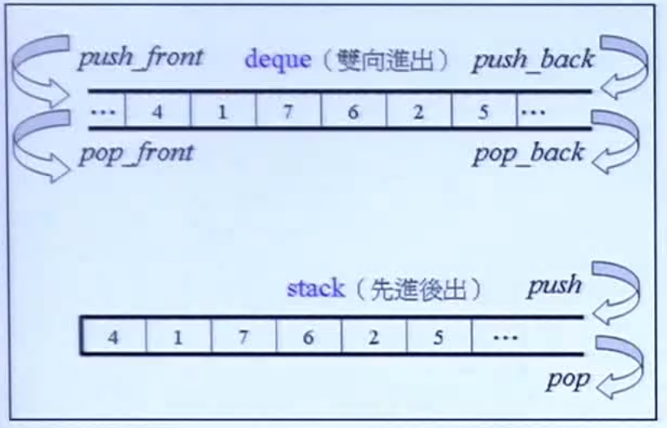
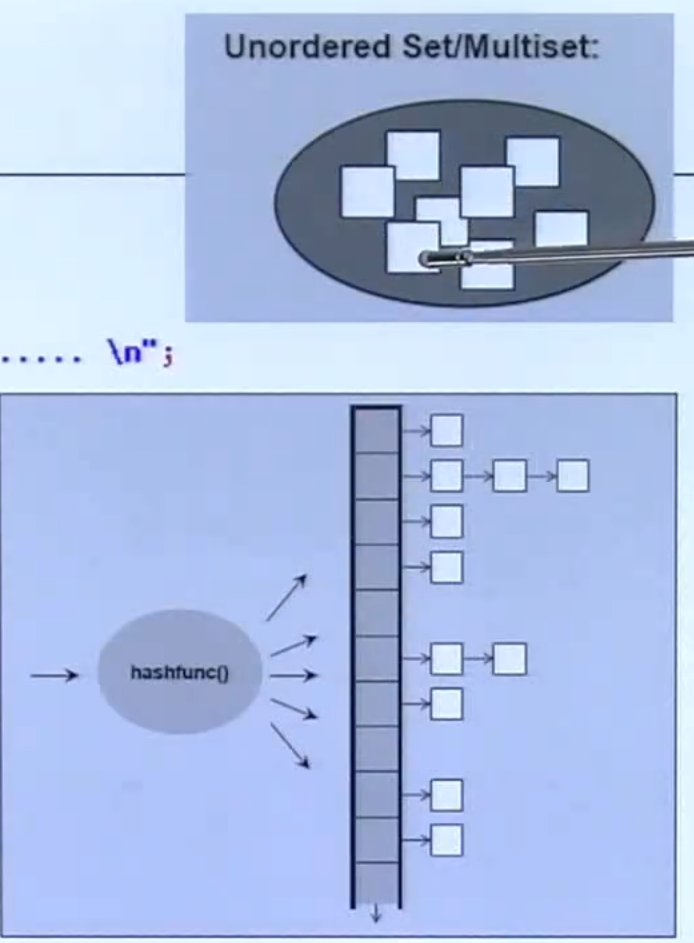
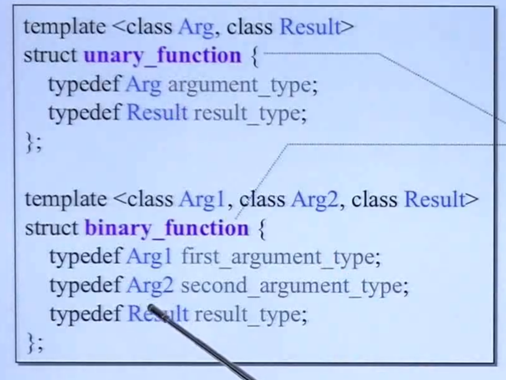

# stl与泛型编程

**date：2022年4月17日15:00:28**

c++标准库包含c++ stl（标准模板库）

## 第一部分 六大部件（components）


- **容器（containers）**
- **算法（algorithms）**
- 迭代器（iterators）
- 分配器（allocator）
- 泛函数（functors）
- 适配器（container adapters，iterator adapters， functor adapters）

--------------

## 一、容器

### （1）、顺序容器

- array
- vector
- list（双链表）
- forward_list（单链表，且只有push_front)
- deque
- queue 先进先出
- stack 先进后出

**需要注意的点：**

1. array需要第二个参数，即容器的大小是固定的
2. vector每次扩容都是乘以2，当size很大时，会造成空间的浪费
3. list每次扩容只需要分配一个大小的空间，但是遍历list花时间；forward_list相比于list来说节省了一半的指针
4. list和forward_list有自己的排序算法，通过成员函数调用
5. deque的实现结构如下（**分段连续**），通过一个map连续空间存放一段段的buffer


6. **其中stack和queue都是基于deque实现的**，且操作接口是`push`, `pop`，且stack和queue也可以使用list作为底层结构，特别的，stack也可以使用vector作为底层结构。主要看使用的底层结构是否支持了stack和queue所需要的操作。在stack的定义中，设定了一个默认模板参数deque<T>，且在类中声明了一个deque（复合composition），通过调用声明的deque的函数来完成stack的接口。




7. **stack和queue为了保护先进后出\先进先出的特性，不提供iterator的操作，防止通过iterator直接修改或者破坏容器中的元素。**

#### 1.list


#### 2.vector


数据区：

- start —— 指针，指向vector开始的内存空间
- finish —— 指针，指向vector结束的空间，finish-start= size
- end_of_storage —— 指针，指向capacity结束的空间，end_of_storage - start = capacity

#### 3.deque（分段连续）


一些概念：

1. 通过一个map控制着多段buffer，map中存放的是每个buffer的地址。

2. deque中的iterator有4个指针组成，分别是cur，first，last，node
   - cur指针，指向当前迭代器所指向的元素
   - first指针，指向元素所在buffer的头
   - last指针，指向元素所在buffer的尾
   - node指针，指向当前buffer的位置，通常是map用来确定当前的buffer的位置的

3. 通过`deque.begin()`函数获得的一个迭代器，其内含有四个指针，其中node指向map中的头结点，cur指向结点（buffer）中的头元素，first指向buffer的头部，last指向buffer的尾部

4. deque如何模拟连续空间？通过__deque_iterator模拟，即重载iterator的操作符

   
   
   

### （2）、关联容器

- set/multiset
- map/multimap
- unordered_set 
- unordered_map 

**需要注意的点:**

1. set和map为有序，而unordered_map和unordered_set为无序

2. set和map的底层实现原理为**红黑树**，而unordered_map和unordered_set的实现原理为**哈希算法**，通过哈希算法得到篮子的位置，其中每个bucket的数据以链表形式存放。

   

   

3. set和map有自己的find函数，实现速度更快 

#### 1、红黑树rb_tree(set, map)


一些概念：

- 一个节点就是一个value，value中包含了键和值`value = key+data`

- 红黑树需要指明五个模板参数，分别是`key`, `value`, `keyOfValue`, `compare`, `alloc`，其中compare是一个仿函数，如`less<T>`

  - 在gnu_c++中，keyofvalue通常通过一个仿函数`identity<T>`来获取

  

  - 如果是map，一般传入的模板参数是key和data，在map的类中，会将`pair<const key, data> value`将key和data包装成一个value

- 红黑树提供遍历操作和iterator，按照++iter遍历就是已经排序好的数据，红黑树的遍历方式是左子树优先遍历
- 红黑树一般不允许直接通过iterator修改key的内容，但是并未阻止此事，是因为map继承于红黑树，而且key对应的data是可以改变的
  - 为了使set不能通过iterator改变key，在set的实现中，`typedef rb_tree::const_iterator iterator;`，将set类的iterator设为const
- 插入的操作分为`insert_unique`（不允许重复元素），`insert_equal`（允许重复元素）

#### 2、哈希表/散列表（unordered_set、unordered_map)


**一些概念**：

- bucket：hashtable中每个bucket中包含了一个链表，通过一定的**hashFunction**（如求余）将待插入的数值放到对应的bucket中的list中
- bucket的数量一般都会设置为**质数**，每次扩充时，取两倍的bucket数量并找到其附近的质数作为size
- 当hashtable的总size大于了bucket的size，这时需要进行**rehashing**，防止有过长的链表
- buckets通过vector实现，`vector<node*, alloc> buckets;`
- hashtable中需要指明的模板参数如下，`value`, `key`, `hashFunction`, `ExtractKey`(如何从value中提取出key), `equalKey`(如何判断两个key相等)，其中后三个都是仿函数


- 标准库提供的hash仿函数直接包含的特化版本有char, short, unsigned short, int, unsigned int, long, unsigned long, char *, const char *            `auto i = hash<int>() (32); // i = 32`
- 如果需要计算一个对象的哈希值，需要自己编写仿函数，并返回一个size_t(unsigned long long)的编码

## 二、分配器

不同版本的c++对分配器的实现形式不一样

- allocator有两个成员函数，`allocate`和`deallocate`，但是一般不直接使用他们，因为deallocate需要指定释放的空间大小
- allocator的底层实现都是调用`malloc`和`free`函数来进行内存的分配和释放
- 要使用额外的分配器，需要包含头文件`#include <ext/...>`

## 三、迭代器

容器中有自己的迭代器子类，如`list`类中有`__list_iterator`，用来实现对list的操作，`iterator`一般需要重载操作符++和--

- 左++，`++i`，其实现方式为`T &operator++();`
- 右++，`i++`，其实现方式为`T operator++(int);`，一般通过调用重载好的左++来重载右++

```c++
T operator++(int) {
    iterator tmp = *this;
    ++*this;
    return tmp;
}
```

- 通过参数列表对左右自增/自减进行重载，且c++语言中没有`i++++`的操作，所以`i++`的返回类型为value
- 一般随机存取迭代器(random access iterator)， 即连续空间的迭代器，才支持加上或减去一个different_type类型的操作

#### 迭代器是算法与容器之间的桥梁

将迭代器传入泛型算法时，算法需要知道迭代器的信息，为此特意定义了**迭代器的五种相关类型**（associate types），以便回答算法的提问

1. value_type 即容器中数据的类型
2. difference_type 即用何种类型来表示两个迭代器之间的距离
3. iterator_category 表明了迭代器的种类
4. reference 容器中数据的引用类型
5. pointer 容器中数据的指针类型


##### 如何获取iterator的五种相关类型？

考虑到iterator可能是一个class，或者只是一个单纯的pointer，而pointer没有能力定义五种相关类型，所以需要**加上一个中间层**（萃取机）即`iterator_traits`


上述建立了一个**中间层并通过偏特化**来根据传入的迭代器类型进行不同的响应。

Tips：

**解决计算机问题的尚方宝剑，加一个中介层**

##### 1.迭代器的种类


iterator的不同种类以对象方式来表现

- 算法针对传入的不同的迭代器，需要选择最合适的版本，以提高效率和可用性
- outputIterator是write-only的迭代器，不能做read操作，所以要区别于inputIterator

```cpp
template <typename InputIterator>
inline iterator_traits<InputIterator>::difference_type
distance(InputIterator first, InputIterator last) {
    typedef typename iterator_traits<InputIterator>::iterator_category category; // 定义一个传入迭代器的iterator对象别名
    return __distance(first, last, category()); // 根据category临时对象的不同传入不同的版本次函数
}
```

- 如上例中的typename `InputIterator`只是算法对传入迭代器种类的暗示，并未做强制要求，但是如果传入的迭代器不符合特化版本的实现，会在后续报错

## 四、算法

一些常用的算法

- list自带了sort，因为标准库的sort要求random_access_iterator
- associate container自带了count和find，因为他们可以直接查找

```cpp
// 1. accumulate(first, last, init, binaryOperation) 需要#include <numeric>
cout << "accumulate: " << endl;
int nums[3] = {3, 4, 5};
int init = 10;
// 10 + 2*3 + 2*4 + 2*5 = 34
auto i = accumulate(nums, nums + 3, init, myfunc);
cout << i << endl;

// 2. for_each(first, last, function) 可用 range-bases statement (for (auto &i : v) {})代替
cout << "for_each: " << endl;
for_each(nums, nums + 3, print);
cout << endl;

// 3. replace(first, last, old_value, new_value)
// replace_if(first, last, pred, new_value) 其中pred是一个判断式，即返回值是bool的函数或者仿函数
// replace_copy(first, last, outputIterator, old_value, new_value)
cout << "replace: " << endl;
vector<int> vec;
replace_copy(nums, nums + 3, back_inserter(vec), 4, 10);
for_each(vec.cbegin(), vec.cend(), print);
cout << endl;

// 4. count(first, last, value)
// count_if(first, last, pred)
cout << "count: " << endl;
cout << count_if(vec.cbegin(), vec.cend(), bind2nd(less<int>(), 8)) << endl;

// 5. find find_if 循序查找
cout << "find: " << endl;
auto it = find(vec.cbegin(), vec.cend(), 3);
cout << distance(vec.cbegin(), it) << endl;

// 5. sort(first, last, compare)
cout << "sort: " << endl;
vector<int> vec2{3, 5, 3, 3, 0, 1, 2};
sort(vec.begin(), vec.end(), compare); // 从大到小，传入一个函数指针
sort(vec.begin(), vec.end(), less<int>()); // 从小到大，传入一个仿函数（对象）
for_each(vec.cbegin(), vec.cend(), print);
cout << endl;

sort(vec2.begin(), vec2.end());
for_each(vec2.cbegin(), vec2.cend(), print);
cout << endl;

// 6. bool binary_search(first, last) 前提必须是排好序的区域
cout << "binary_search: " << endl;
auto it_low = lower_bound(vec2.cbegin(), vec2.cend(), 3);
auto it_up = upper_bound(vec2.cbegin(), vec2.cend(), 3);
cout << *it_low << endl;
cout << *it_up << endl; // 3的范围 [it_low, it_up)
auto range = equal_range(vec2.cbegin(), vec2.cend(), 3);
cout << *range.first << " " << *range.second << endl;

```

```markdown
// 执行结果
accumulate:
34
for_each:
3 4 5
replace:
3 10 5
count:
2
find:
0
sort:
10 5 3
3 5 10 
0 1 2 3 3 3 5
binary_search:
5
5
3 5
```

-----------

## 五、仿函数

> 定义一个类，重载小括号

**分类：**

- 算术类(arithmetic) `return x + y;`
- 逻辑运算类(logical) `return x && y;`
- 关系类(relational) `return x < y;`

**调用方法：**

```cpp
less<int>()(val); // 创建一个模板参数为int的less临时对象，并通过重载后的()调用，仿真一个函数
```

**定义自己的仿函数：**



为了使自己的仿函数融入标准库，**同时可以回答function adapter的提问**`如bind2nd(less<>(), val)`，即被函数适配器进行修改。需要对上述进行二选一继承，即继承了上述的typedef

## 六、适配器（改造）

> 把某个存在的东西进行改造，如修改函数的名字，修改其传入参数个数等等

**分类：**

- iterator adapter
- functor adapter
- container adapter

**适配器都是通过composition实现的**，即adapter类中包含了一个functor/container/iterator的对象


### 1. 容器适配器（container adapter）

如stack、queue的实现方式


### 2. 函数适配器（function adapter）

#### binder2nd


- 通过调用bind2nd辅助函数时，将functor即operation形参传入了binder2nd对象，同时返回的也是一个binder2nd对象，所以需要对binder2nd进行`()`的操作符重载，使得经过适配器的仿函数仍然可以进行调用

- 如上所述，`bind2nd(less<int>(), 40)`只是得到了一个binder2nd对象，记录了operation即`less<int>()`并将40作为第二参数记录了下来，等到实际调用操作符`()`时，才会进行仿函数的调用，此时将40作为第二参数传入operation，同时需要返回operation的result_type

- **为什么binder2nd还要继承一个unary_function对象？** 答：为了嵌套的使用adapter

   因为binder2nd对functor进行修饰之后，如果还需要一个adapter对binder2nd进行调整，则binder2nd对象需要告知adapter它的参数和返回类型。此时binder2nd将一个binary_function的第二个参数绑定后，调用`()`操作符就变成了unary_function，此时需要继承unary_function并声明原始的functor即less<>()的`operation::first_argument_type`作为unary_funciton的`argument_type`，将`operation::result_type`作为unary_function的`result_type`

Tips：

现在bind2nd已经被bind适配器取代了。。。

#### bind

bind可以绑定的对象为：

- 函数
- 仿函数（函数对象）
- 类成员函数
- 类数据成员

1. 函数和仿函数bind的方法

```c++
double my_divide(double x, double y) {
    return x / y;
}

auto fn = bind(my_divide, 10, 2);
cout << fn() << endl; // 5

auto fn_half = bind(my_divide, _1, 2);
cout << fn_half(10) << endl; // 5

auto fn_reverse = bind(my_divide, _2, _1);
cout << fn_reverse(10, 2) << endl; // 2 / 10 = 0.2

auto fn_result_type = bind<int>(my_divide, _1, _2);	// bind<int>表示将返回类型模板参数绑定为int
cout << fn_result_type(10, 3) << endl; // (int) 10/3 = 3;
```

2. 类成员函数实际上有个参数this指针，即_1占位符代表的是this
3. 同理，类数据成员占位符也代表了this对象，需要传入一个类对象

### 3. 迭代器适配器（iterator adapter）

- reverse_iterator
- inserter  底层有一个insert_iterator的实现类，insert是一个辅助函数，类似于bind2nd和binder2nd的关系
  - inserter(container, iterator)    ——在container的iterator处进行insert操作
  - back_inserter(container)   ——在container的末尾进行push_front，容器必须支持push_back
  - front_inserter(container)  ——在container的前端进行push_front，容器必须支持push_front
- ostream_iterator
- istream_iterator

#### inserter是如何实现的呢？

```cpp
vector<int> vec{0, 1, 2, 3, 4, 5, 6};
vector<int> output_vec(7); // 准备好大小为7的空间
copy(vec.cbegin, vec.cend(), output_vec.begin()); // 普通的vec，实际上进行的是assign操作，如果超出了output_vec的范围，会发生错误

// --------> 改进，inserter的实现实际上是调用了vec的insert成员函数
copy(vec.cbegin(), vec.cend(), inserter(output_vec, output_vec.begin()));

// copy泛型函数中，已经将操作写死了如下，通过output_iterator进行赋值操作如何实现insert操作？
copy(first, last, result) {
    ...
    while(first != last) {
        *result = *first;
        ++result;
        ++first;
    }
}

// 答案：在inserter类中委托一个container指针，对其=操作符进行了重载，使得操作符=里面实际上使用的是成员函数insert
```

1. 通过一个inserter辅助函数，返回一个insert_iterator对象，并将传入inserter函数的参数作为insert_iterator的成员数据保存起来，即对insert_iterator对象进行初始化
2. 考虑到是将insert_iterator对象作为OutputIterator形参传入copy函数中，考虑在函数内需要做的操作
3. 根据1中保存的成员数据和2中分析的操作，在insert_iterator类中进行操作符的重载，以此覆盖原来copy函数中对OutputIterator对象的操作


#### ostream_iterator是如何实现的？

1. 定义一个ostream_iterator对象，并传入参数作为成员数据，即对象初始化，如ostream(cout)，和delimiter
2. 通过copy函数传入了ostream_iterator对象作为OutputIterator，分析需要做的操作符重载操作
3. 在ostream_iterator实现类中根据1中保存的成员数据和2中分析需要的操作，实现对操作符的重载


#### istream_iterator是如何实现的？


值得注意的是：

当创建isit对象时，istream_iterator构造函数中会执行一次`++*this`，实际上已经执行了一次操作符`++`，即初始化isit对象的时候已经开始读取数据了，而不是调用isit才开始读取

```cpp
istream_iterator<int> eos;  // 未指定初始化参数，默认为输入终止 end of stream
istream_iterator<int> isit(cin); // 将绑定到一个basic_istream对象即cin上
while (isit != eos) {
    int value = *isit;
}

++isit; // 从cin中读入一个int数据

vector<int> c;
copy(isit, eos, inserter(c, c.begin())); // 从输入读入数据，传入到容器c的开头
```

也可以将istream_iterator绑定到一个文件中，不断用迭代器读取其中的内容

------------

## 第二部分 一些边角料

### 一、自定义自己的hash function

- 函数形式
- 仿函数 如animalHash
- hash<>()的偏特化版本

### 二、tuple可以在容器中放入不同的类型

```cpp
#include <tuple>
// 创建tuple对象
tuple<string, int, int, complex<int>> t1("queshirun", 1, 2, (3,4)); 
auto t2 = make_tuple(3, "queshiurn", complex<int>(3,4));

// 获取tuple中的元素，0代表t1中的第0个元素
cout << get<0>(t1) << endl; // "queshirun"

int i1;
string s1;
complex<int> c1;
tie(i1, s1, c1) = t2; // 将tuple的元素分别绑定到三个类型

// 获取tuple的信息
typedef tuple<string, int, int, complex<int>> tupleType; // 将t1的类型定义为tupleType
cout << tuple_size<tupleType>::value << endl; // 4
typedef tuple_element<1, tupleType>::type tp; // 取tupleType中的第一个类型 命名为tp
tp s2;	// 等效于 string t1
```

- tuple重载了比较和赋值操作符`<`，`=`，可以直接比大小和赋值 （tuple中需要是基础类型）

## 三、type traits 类型提取

用法：

```cpp
cout << is_void<Foo()>::value << endl; // 0， 判断Foo对象是否是一个void类型
```

[type traits函数]([ - C++ Reference (cplusplus.com)](https://www.cplusplus.com/reference/type_traits/))

[c++ type traits function](https://www.cplusplus.com/reference/type_traits/)

## 四、移动拷贝构造/赋值函数（move copy/assignment）

和普通构造函数的区别：

move copy是**浅拷贝**，只是拷贝了指向数据区的指针，实际上共用了数据。

而普通的copy是**深拷贝**，会拷贝数据区，如下图所示


**原来的数据不可以再次使用了**

**如何传递一个move copy？**

```cpp
// 1. 使用临时对象，且Foo类中定义了move copy ctor
Foo f2(Foo()); // 因为临时对象只使用一次就会被销毁，所以适合浅拷贝，原来的对象不会再使用了

// 2. std::move函数
Foo f1;
Foo f3(std::move(f1)); // 显示的声明使用move copy ctor
```

