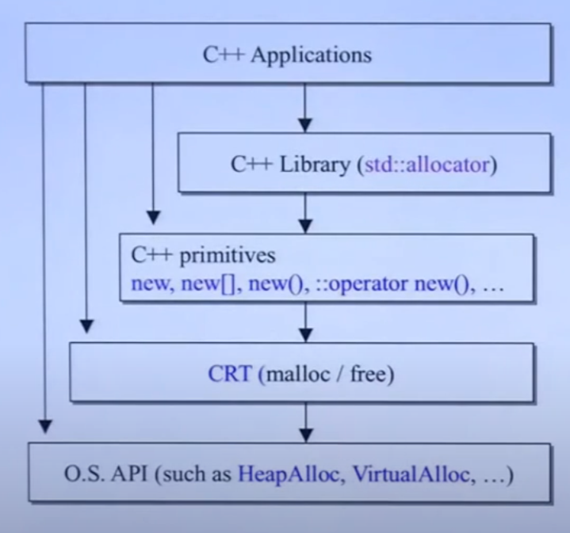
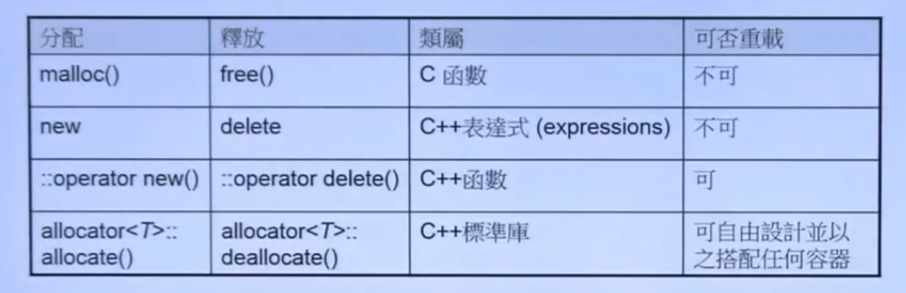

# 内存管理

date: 2022年6月11日21:01:53

-------------

# 一. 概要





---------

## 二. new和delete

### 2.1 new

- new expression
- new function

其中, new expression不可被重载, 其过程等价于:

```cpp
complex<int> *p = new complex<int>(1, 2);

// ===> 等价于

//1. 分配内存
void *mem = operator new(sizeof(complex<int>));
//2. 类型转换
complex<int> *p = static_cast<complex<int>*>(mem);
//3. 调用构造函数
p->complex<int>::complex(1, 2);	// 不同编译器可能不能直接调用构造函数
```

### 2.2 delete

* delete expression
* delete function

delele expression的过程等价于:

```cpp
delele p;

// ===> 等价于

//1. 调用析构函数
p->~complex();	// 可以直接调用析构函数
//2. 释放内存
operator delete(p);
```

**Tip: 不可以通过作用域直接调用构造函数, 但是可以调用析构函数, 可以通过placement new来调用构造函数**


