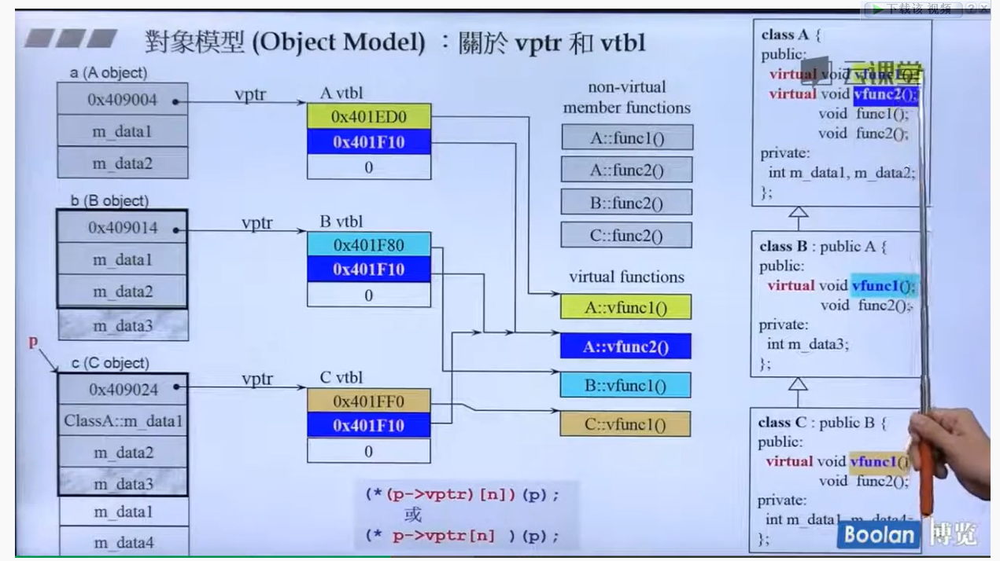

# 侯捷c++ 面向对象开发

## 0、前言，类基础特性：

- 类中分为data区和function区，通常private中定义的是data
- 将构造函数声明为private，则外部无法直接生成一个类对象，可以通过类静态函数生成一个静态singleton对象，表示只有一个（设计模式）
- 类分为包含指针和不包含指针的，一般来说，包含指针的类要定义析构函授，不包含指针的大部分情况下不用
- 友元函数可以直接访问类中的数据部分
- 如果一个类内函数不改变类中的data，需要将其定义为const；同理，如果传入的参数不会被改变，也需要将其声明为const，**能const就const**
- 传入的实参为变量，而形参为常量是可以的，const只是对编译器做了一个声明，告诉其将传入的实参当成const来使用，反之是不行的，所以**能const就const**
- 同一个class生成的对象之间是友元关系，所以可以通过一个对象调用另一个同类对象的data
- 传值（pass by value）会进行复制，有时候会占用太多开销，类函数传入参数如果可以使用reference就使用reference（pass by reference），返回参数尽可能使用reference（但是局部变量不能返回reference，因为其在函数结束时会被销毁）。引用的底层是指针实现的。一个变量的reference可以理解为其别名，编译器会制造一个假象，即变量的reference和变量的size和地址都是一样的
- 短小而经常调用的函数需要使用inline内联函数，其类似于宏展开，在调用函数的地方直接展开成函数体的内容，可以节省函数调用压栈的开销。如果太过复杂（比如有循环），编译器不会将其当成内联函数。
- 构造函数尽量使用列表初始化（initialization list），防止在函数体内进行赋值  （初始化 >  赋值）
- 用argument代表实参，而parameter代表形参
- temp object 临时对象，不需要声明对象的名字，如`complex();`常用于函数的返回 
- 顶层const对于函数的重载来说是没有意义的，即`void func(int a)`和`void func(const int a)`是同一个函数，都不会改变实参的值，会导致重复定义
- 基类的**访问控制说明符**用来控制派生类是否能看见基类的成员，如public和protected可以被子类看见；而**派生列表的访问控制说明符**，如public继承和private继承与派生类是否能访问父类的成员无关，private继承也可以访问父类的protected对象，这是用来控制用户（包括派生类的派生类）对基类的可见性，如基类的public对象如果被private继承后，用户调用子类时，将看不见父类的public对象，这是因为派生列表的类型访问说明符将其限制到了private对于用户来说。
- 动态绑定的缺点，如果将一个派生类指派给一个基类的指针，那么就不能通过通过基类指针访问派生类所独有的函数，在其基类的作用域无法被看见，除非调用的时虚函数。
- 如果派生类对基类的成员进行了重载（重定义，包括数据成员），则将父类的成员进行了隐藏。可通过Base::mem进行调用


-------------

## 1、c++的类对象

#### 操作符重载

- 操作符重载函数分为**成员函数**和**非成员函数**
- 非成员函数的操作符重载可以在类内将其声明为friend，方便访问类内的数据。

如何考虑将重载操作符设置为成员函数还是非成员函数？

- 考虑操作符的作用对象，如<<作用于ostream，即第一个参数是ostream，只能作为非成员函数
- =、()、[]、-> 操作符只能通过成员函数重载

---------------

#### 构造函数和析构函数

- 包含指针的类和不包含指针的类，其中拷贝构造和拷贝赋值的方式不一样，不包含指针的用编译器给的拷贝初始化就可以（自己不用定义）；而包含指针的类，即用一个指针指向类对象，需要自己定义拷贝构造和拷贝赋值，否则拷贝的只是一个指针，会造成**两个对象指向同一块内存区域**。
- 带有动态分配的指针的类必须要有析构函数，释放指针

##### 两个基本原则

1. 如果实现了析构函数，一般就需要实现拷贝赋值和拷贝构造。防止浅拷贝的发生。
2. 拷贝构造和拷贝赋值基本上同步出现，两个要同时实现。

#### delete

可以对除析构函数的任意函数使用delete声明函数被删除

**当一个类中含有const对象或者引用对象时，此函数的拷贝赋值函数默认是delete的**，因为const成员对象和引用只能在实例初始化的时候进行初始化，而不能进行拷贝

-----------

Tips：

- ```cpp
  // 下面三个函数被称为Big Three，是带有指针的类必有的
  class string {
  public:
    string (const string &str); // 拷贝构造
    string &operator=(const string &str); // 拷贝赋值
    ~string(); // 析构函数
  }
  ```

#### 动态内存

new一个对象需要手动的delete

- new先分配内存，再进行ctor（构造函数）

- ```cpp
  String *pc = new String("queshirun");
  // ---> 等价于以下代码
  String *pc;
  void *mem = operator new(sizeof(String)); // 1. 分配内存 其内部调用malloc
  pc = static_cast<String *> (mem); // 2. 强制类型转换
  pc->String::String("queshirun");    // 3. 调用构造函数，等于对此对象的构造函数隐式的传入this指针，即pc
  ```

- delete先调用dtor（析构函数）再释放内存

- ```cpp
  delete pc;
  // ---> 等价于以下代码
  String::~String(); // 析构函数
  delete pc; // 其内部调用free，释放内存
  ```

上面pc是一个指向指针的指针，String对象也是一个指针，指向其内部的字符串数据char *，上述代码中，析构函数负责将String对象内部动态分配的data空间释放掉，而`delete pc`负责释放掉String对象。

##### 在VC下的动态分存分配，调试模式


- 红色：cookie，标志了对象开始的范围，其中41中40表示大小，1表示分配内存

- 灰色：调试头

- 蓝色（pad）：保证内存空间是16的倍数做的填充

##### 在VC下动态分配内存，数组Array


- 特别的，用4个字节int来记录分配的数组大小3
- 右边的为非调试模式，没有debugger header

##### array new 一定要用 array delete

```cpp
String *pc = new strs[3];
delete[] pc;
```

原因：会导致内存泄漏。因为array的内存空间大小记录在cookie头中，所以不会内存泄漏，**但是**，array中有3个String对象，如果不调用array delete，编译器不知道数组中有几个对象，所以**只会调用一次析构函数**，导致String对象内的动态分配的m_data空间不能释放完全，而造成内存泄漏。

##### 静态成员函数和静态成员变量

> 前言：非静态成员函数是如何找到对象的？
> 
> 当对象调用非静态成员函数时，会**隐式**的传递给函数一个`this`指针，通过指针指向不同的对象

- 静态成员函数( static member function )只能够访问静态成员变量，因为无法对其传递`this`指针，无法访问对象

- 静态成员变量( static member variable ) 在类内进行声明，**要在类外进行定义**，因为静态成员变量是属于类的

- 调用静态成员函数的方法有两种：通过类作用域调用或者通过对象调用，通过对象调用时不会再隐式传入this指针 

- 静态成员函数不能声明为const，因为其没有this指针，而const成员函数的作用是修饰this指针

Tips：

###### this指针的概念

1. 指向常量的指针：const string *，不能改变指向的对象的数据内容
2. 常量指针：string *const ，不能改变指针指向哪个对象
3. 指向常量的引用：const string &  （引用不是类型，所以其本身不能声明为常量）

this指针的类型是**指向非常量类类型的常量指针**，如`string *const`，即this只能指向当前的对象，但是对象内的内容可以改变。

###### const成员函数

const作用于一个类成员函数的作用是**修改隐式this指针的类型**。

因为this指针本身是一个`string *const`类型，我们不能将this指针绑定到一个常量对象上`const string`，而对象调用成员函数都是通过this指针来实现的 ，设`const string str`，`str.size() --> string::size(&str)`，所以`&str`的类型为`const string *`而不是`string *`类型，无法作为this指针。

**为了传入常量对象的地址作为`this`指针**，所以需要我们将`this`指针修饰为`const string *const`，即**常量成员函数**，用const来修饰this指针。

Tip：

- **当一个成员函数的const版本和non-const版本同时存在时，const对象只能调用const成员函数，non-const对象只能调用non-const成员函数**

- 如果只有const版本的成员函数，则传入const对象和non-const对象都可以，如同non-const对象可以取地址给const指针。

## 2、OOP（oriented object programing）面向对象编程

- Composition（复合）
- Inheritance（继承）
- Delegation（委托）

### 1. composition——has a关系


###### 构造和析构

- 构造由内而外，先构造component（deque），再构造container（queue），先调用内部的默认构造函数

- 析构由外而内，先析构自己，再调用component的析构函数

### 2. delegation —— composition by reference关系

container中有一个component的指针，**通过component具体实现container中的所有功能**（pimpl， pointer to implementation）

其中 container又称为handle，component又称为body，`handle/body`


**好处：**对外的接口不必变动，如果需要改动的话，只需要修改指针指向的具体实现类。

### 3. Inheritance —— is-a关系


- 同上述，构造必须由内而外，析构必须由外而内，且都不需要执行，编译器会自动执行    

```cpp
derived::derived() : base() {...} // 构造从内到外，其中base()是父类的默认构造函数，也可以自己指定父类的构造函数，通过父类初始化子类
derived::~derived() : { ... ~base(); } // 析构从外到内
```

- 派生类会继承（public）父类的所有数据和函数（private除外），所以父类要被继承的数据最好写在protected
- 继承的函数意思是继承了函数的调用权，而不是大小，可以通过调用父类的函数，传子类的地址到父类的函数中了
- 基类的析构函数必须是virtual

##### 继承的访问修饰控制符

用户和类的实现者是两个不同的概念，用户通过生成一个类，并使用类的接口；实现着负责类中具体代码实现，可以使用类中的所有内容（包括public、protected和private）

:one:基类中的访问修饰符：控制派生类成员对基类成员的访问权限（影响的是实现者）

:two:派生列表的访问说明符：对于派生类成员能否访问基类的成员没有影响。而是影响了派生类的**用户（包括了派生类的派生类）**对于基类成员的访问权限（影响的是用户及派生类的派生类）

private继承只是针对类对象来说的，而不是类中的数据成员。private继承的派生类成员仍然可以访问基类中的protected对象而没有影响。但是一个private derived对象不能直接调用基类中的protected成员，经过private继承后，权限变为了private

```cpp
class base {
  public:
    std::string str;
  protected:
    int value;
};

class derived : private base {
  public:
    int get_base_prot() const { return value; } // 正确，private继承对成员访问没有影响
};

int main() {
    derived d;
    cout << d.str; // 错误，经过private继承后，访问权限变成了private
}
```

##### 虚函数virtual function

1. 非虚函数：不希望子类对其进行重写（override）
2. 虚函数：允许子类对其进行override
3. 纯虚函数：子类必须对其进行override，因为父类没有对其进行定义

子类对象通过调用父类的函数来实现某些功能（is-a关系），实际上传入的this指针是子类对象的。所以当需要调用重写的方法时，通过virtual关键字，this->func会自动的调用子类重写过的方法。

**虚函数的主要两种用途**：

1. 实现多态

2. template method（一种设计模式），子类可以调用父类的方法（继承了函数的调用权），然后函数中调用了虚函数，虚函数通过虚表又调用了子类重写的虚函数，最后返回函数中执行剩下的过程。符合了**动态绑定**的条件 ，通过子类的this指针调用了serializa函数。
   
   
   
   

##### 当既有继承又有复合关系时，构造和析构的顺序


如上图所示，derived类继承于base，而component是derived类的复合，即在derived类中声明了component，其构造和析构顺序如下：


## 3、c++一些特性（模板，泛型）

#### 转换函数（conversion function）

```cpp
// 将Fraction类型转换为double类型，没有返回类型
operator double() const { return (double) (m_numerator / m_denominator); }
```

##### 编程时要防止二义性（ambiguous）

```cpp
// --- Fraction.h
class Fraction {
public:
    Fraction(int num, int den=1) : m_numerator(num), m_denominator(den) {}
    operator double() const { return (double) (m_numerator / m_denominator); }
    Fraction operator+(const Fraction &frac) { return ... ; }
};

// --- main.cpp
Fraction frac(3, 5);
double value = frac + 4;
```

如上述代码所示，当最后一行时：

1. 对于没有声明为`explicit`关键字的构造函数，计算frac+4时会将4传入num形参，然后进行Fraction类中重载的加法计算；
2. 会将frac+4中的Fraction对象通过转换函数转为double类型，从而进行计算

！上述两种方法编译器都可以通过，但是造成了**二义性**，所以会报错

##### explicit关键字的作用

一般用于构造函数，指明了构造函数只能通过传入形参来运行，防止无意识的不清晰的转换。

#### （pointer-like classes）像指针的类

##### 智能指针（shared_ptr)

一定要重载`*`和`->`操作符，且类中一定有一个普通的指针

```cpp
T& operator*() const { return *px; }
T* operator->() const { return &px; }
```

##### 迭代器（iterator）

```cpp
T& operator*() const { return (*node).data; }
T* operator->() const { return &(operator*()); } // 相当于调用operator*函数，返回一个(*node).data，再进行取地址
```

上述为迭代器和智能指针对重载操作符`*`和`->`的不同写法

#### （pointer-like function）仿函数，像指针的函数

> 如果一个东西可以接受（）进行操作，那么就是函数或者是仿函数

仿函数一定是重载了（）操作符，调用仿函数实际就是对其调用重载后的（）操作符

仿函数的作用？类似于函数指针，当需要将一个“操作”作为函数的形参时，可以采用函数指针或者仿函数。生成一个仿函数对象，再将此对象作为函数的一个形参。

仿函数的性能 > 函数指针

因为函数指针当指向的函数参数列表需要变动时，预定义的函数指针就会失去效果。而仿函数实际上是一个类，可以通过初始化类内的成员变量来实现更多操作。

#### template 模板

> 模板只有在使用时（而不是定义）才会生成代码，所以需要知道模板函数/类的定义，所以模板函数和类的定义需要放在头文件中
> 
> 普通函数和模板可以将声明放在头文件.h，而定义放在源文件.cpp中

- class template
- function template
- member template 常用于构造函数

例如`shared_ptr<base> *ptr = new shared_ptr<derived>();`，定义了一个子类智能指针，却指向父类的智能指针（is-a关系）。这时需要其内部的构造函数是一个member template， 和class template不同，满足两种不同的类型。

##### specialization 特化模板

- 全特化——类中不保留模板类型

对于不同的模板类型，调用不同的代码；特化模板可以写任意个；且特化模板先于泛化模板进行调用

```cpp
template<class T>
class A {
  ...
};

template<>
class A<int> {
  ...
};

template<>
class A<long> {
  ...  
};
```

- 偏特化
  
  - 个数
  - 范围
  
  其中，**个数上的偏**是绑定其中一个或多个模板参数；**范围上的偏**是将模板参数的范围加以限定，如T变成T*，指明了模板参数必须是一个指针

```cpp
template <typename T, typename Alloc=...> // ... 为默认值
class B<bool, Alloc> {  };

template <typename T>
class B<T*> {  };
```

##### 模板模板参数（template template parameter）

```cpp
template <typename T, template <typename T> class container>
class xcls {
private:
    container<T> c;    
};

// --- main.cpp
template <typename T>
using vec = vector<T, allocator<T>>; // 第二模板参数，分配器

xcls<string, vec> t; // xcls类中的container<T> c 等价于 vector<string> c;
```

当需要在自定义任意参数类型和一个包含此类型的任意容器时，需要用到模板模板参数

Tip: 和默认模板参数是不同的，默认模板参数传入的容器已经写死了

##### 默认模板参数

```cpp
template <typename T, typename sequence = deque<int>>
class xcls {
private:
    sequence c;
}

// --- main.cpp
xcls(string) t1;
xcls(int, list<int>) t2; // 第二个传入的其实也是一个typename
```

##### variadic template（数量不定的参数模板）

你可以通过`...`将传入的参数声明为一个pack

```cpp
// variadic template

void print() {} // 迭代到最后，pack中的参数为0，需要传入空参数的函数版本

template<typename T, typename ...Types>
void print(const T &firstArg, const Types &...args) {
    std::cout << firstArg << std::endl;
    print(args...);
}
```

## 4、探索对象模型

#### 虚指针和虚标（vptr和vtbl）



- 只要类中有一个函数，就会形成一个虚指针，指向**存放虚函数地址**的虚表
- 虚表中存放了虚函数的地址，其中的虚函数包括从父类继承下来的和自己改写后的。derived类中的虚表中，若是改写了继承的虚函数，虚表中会形成一个新的虚函数地址覆盖父类原来的

##### :strawberry:动态绑定的条件

1. 使用**指针调用**对象 ，如`shape *p = new circle();`
2. 指针向上转型（up-cast），上式中shape是circle的父类
3. 调用了虚函数

**即，当通过基类指针调用虚函数时，会发生动态绑定**，为了在运行时，虚函数根据绑定对象的实际类型，选择调用函数的版本。

此时也称为**多态**，声明父类的指针可以指向不同的子类类型，即有多重形态。

##### :smile:静态类型和动态类型

**静态类型：**一般为父类，即变量声明的类型，为`shape`

**动态类型：**一般为实际的派生类类型，即`circle`

当变量非指针和非引用时，其动态类型和静态类型永远是一样的

##### :upside_down_face:不存在从基类向派生类的转换

基类是派生类的一部分，或者作为独立的的对象存在。所以**基类无法转换为派生类（向下转换）**

`derived *d = new base(); // !WRONG, It can't be transform `

如果一个指针绑定的动态类型是派生类的，可以通过`static_cast`进行强制转换

```cpp
base *b = new derived();
derived *d = static_cast<derived*>(b);    // b的动态类型是派生类，可以进行强制转换
```

上述的转换都是发生于**指针或者引用**，而不能直接在对象之间进行转换

##### :orange:使用派生类来初始化基类

```cpp
derived d;    // 定义一个派生类
base b(d);     // 通过派生类来初始化基类（copy ctor）base::base(const base &);
b = d;    // 通过派生类来进行基类的拷贝赋值（copy assign）
```

此时拷贝构造函数负责拷贝派生类d中的部分成员（属于base类的部分），其他的只属于derived类的部分被忽略（sliced down）


##### :apple:虚函数的默认实参

虚函数的默认实参根据动态绑定时的静态类型决定，即基类的默认实参。最好保持基类和派生类的默认实参一致。

##### :banana:如何回避虚函数的机制？

通过作用域调用，执行某个虚函数的特定版本

```cpp
double discounted = baseP->Quote::net_price(42);    // 强制使用Quote版本的虚函数，而不管其动态类型
```

Tip：

- **静态绑定**：通过对象来调用，如`a.getValue()`，或者调用一个非虚函数，都是静态绑定
- 当需要一个容器存放基类和多种派生类时，存放**其（智能）指针**而不是对象，方便实现动态绑定

--------

## 5、补充说明

#### copy on write（COW）写时复制

某些类中，（如string）如果对一个类进行拷贝赋值时，并不会重新分配一块堆内存给新的对象，而是两个对象共享一块内存空间。而当其中一个对象需要进行写入/更改时，才复制一块空间来进行写操作。

#### 关于new和delete

重载`new`和`delete` / `new[]`和`delete[]`

- 重载函数必须为static函数或者是全局函数，因为调用new或者delete的时候对象还没有被创建
- 重载为全局函数的时候要小心，所有的new和delete操作符都会改变

```cpp
class foo {
    // 其中size表示单个对象的大小，如complex对象中有两个int，real和imag，所以占8个字节
    static void* operator new(size_t size);    
    static void operator delete(void* pdead, size_t size);

    // 其中size表示对象数组加上一个表示数组大小的int，如果一个对象8字节，共5个对象，则表示为40+4 = 44
    static void* operator new[](size_t size);    
    static void operator delete[](void* pdead, size_t size);
};
```

**new的步骤：**

1. 分配内存，`malloc(size)`
2. 指针类型转换void* ---> object*
3. 调用构造函数ctor

**delete的步骤：**

1. 调用析构函数dtor
2. 释放内存，`free(pdead)`

**强制使用全局的new和delete：**

```cpp
string* p = ::new string();
::delete p;
```

**重载new()和delete()**:

- 可以写出多个版本，但是第一个参数必须是`size_t`，其余参数以`new()`指定的占位实参为初值

```cpp
void* operator new(size_t size, int extra, char ch);

// ---> main.cpp
Foo* p = new(10, 'c') Foo; // 带参数的new一个对象，extra初值为10，ch初值为'c'
```

- 也可以重载多个版本的`delete()`，但是**只有当`new()`重载版抛出了异常**，才需要通过这些对应版本的`delete()`清除未完全创建的memory

- 用法：当需要扩充分配的内存时，可以重载`new()`
