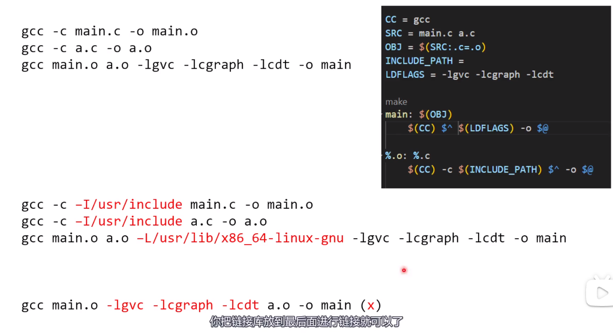

## 一、VS中如何导入动态库

1. 对要导出的动态库的函数/类添加导出标志 `_declspec(dllexport)`

```C++
#define DLL_EXPORTS

// 定义导出宏
#ifndef DLL_EXPORTS
#define DLL_API _declspec(dllimport)
#else
#define DLL_API _declspec(dllexport)
#endif


DLL_API int sum(int a, int b);		// 在要导出的函数之前添加导出标志

// 在要导出的类之前添加导出标志
class DLL_API Animal {
public:
  Animal() {}
  ~Animal() {}
};
```

2. 此时，动态库项目会生成`.dll`文件和`.lib`文件，其中`.lib`文件作为别的项目需要导入此动态库时需要添加的依赖

   

3. 创建一个demo项目进行`dll`调用

   1. 添加`dll`所需要的头文件目录到包含目录

      

   2. 添加`.lib`文件所在的库目录

      

   3. 添加依赖项，`.lib`文件包含了函数的描述和其在DLL中的位置，方便找到DLL中的入口点

      a). 在代码中添加

      ```c++
      #pragma coment(lib, "utils.lib")
      ```

      b). 在属性中添加

      

------------------

#### 如何查看gcc的默认搜索路径？

```shell
gcc -E -v -

# -E 预处理
# -v 打印输出信息（默认quiet）
# - 从stdio中读取输入
```


-------

### 把链接库放在最后面



如果在`a.o`文件中找到未定义的符号时，是不会在已经出现过的链接库中再去查找的。如果这样做会要求把所有的符号表的段表信息都存放到内存中等待查询。  

#### 通过`pkg-config`查询包所在的库路径和头文件路径

```shell
# /usr/lib/x86_64-linux-gnu/pkgconfig
cat fmt.pc

pkg-config fmt --cflags
# -I/usr/include/fmt 头文件搜索路径
pkg-config fmt --libs
# -lfmt	指定链接库文件名称

# -L/usr/lib  指定库查找路径
```

------------

### C 运行时库 （C Runtime Library）


通过Triplet（三连音？）描述一个平台：架构-操作系统-运行时库


---------------

#### 编译链接指定动态库和运行时动态库

在GCC中，可以使用`-L`选项来指定额外的库目录，也可以使用`LD_LIBRARY_PATH`环境变量来设置动态库的搜索路径。这两种方法有以下区别：

1. `-L`选项是在编译链接过程中显式指定的，它告诉编译器和链接器在指定的目录中搜索库文件。这种方式适用于特定的编译链接命令，仅在该命令执行期间生效。
2. `LD_LIBRARY_PATH`环境变量是在运行时设置的，它告诉动态链接器在指定的目录中搜索动态库。这种方式适用于在运行程序时动态加载库的情况，对所有使用该环境变量的程序生效。

区别总结如下：

- `-L`选项是编译链接过程中的静态设置，仅适用于特定命令，作用范围有限。
- `LD_LIBRARY_PATH`环境变量是运行时的动态设置，适用于所有使用该环境变量的程序，作用范围更广。

通常情况下，推荐使用`-L`选项来指定编译链接时所需的库目录，以确保编译链接的一致性和可重复性。而`LD_LIBRARY_PATH`环境变量更适合在运行时为特定的程序设置额外的动态库搜索路径，以满足特定的运行环境需求。

-----------

#### windows和linux链接的区别

* 导入库文件（Import Library）
  * 文件后缀为`.dll.a`的文件是Windows系统上的导入库文件，表现为静态库形式（Mingw-64编译器）。
  * 文件后缀为.lib的导入库则是MSVC编译器的导入库文件。

在Windows系统上，动态链接库（DLL）是用`.dll`作为文件扩展名的共享库文件。然而，为了在Windows上使用静态库（`.lib`文件）时能够与动态库的符号进行链接，通常需要一个称为导入库（Import Library）的文件。导入库文件的后缀通常是`.dll.a`。

`.dll.a`文件是GCC/MinGW工具链生成的导入库文件。它包含了用于在编译时与动态库进行符号链接的信息。这样，即使使用静态库，在链接时仍然可以引用动态库的符号。导入库文件充当了静态库与动态库之间的适配器，使得可以在编译时使用静态库，但在运行时仍然能够加载和使用动态库。

因此，`.dll.a`文件是一种用于静态链接的文件，允许在Windows系统上使用静态库与动态库进行链接。它通常由GCC/MinGW工具链生成，并在编译时用于与对应的动态库进行符号链接。

* windows下需要定义到处符号才能使用动态库

```c++
_declspec(dllexport)
```

* 动态库运行时链接方式不同
  * windows下需要将dll放在和exe同一可执行路径下
  * linux则是通过链接器ld在系统库目录和`LD_LIBRARY_PATH`中寻找动态库，不要求和可执行文件在同一路径底下

------------

#### 编译器使用平台判断


在C++中，可以使用以下宏来表示不同平台：

1. Windows 平台：
   - `_WIN32`：定义在 Windows 平台上（包括 32 位和 64 位）。
   - `_WIN64`：定义在 64 位 Windows 平台上。
2. Linux 平台：
   - `__linux__`：定义在 Linux 平台上。

这些宏在不同的编译器和操作系统中可能会有所变化，但在大多数情况下，上述宏可以用于区分 Windows 和 Linux 平台。你可以根据需要使用这些宏来编写平台相关的代码或进行条件编译。例如：

```c++
#ifdef _WIN32
    // Windows 平台相关代码
#elif __linux__
    // Linux 平台相关代码
#endif
```

请注意，这些宏只能用于判断当前编译时所在的平台，而不能用于运行时判断。如果需要在运行时动态判断当前平台，需要使用其他方式，例如使用操作系统提供的 API 函数或库函数来进行判断。