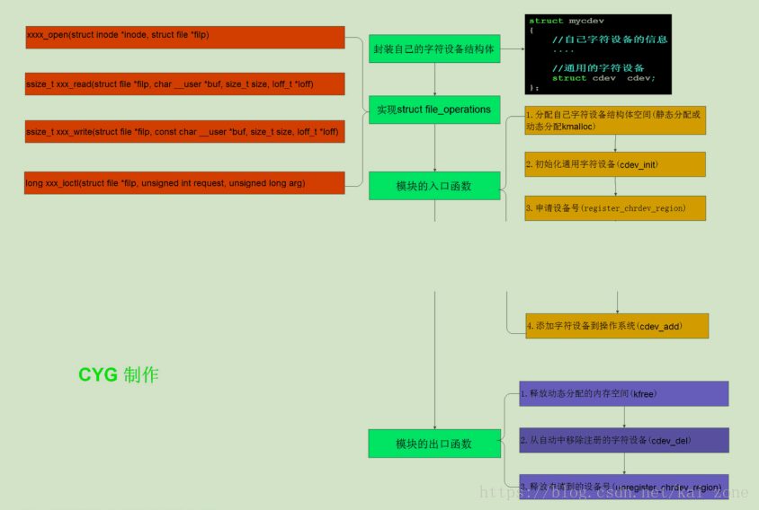
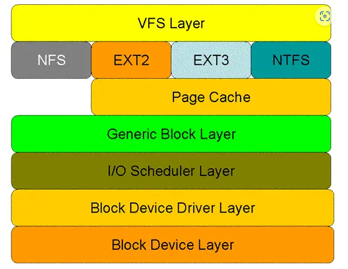
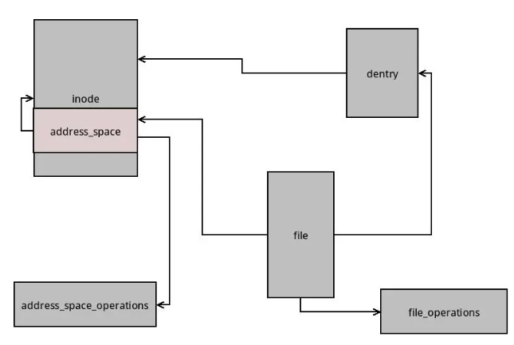
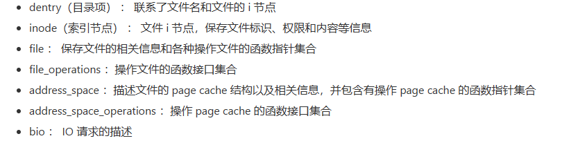

# Linux驱动开发

## 常见问题

### 如何启动Linux内核？

todo

---------

### 常见设备类型

字符设备：字符流设备，流式读取，不能定位。通过文件访问接口

块设备：按块进行访问。通用文件访问接口

网络设备：网卡接口，`loopback`。`socket`套接字访问接口

--------

### 如何编写并加载自己的驱动设备？

`module_init(dev_init) / module_exit(dev_exit)`模块初始化和模块卸载函数的注册函数

### 系统调用层次模型

* VFS（虚拟文件系统）：屏蔽下层文件系统的差异，提供一个统一的文件读写接口`open, write...`，将设备抽象成文件。
* 具体文件系统层：每一种不同的文件系统提供了自己的操作接口。
* cache层：缓存作用，提供了文件访问的性能，防止频繁的磁盘操作。
* 通用块层：接收上层磁盘、向底层发送IO请求。隐藏了底部硬件块设备的特性，统一抽象原则。
* IO调度层：接收上层IO请求，视情况进行合并，回调下一层驱动层提供的回调函数，以处理具体的IO请求。
* 块设备驱动层：取出上层IO请求，通过与硬件设备控制器发送命令，来操纵设备传输数据。
* 块设备层：不同的物理设备。

