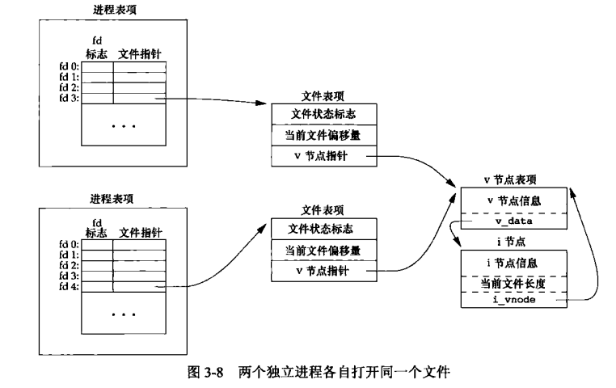
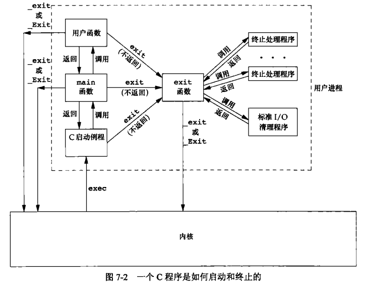
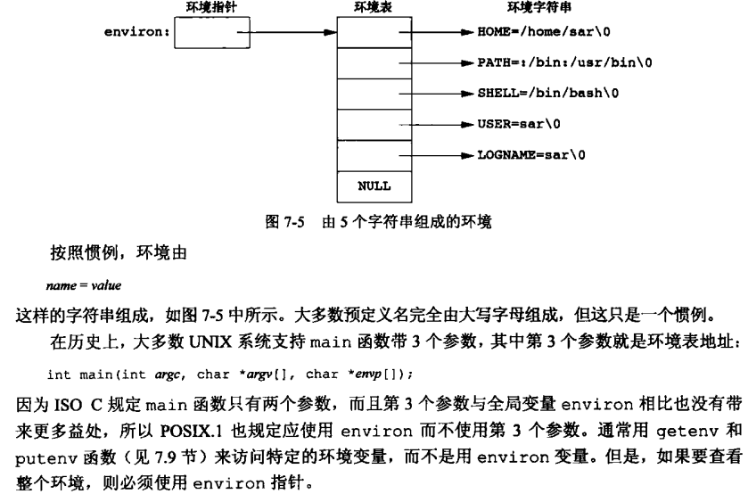
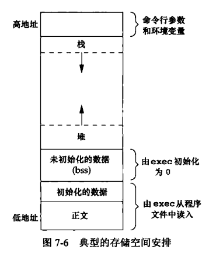
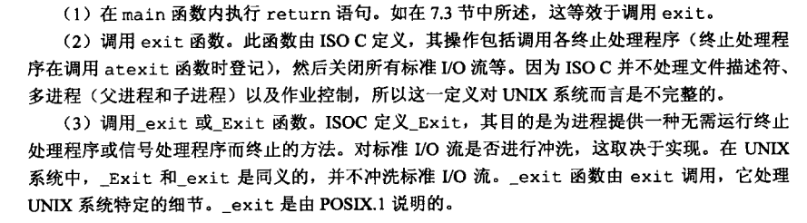
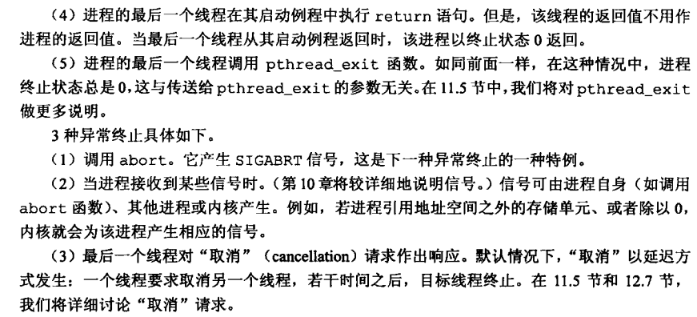
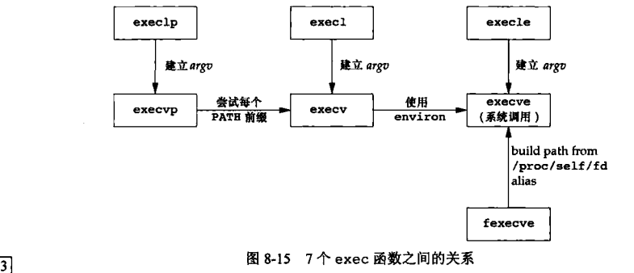

## Unix环境高级编程

文件描述符对应着不同的文件表项，文件表项可能包含了对文件的**偏移量**，**流指针**，**打开模式**，同时有可能指向通过一`inode`节点，`inode`节点对应磁盘中的一块区域的控制信息，如文件权限、数据位置和修改时间等，对应唯一的一块磁盘数据区域。

#### 进程空间

main函数执行前：由`exec`装载程序并找到内存开始执行的位置，传入命令行参数和环境变量

main函数执行后：由`atexit`注册的函数`exit handler`可以由`exit()`函数退出时自行调用，同时`exit`函数负责关闭文件描述符的资源自动回收的工作。

_exit和exit的区别？exit函数会额外的执行一些回收工作。

使用`extern char **environ`环境表而不是main函数的第三个参数

#### 进程控制

fork函数中，子进程返回pid == 0，因为子进程可以根据`getpid(), getppid()`知道自己和父进程的进程id；父进程返回pid == 子进程id，因为没有函数可以获取所有子进程的id。

子进程和父进程之间共享文件表，即打开文件的偏移量只有一个，需要考虑到进程之间的同步问题。通常可将用不到的文件描述符进行关闭，防止冲突。

* 父进程希望复制自己，使得父进程和子进程执行不同的代码，如监听网络请求，fork并处理
* 一个进程要执行不同的应用程序，先fork再exec，即spawn，如shell中执行命令

5种正常终止和3种异常终止情况：

**子进程正常/异常退出时会发生什么？** 

子进程向父进程发送一个`SIGCHLD`信号，父进程默认忽略，但也可通过信号处理函数`signal_handler`执行某些处理

**父进程等待子进程执行完毕**

调用`wait`函数，来等待一个执行完毕并返回的子进程id，如果无一返回则阻塞，如果无子进程则返回-1

调用waitpid函数，可灵活控制选项是否阻塞等

父子进程之间存在竞争关系

**exec做了什么？**

将一个新程序替代当前的程序的代码段、数据段、bss段，但是进程pid不变

