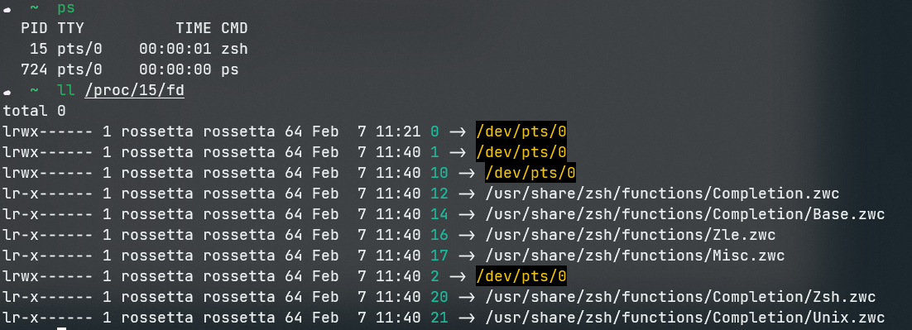
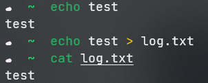

## 文件描述符

* 0：标准输入
* 1：标准输出
* 2：标准错误

万物皆文件，文件描述符FileDescriptor（fd）是文件的唯一标识

### 如何查看一个进程占用的文件描述符？

1. 得到进程id `ps`
2. 在`/proc/${pid}/fd`路径下，有进程所占用的文件描述符信息

-------

## 重定向

一般命令的输出结果会显示给标准输出(fd = 1)，利用重定向可以将输出的信息打印到log文件中

其中，`>&`表示重定向到一个文件描述符，否则`>`会被认为是重定向为文件名

**脚本中的常用写法：`{command} > /dev/null 2>&1`**

其中，第一个`>`表示将命令的输出内容从标准输出（fd=1）重定向到/dev/null，这是一个只写文件，只能往里面写而读不到任何东西，可看做删除了输出的信息。

第二个`>&`表示将标准错误（fd=2）重定向到标准输出（fd=1）中，而标准输出（fd=1）已经重定向给了/dev/null，所以标准输出（fd=1）和标准错误（fd=2）都定向到了/dev/null，即都不显示