# 第三章、进程

在Linux源代码中，常把进程称之为任务（task）或者线程（thread）。

在Linux系统中，对多线程进程的支持依赖于轻量级进程（LWP）。

---------

## 1. 进程、轻量级进程和线程

进程的目的就是担当分配系统资源（CPU时间、内存等）的实体。

进程通过fork系统调用时创建，创建时和父进程几乎相同。并从fork调用的下一句开始执行相同的代码，父子进程共享含有程序代码的页（正文），但是也有各自独立的数据拷贝（栈和堆，copy on write），父子进程之间对内存单元的修改是相互不可见的。

早期的多线程进程不能真正意义上的并行，所以无法让一个线程（执行流）进行真正的阻塞。Linux采用轻量级进程（lightweight process）对多线程应用程序提供更好的支持。一个简单的实现方式是将轻量级进程和线程逐个关联起来。

---------

## 2. 进程描述符

内核必须对每个进程所做的事情进行清除的描述。包括：进程的优先级、进程运行状态、地址空间分配范围、允许访问的文件描述符列表等等。

进程描述符（process descriptor）来进行表述，在Linux内核中，通过`task_struct`类型结构来进行表示。

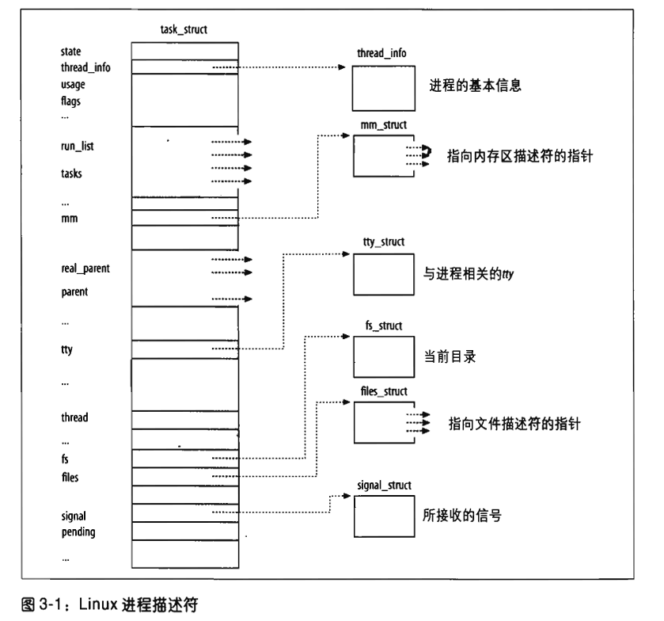

### 2.1 进程状态

上述进程描述符中`state`字段代表了进程的状态。

* 可运行状态（TASK_RUNNING)——运行、待命
* 可中断的等待状态（TASK_INTERRUPTIBLE）——挂起（睡眠）。可被硬件中断或接收一个信号唤醒。
* 不可中断的等待状态（TASK_UNINTERRUPTIBLE）——无法接收信号的睡眠状态。防止被中断，在一些硬件驱动程序进行硬件设备探测的时候会用到。
* 暂停状态（TASK_STOPPED）——进程的执行被暂停。当进程接收到SIGSTOP、SIGTSTP、SIGTTIN、SIGTTOU信号时，会进入暂停状态。
* 跟踪状态（TASK_TRACED）——进程执行被debugger进程暂停。
* 僵死状态（EXIT_ZOMBIE）——进程执行终止但是父进程没有通过`wait4()`或者`waitpid()`调用来返回死亡进程相关的信息。**在父进程调用`wait`之前，系统只能保留僵死进程相关的信息，以保证父进程的需要。**
* 僵死撤销状态（EXIT_DEAD）——最终状态，接收到父进程的`wait`调用之后，进程由系统进行删除。为了防止其他执行线程也执行`wait`调用从而引发竞争，则将进程的状态转为此状态。

```c++
p->state = TASK_RUNNING;
```

------------

### 2.2 标识一个进程

能被独立调度的每个执行上下文都必须拥有它自己的进程描述符；轻量级进程共享大部分的内核数据结构，且也拥有自己的`task_struct`结构。

通过**进程描述符地址**来标识进程，进程描述符指针指向这些地址，内核对进程的大部分引用是通过进程描述符指针进行的。

用户可通过**PID**来标识进程，存放在进程描述符的`pid`字段中，按顺序进行编号和递增，在不够时进行循环使用。PID的最大值通过`PID_MAX_DEFAULT`指定，系统管理员可以在`/proc/sys/kernel/pid_max`中进行修改。

内核通过一个**`pidmap-array`位图**来表示当前已经分配的PID号和闲置的PID号，一个4KB的页框包含32768个位，在32位体系结构中`pidmap-array`位图存放在一个单独的页中。

为了使一个多线程应用的所有线程具备相同的pid，Linux引入了线程组的表示。**一个线程组中的所有线程使用和该线程组的领头线程（thread group leader）相同的PID，也就是改组中第一个轻量级进程的PID。**存入了进程描述符的`tgid`字段中。`getpid()`返回的是`tgid`的值，而不是`pid`。

#### 进程描述符处理

进程是动态实体，内核需要同时处理很多进程，所以**进程描述符存在于动态内存（堆区）中**。Linux把两个不同的数据结构紧凑的存放在一个单独为进程分配的存储区域中：一个是内核态的进程堆栈，另一个是紧挨进程描述符的小数据结构`thread_info`，即线程描述符。这两块结构存放在两个连续的页框中。

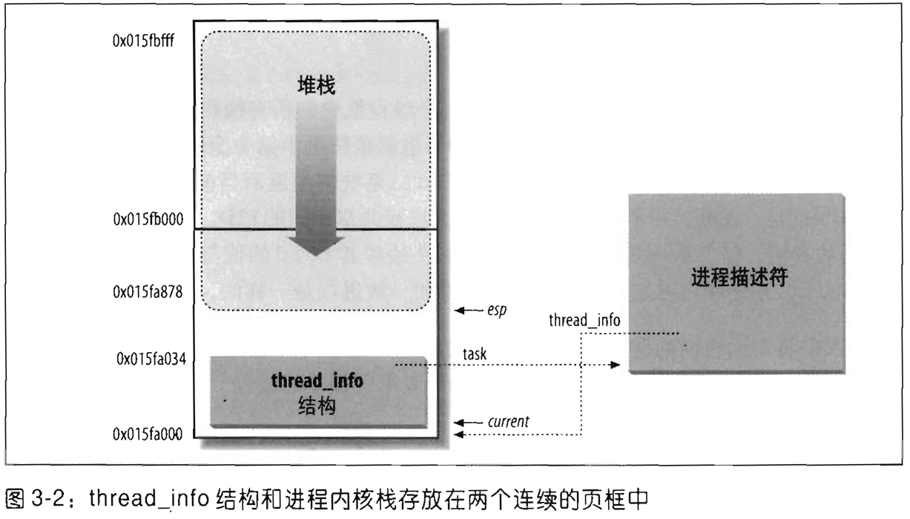

从用户态切换到内核态使，进程的内核栈总是空的，esp寄存器指向堆栈顶端，一旦数据写入堆栈，esp的值就开始递减。

#### 标识当前进程

根据上述处理过程可知：`thread_info`结构和内核态堆栈之间紧密结合，内核**很容易从esp寄存器的值获取当前在CPU上正在运行进程的`thread_info`结构的地址**。由`current_thread_info()`函数来完成。

##### **如何获取进程描述符指针？**

内核调用current宏，等价于`current_thread_info()->task`

```assembly
movl $0xffffe000, %ecx	/* 或者是用于4k堆栈的0xfffff000 */
andl %esp, %ecx
movl (%ecx), p          /* task在thread_info中的偏移量为0 */
```

**通过将内核栈和进程描述符放在一起，对于每个硬件处理器，仅通过检查栈就可以获得正确的进程。**

#### 双向链表

Linux内核定义了`list_head`的数据结构来实现了双向链表的原语，其`next`和`prev`分别表示通向双向链表向后和向前的指针元素。

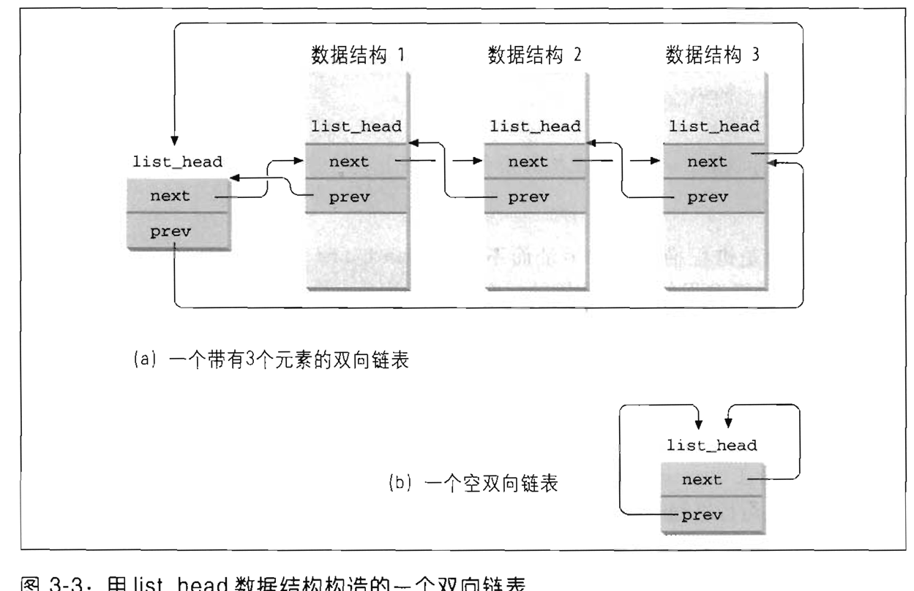

如果一个数据结构中包含了一个`list_head`，则`list_head->next`指向的是下一个`list_head`的地址，而不是这整个数据结构的地址。

一般来说，`list_head`会包含在宿主数据结构中，通过一系列相关的接口可以访问宿主结构。如访问链表所在的宿主结构使用`list_entry(ptr, type, member)`宏

```c
#define list_entry(ptr, type, member) \
	    container_of(ptr, type, member)

#define container_of(ptr, type, member) ({			\
        const typeof( ((type *)0)->member ) *__mptr = (ptr);	\
        (type *)( (char *)__mptr - offsetof(type,member) );})
```

详细的接口见`linux/include/list.h`

#### 进程链表

> 进程链表将所有的进程描述符链接起来。

每个`task_struct`都包含一个`list_head`类型的`tasks`字段，`next`和`prev`字段分别指向下一个/上一个`task_struct`元素。

进程链表的头是`init_task`描述符，即0进程（process 0）或者swapper进程（详见[内核线程](#内核线程)）的进程描述符。`init_task.tasks.prev`指向链表中最后插入的进程描述符的`tasks`字段。

`SET_LINKS`和`REMOVE_LINKS`分别从进程链表中插入和删除一个进程描述符。

`for_each_process`宏扫描整个进程链表:

```c
#define for_each_process(p) \
	for (p = &init_task; (p = list_entry((p)->tasks.next, \
						struct task_struct, tasks) \
						) != &init_task; )
```

#### TASK_RUNNING状态的进程链表

早期Linux版本将可运行进程放到一个运行队列（runqueue）的链表中，但是维持链表的进程按优先级排序开销过大，需要扫描整个队列。

Linux 2.6实现运行队列的目的在于：固定时间内选出“最佳”可运行进程，与进程数无关（详见第七章）。

**多级反馈优先级队列：**

建立多个可运行进程链表，每种进程优先级对应一个链表。每个进程描述符`task_struct`包含一个`list_head`的字段`run_list`，根据进程的优先权放入不同的链表中。

通过`prio_array_t`存放运行队列，最多140个优先级

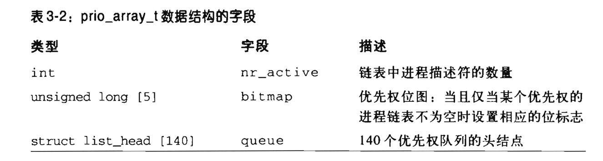

`enqueue_task(p, array)`函数把进程描述符插入某个运行队列的链表

```c
list_add_tail(&p->run_list, &array->queue[p->prio]);	// 根据p的优先级p->prio找到优先级队列，再将p->run_list插入
__set_bit(p->prio, array->bitmap);	// 设置优先权位图
array->nr_archive++;
p->array = array;
```

-------

### 2.3 进程间的关系

> 进程之间包含父子关系和兄弟关系。
>
> 进程0和进程1是由内核创建的；进程1（init）是所有进程的祖先。

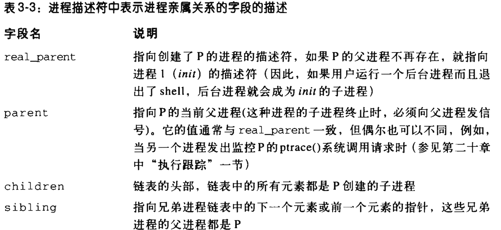

--------

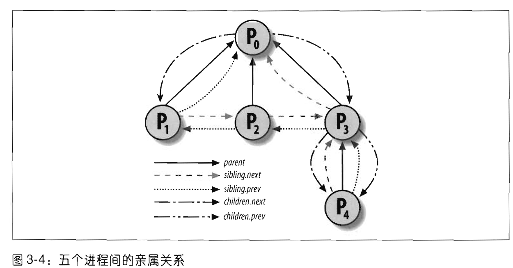

进程间的其他关系包括：

* 一个进程组或者登录会话的领头进程
* 一个线程组的领头进程
* 跟踪其他进程执行

#### pidhash表和及链表（通过PID快速查找进程描述符指针）

一些情况下，需要从PID获取进程的进程描述符指针。如发送信号时，进行`kill()`系统调用，此时需要通过pid获取进程描述符指针，再通过进程描述符指针取出记录挂起信号的数据结构指针。

为了加速查找进程描述符指针而避免进行遍历，引入了4个散列表（哈希表）。因为进程描述符包含了表示不同类型PID的字段，每种PID都需要自己的散列表。

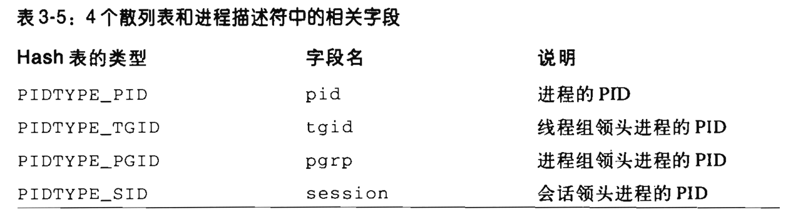

**内核初始化期间动态地分配4个散列表，并将其地址放在`pid_hash`数组**，散列表的长度依赖于RAM的大小。

1. 通过`pid_hashfn(pid)`宏将PID转为表索引。
2. 通过双向链表来解决哈希冲突。
3. 定位在哈希表中的进程描述符指针

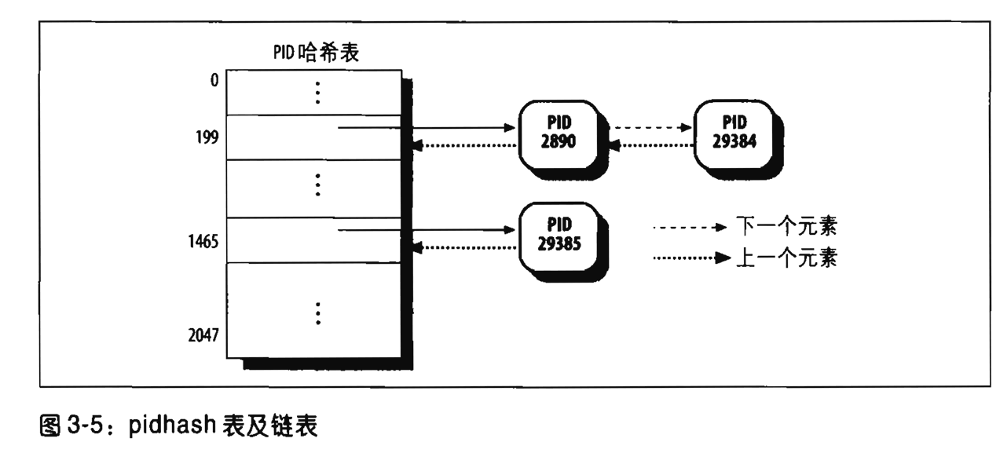

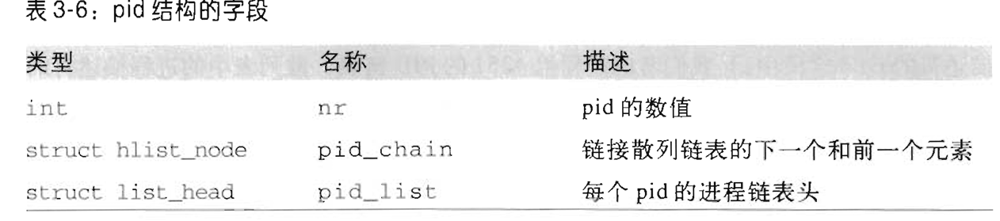

进程描述符的pid字段如上图，它们可以为任意一个包含在散列表中的PID号定义进程链表。

TGID哈希表中，存放的是`hlist_head`结构。

```c
struct hlist_head {
  hlist_node* first;	// 指向第一个节点  
};

struct hlist_node {
  hlist_node* next;		// 指向下一个节点
  hlist_node** pprev;	// 指向上一个节点的next字段，方便删除头节点时，可以和hlist_head不做区分（&hlist_head.first和&hlist_node->next同类型）
};
```

**`hlist_node`结构描述的是哈希冲突的pid进程所形成的链表；`list_head`所描述的是进程链表，如`tgid`线程组。**

如下图所示：

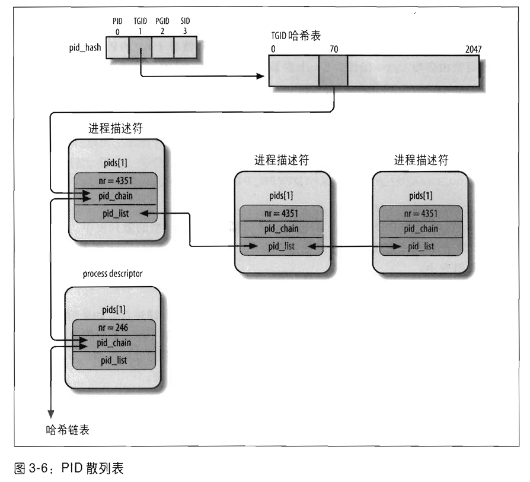

上图在TGID哈希表中的第71项中有两个PID号为4351和246的进程描述符，即`task_struct.pid.nr = 4351`

线程组4351的PID链表如上图所示用`list_head`表示。

```c
struct list_head {
  list_head* next;
  list_head* prev;
};
```

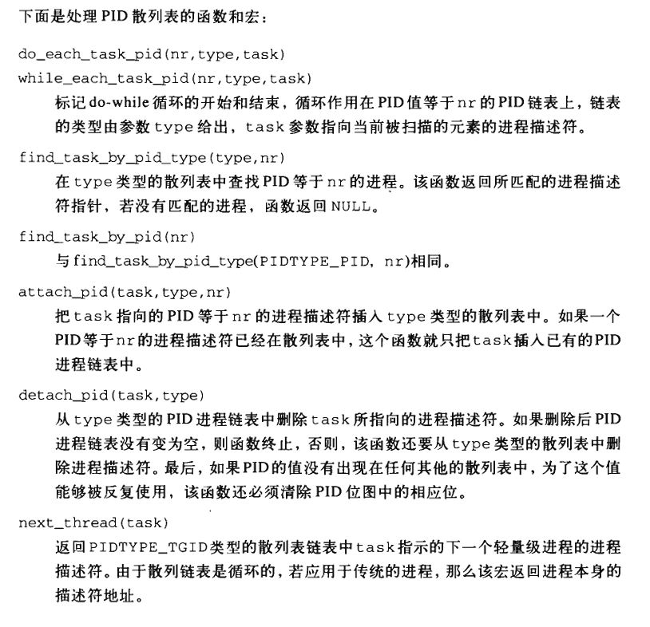

------------

### 2.4 如何组织进程

运行队列链表将处理`TASK_RUNNING`状态的所有进程组织在一起。对于其他的状态的进程来说：

* `TASK_STOPPED, EXIT_ZOMBIE, EXIT_DEAD`，即暂停、僵死、死亡状态只需要通过pid或者特定父进程的子进程链表访问即可。

#### 等待队列

进程通常需要等待某些事情的发生：**等待磁盘操作终止、等待释放系统资源等**。

等待队列实现了在事件上的条件等待：希望等待特定事件的进程把自己放进合适的等待队列，并放弃控制权。**等待队列表示一组睡眠的进程**，当某一条件为真时，由内核唤醒它们。

等待队列也是双向链表，包括了指向进程描述符的指针。等待队列头结构如下：

```c
struct __wait_queue_head {
  spinlock_t lock;		// 保护双向链表避免中断处理程序或者内核函数同时访问
  struct list_head task_list;
};
typedef struct __wait_queue_head wait_queue_head_t;
```

等待队列链表中的元素类型为`wait_queue_t`，代表一个睡眠进程，等待某一个事件的发生。等待队列链表元素如下：

```c
struct __wait_queue {
    unsigned int flags;		// 标记是否为互斥线程
    struct task_struct* task;	// 进程描述符指针
    wait_queue_func_t func;		// 表示等待队列中的睡眠进程应该以什么方式唤醒（函数指针）
    struct list_head task_list;	// 等待队列链表
};
typedef struct __wait_queue wait_queue_t;
```

* 互斥进程`flags = 1`：由内核有选择的唤醒，避免等待进程之间抢占资源导致的竞争（如等待进入临界区）
* 非互斥进程`flags = 0`：总是在内核发生事件时唤醒。

--------

#### 等待队列的操作

关于等待队列的操作详见`linux-2.6.11/include/linux/wait.h`

包括一系列的`wake_up`唤醒函数。

----------

### 2.5 进程资源限制

对于进程有一组相关的资源限制（resource limit），限制了进程能使用的系统资源数量。

资源限制放在进程的信号描述符字段，即`current->signal->rlim`字段。结构如下，每个资源限制对应一个元素：

```c
struct rlimit {
    unsigned long rlim_cur;		// 当前资源限制
    unsigned long rlim_max;		// 资源限制所允许的最大值
};
```

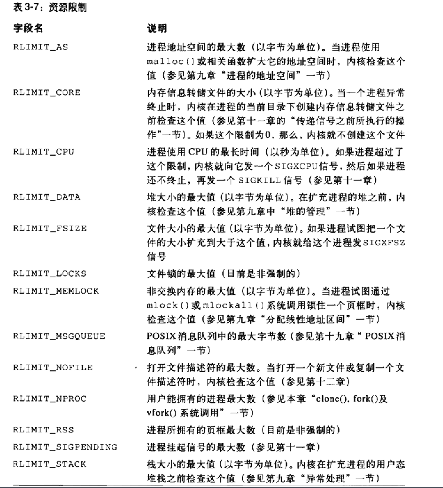


## 3. 进程切换

-----------

## 4. 创建进程

-------------

## 5. 撤销进程

