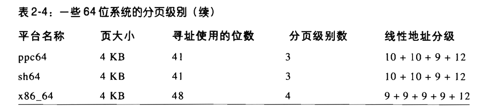

# 第二章、内存寻址

## 1.内存地址

* 逻辑地址（logical address）：由段（segment）和偏移量（offset）组成。
* 虚拟地址/线性地址（virtual address）：32bit机器上，可使用`uint32_t`来表示`0x00000000`到`0xFFFFFFFF`范围的内存单元。
* 物理地址（physical address）：用于内存芯片级的内存单元寻址。与从微处理器的地址引脚发送到内存总线上的电信号相对应。

**内存控制单元（MMU）**通过一种称为分段单元（segmentation unit）的硬件电路把一个逻辑地址转换成线性地址；接着第二个分页单元（paging unit）的硬件电路把线性地址转换成一个物理单元。

RAM内存中也有芯片，多个CPU使用同一块内存，意味着多个CPU可以并发访问RAM芯片，但在RAM芯片层面对内存的读写操作必须串行的执行。

内存仲裁器（memory arbiter）的硬件电路在总线和RAM芯片之间，用于将多个并行访问的CPU请求转为串行。对于软件层面，内存仲裁器是隐藏细节。

---------

## 2.硬件中的分段

从80826开始，Intel微处理器以两种不同的方式执行地址转换，分别为**实模式（real mode）**和**保护模式（protected mode）**

* 实模式：维持处理器与早期模型兼容，并让操作系统自举
* 保护模式：具有用户态和内核态

------

### 2.1 段选择符和段寄存器

> 逻辑地址 （logical address）= 段选择符（segment selector）+ 偏移量（offset）

* 段选择符：通过段寄存器直接访问段地址
  * cs：代码段寄存器，指向程序指令段；包含了一个2位的字段，用于指明当前CPU特权级（current privilege level），0代表最高优先级（内核态），3代表最低优先级（用户态）。
  * ss：栈段寄存器，指向当前程序栈段
  * ds：数据段寄存器，指向静态或者全局数据段
  * es、fs、gs：一般寄存器，可指向任意数据段

### 2.2 段描述符（segment descriptor）

> 段描述符为8字节，用于表示段的特征。

#### 段描述符存放于GDT或者LDT中

段描述符位于全局描述符表中（Global Descriptor Table，GDT）或者局部描述符表中（Local Descriptor Table，LDT）中。

GDT具有其唯一性，如果进程中除了GDT所包含的段还需要创建附加段，则创建LDT。

GDT一般位于内存中，其地址和大小放在`gdtr`控制寄存器中；当前在使用LDT的地址和大小存放于`ldtr`控制寄存器中。

段描述符为8字节长，它在GDT或者LDT中的相对地址是有段选择符的最高13位的值乘以8得到的；GDT表中第一个表项设置为0，代表了空段选择符时的逻辑地址无效；保存在GDT中的段描述符的最大数目是`2^13 - 1 = 8191`

#### 段描述符的内容

段描述符一般包括段的线性地址、段的大小、段的类型、段的特权级（descriptor privilege level）等等，示意如下：

各字段含义如下：

#### 如何判断一个指令是否能够访问当前段？

通过cs段中的CPL和段描述符中的DPL判断；即当`CPL <= DPL`时，即当前指令的特权级更高，能够访问当前段。

#### 常见的段描述符类型

* 代码段描述符：存放于GDT或者LDT中。将S标志位设置为1（非系统段）
* 数据段描述符：存放于GDT或者LDT中。将S标志位设置为1，栈段一般通过一般的数据段来实现
* 任务状态段描述符（TSSD）：只能存放于GDT中。代表一个任务状态段（TSS），<u>用于保存处理器寄存器的内容</u>
* 局部描述符表描述符（LDTD）：只能存放于GDT中，代表一个包含LDT的段

#### 快速访问段描述符

段寄存器仅仅存放了段选择符，一般来说需要从段选择符在GDT或者LDT中查找段描述符。

为了加速对逻辑地址到线性地址的转换，80x86提供了一种附加的非编程的寄存器直接包含了8个字节的段描述符，**每当一个段选择符被装入段寄存器时，相应的段描述符就由内存装入到对应的非编程CPU寄存器**。从而避免了对GDT和LDT的访问，如下图所示。

#### 分段单元

> 分段单元是MMU中的一部分，执行将逻辑地址转为线性地址的工作，其步骤如下

1. 检查段寄存器中的段选择符，查看TI字段，以判断段描述符在哪个描述符表中。
2. 访问`gdtr`寄存器或者`ldtr`寄存器，获取GDT和LDT的线性地址。
3. 从段选择符的index字段计算段描述符的地址。index字段乘以8（一个段描述符的大小），并与`gdtr`寄存器或者`ldtr`寄存器中的内容（描述符表开始位置）相加。
4. 将逻辑地址的偏移量与上述获取的段描述符的Base字段相加则得到了线性地址。

**段选择符 --> 查描述符表 --> 段描述符 --> 叠加段偏移 -->线性地址**

---------

## 3. Linux中的分段

> 进程中的分段机制鼓励程序也进行划分成逻辑上相关的实体，例如子程序或者全局与局部数据区域。
>
> 分段用于给一个进程分配不同的线性地址空间，分页可以把统一线性地址空间映射到不同的物理空间。

与分段相比，Linux更喜欢使用分页的方式。

* 当所有的进程使用相同的段寄存器值时，内存管理变得简单，能共享同样的一组线性地址
* 作为跨平台的需求，RISC体系结构对分段支持有限

因此，Linux主要使用一对相同的段来进行管理指令和数据。

* 用户代码段和用户数据段
* 内核代码段和内核数据段

上述段选择符则由`__USER_CS, __USER_DS, __KERNEL_CS, __KERNEL_DS`分别定义，如需要对内核代码进行寻址，将`__KERNEL__CS`放入`cs`段寄存器即可。当内核态和用户态进行切换时，相应的`ds`寄存器和`ss`也需要自动的调整。

-----------

### 3.1 Linux GDT

> 多处理器系统一个一个CPU对应一个GDT，存放在`cpu_gdt_table`中。所有的GDT地址和大小则存放于`cpu_gdt_descr`中。

Linux中的GDT表包含18个段描述符和14个空的，未使用的或保留项。（为了补全以适应32字节的硬件高速缓存）

其中18个段包括：

* 上述4个主要段（用户代码段、用户数据段、内核代码段、内核数据段）。
* 任务状态段（TSS）：每个CPU有一个，其地址空间范围应该是内核数据段的子集，用于保存任务的状态信息于内核空间中。
* 1个包括缺省局部描述符表的段：通常是被进程共享的LDT。
* 3个局部线程存储段（Thread-Local Storage，TLS）段：用于存放线程局部私有的数据的数据段，其他线程只会保存线程局部数据的副本，互不影响。使用`set_thread_area()`和`get_thread_area()`分别为正在执行的进程创建和撤销一个TLS段。
* 与高级电源管理（AMP）相关的3个段：由于BIOS代码使用段，供Linux APM驱动程序调用BIOS函数时，使用的自定义的代码段和数据段。
* 与支持即插即用（PnP）功能的BIOS服务程序相关的5个段：由于BIOS例程使用段，供Linux PnP驱动程序调用BIOS函数时，使用的自定义的代码段和数据段。
* 被内核用来处理“<u>双重错误</u>”（处理异常时发生的另一个异常）异常的特殊TSS段（见第四章-异常）

-----------

### 3.2 Linux LDT

大多数Linux进程不适用LDT表，故提供了一个共享的LDT供大多数进程使用，存放于`default_ldt`数组中。

某些情况下，进程仍需要创建自己的局部描述符表，如`wine`。

------------------

## 4. 硬件中的分页

> 分页单元（paging unit）把线性单元转换成物理地址。其中关键是将所请求的访问类型和线性地址的访问权限相比较，如果内存访问无效则触发缺页异常。

线性地址被分为固定长度单位的组，称为页（page），页内部连续的线性地址被映射到连续的物理地址中。

分页单元将所有的RAM一起分割成页框（page frame），即物理页。每一个页框包含一个页，长度一致。一般来说是4k。

页框是主存的一部分，是物理概念，代表一个存储区域。页只是代表一个数据块，可用页框存放页。

将线性地址映射到物理地址的数据结构称为页表（page table）。启动时内核负责对页表进行初始化，放在主存中。

-------------

### 4.1 常规分页

从80386开始，Intel处理器的分页单元处理4KB的页。32位的线性单元被分为3个域：

* Directory（目录）最高10位
* Table（页表）中间10位
* Offset（偏移量）最低12位

线性地址到物理地址经过多级页表的转换：第一次查询页目录表（page directory），第二次查询页表（page table）。

页目录项和页表项都包含相同的结构，每项都包含下列以下的字段，用作表征**页权限控制、页属性、页地址**等：

* Present标志
* 包含页框物理地址最高20位的字段，可指向页表或者页
* Accessed标志
* Dirty标志
* Read/Write标志
* User/Supervisor标志
* PCD和PWT标志
* Page Size标志
* Global标志

---------

### 4.2 扩展分页

> 80x86微处理器引入了扩展分页（extended pageing），它允许页框大小为4MB而不是4KB。
>
> 通过扩大页的大小，将大段的线性地址空间转换为物理地址，内核可以不使用中间页表进行地址转换，减少了地址访问的时间，节省了页表的内存，并保留TLB（快表）项。

----------------

### 4.3 硬件保护方案

页和页表相关的特权级只有两个，由前面“常规分页”所提到的页目录项（Directory）和页表项（Table）的**User/Supervisor**标志所控制。

段的3种存取权限（读，写，执行），页有2种存取权限（读，写），由**Read/Write**标志所控制。

---------

### 4.4 常规分页举例

假设为进程分配了线性地址空间为`0x20000000 ~ 0x2003ffff`，正好由64页组成。分析如下

`0b'0010'0000'0000'0000'0000'0000'0000'0000 ~ 0b'0010'0000'0000'0011'1111'1111'1111'1111`，其中页目录的地址范围为`00'1000'0000`，即只占据了一个页目录表项，其地址为`0x80`；其中页的地址范围为`00'0000'0000 ~ 00'0011'1111`，共占据64页，从`0 ~ 0x03f`。

如下图所示，如果其他的空间未分配给进程，则其页目录项和页表项都为空。

----------

### 4.5 物理地址扩展（PAE）分页机制

处理器所支持的RAM容量受地址总线上的地址管脚数量所限制。为适应增加的地址管脚，如32 -> 36，**将同样大小的线性地址映射到更大的物理地址空间中**，Intel引入了一种物理地址扩展（Physical Address Extension，PAE）的机制。

包括设置`cr4`控制寄存器种的物理地址扩展（PAE）标志，同时启用大尺寸页（2MB）。

为了支持PAE，改变了如下的分页机制：

* 64GB的RAM需要用$2^{24}$个页框来表示，则表示物理地址的字段从20变成了24位，原表项包含了12个标志位和20位地址，现在变成了12个标志位和24位地址，则页表项的大小从32位变成了64位。**一个4KB的页表包含512个表项而不是1024个表项**。
* 引入一个叫做页目录指针表（Page Directory Pointer Table，PDPT）的页表新级别，由4个64位表项组成（32位能用一个页表表示。
* `cr3`控制寄存器包含一个27位的页目录指针表（PDPT）基地址字段
* 当把线性地址映射到4KB的页时，32位线性地址按如下进行解释：

* 当把线性地址映射到2MB的页时，32位线性地址按下列方式解释：

如上述所示：线性地址仍然是32位长，PAE并没有扩大进程的线性地址空间，它只负责扩大物理地址。

物理地址位数的增大导致表项从32位变成64位，同样4KB的页表表项从1024减小为512，在线性地址中占据9位进行寻址。原始的线性地址为`10+10+12`，只有一个页目录表就能表示32位线性地址，映射到32位的物理地址。PAE同样4KB页表的线性地址表示为`2+9+9+12`，特别的用头2位来表示4个页目录表，表示32位线性地址映射到36位的物理地址。

---------------

### 4.6 64位系统中的分页

> 64位系统一般只采用48位的地址空间来进行寻址，最多能够使用256TB的内存空间。

假设能够使用4KB大小的页，偏移占据12个bit，`48 - 32 = 36`的位用于划分页目录表和页表，还是具备了太多的表项（$2^{18}$），过于占据内存空间。

基于上述原因，64位的CPU的硬件分页采用了额外的分页级别，即多级页表。

`x86_64`系统使用了4级页表的方式进行地址转换，每一级页表使用了512个项，一个表项8个字节64bit。

----------------

### 4.7 硬件高速缓存

> CPU的时钟周期是几GHz，而动态RAM（DRAM）芯片的存取时间是时钟周期的数百倍。为了缩小CPU指令和内存存取速度之间的不匹配，引入了硬件高速缓存内存（hardware cache memory），并基于局部性原理（locality principle）。
>
> 高速缓存引入行（line）的概念，由连续几十个字节组成。**行通过脉冲突发模式（burst mode）在内存（DRAM）和高速缓冲（SRAM）中进行传送，以实现高速缓存。**

高速缓存和内存之间有以下几种关系：

* 直接映射（direct mapped）：主存中的行和高速缓存中的行位置直接对应。
* 充分关联（fully associative）：主存中任意行可以放在高速缓存中任意行。
* N-路组关联（N-way set associative）：主存中的任意行可以放在高速缓存中N行中的任意一行中。

实际运行中，通过高速缓存控制器（cache controller）和高速硬件缓存（hardware cache memory）来相互配合。

高速缓存控制器中需要存放**表项数组**，每个表项对应高速缓存内存中的一个行，每个表项包含标签（tag）和描述高速缓存状态的标志（flag）。

当访问一个RAM存储单元时，首先会与缓存进行比较，造成缓存命中（cache hit）和缓存没有命中（cache miss）。

命中缓存时，高速缓存控制器执行不同的操作，对于读操作，直接从缓存中读取数据到CPU，避免了对内存的访问从而节省时间；对于写操作，可能根据策略触发**通写（write-through），即既写RAM也写高速缓存行，为了提高写操作的效率关闭高速缓存**，也可能触发**回写（write-back），即只写高速缓存行，不改变RAM的内容，等待回写结束后再更新RAM**。

当CPU执行FLUSH命令或者收到一个FLUSH硬件信号时，将高速缓存行写回到RAM中。

处理器的`cr0`寄存器的`CD`标志用来启用或者禁用高速缓存电路。寄存器中的`NW`标志指明高速缓存是使用通写还是回写策略。

**Linux清除了所有页目录项和页表项的`PCD`和`PWT`标志，对于所有页框都启用高速缓存且对于所有写操作都采用回写策略。**

------------

### 4.8 转换后援缓冲器（TLB）

> TLB（Translation Lookaside Buffer）是一种高速缓存，用于加快线性地址的转换。TLB用于记录慢速多级页表访问得到的物理地址，记录一个TLB表项（TLB entry），以便以后对同一个线性地址的引用可以快速转换。

多处理器系统中，每个CPU都包含一个TLB。

与cache不同的是，TLB中的对应表项不必要同步，多进程视图中，各个进程可以使同一线性地址映射到不同的物理地址上。修改CPU的`cr3`控制器后则表示本地TLB中所有项失效，表示新的一组页表被启用，而TLB指向的是旧数据。

频繁的进程切换会导致TLB频繁失效，从而增加内存访问的时间。

-----------------

## 5. Linux中的分页

> Linux采用了适用于32位和64位的普通分页模型。

Linux 2.6.11版本采用四级分页模型，分别为：

* 页全局目录（Page Global Directory）
* <u>页上级目录（Page Upper Directory）</u>
* <u>页中间目录（Page Middle Directory）</u>
* 页表（Page Table）

**对于没有启动物理地址扩展的32位系统**，采用两级页表，即使页上级目录和页中间目录为0，取消了这两级字段。

Linux内核代码中，页上级目录和页中间目录在指针序列中的位置被保留，以保证32位系统和64位系统代码兼容；通过将这两级页目录表的页目录项数设置为1，并映射到页全局目录的一个适当的目录项实现。

**对于采用了物理地址扩展的32位系统**，采用三级页表，页全局目录对应80x86的页目录指针表（PDPT），取消页上级目录。

**64位系统**使用三级还是四级分页取决于对线性地址位的划分。

Linux把`cr3`控制寄存器的内容保存在前一个执行进程的描述符中，然后把下一个要执行进程的描述符的值装入`cr3`寄存器中，用于进程切换时，分页单元进行页表的切换。

------------

### 5.1 线性地址字段

通过一系列宏简化页表处理:

`PAGE_SHIFT`：指定Offset字段的位数

`PMD_SHIFT`：指定线性地址的Offset字段和Table字段的总位数

`PUD_SHIFT`：确定页上级目录项能映射的区域大小的对数

`PGDIR_SHIFT`：确定页全局目录项能映射的区域大小的对数

-------

### 5.2 页表处理

> 详细见深入理解Linux内核p66

pte_t、pmd_t、pud_t和pgd_t分别描述页表项、页中间目录项、页上级目录项、页全局目录项的格式

--------------

### 5.3 物理内存布局

在初始化阶段，内核必须建立一个物理地址映射来指定哪些物理地址范围对内核可用而哪些不可用。

下列页框记为保留：

* 不可用的物理地址范围内的页框
* 含有内核代码和已初始化的数据结构的页框

内核会被安装在RAM中从物理地址`0x00100000`开始的地方，即从第二个MB开始，因为：

* 页框0一般由BIOS使用，进行自检等得到的硬件系统配置
* 物理地址从`0x000a0000`到`0x000fffff`的范围留给BIOS例程，存在但被保留，操作系统不能使用
* 第一个MB内的其他页框可能会由特定计算机模型保留

-----------

### 5.4 进程页表

进程线性地址空间分为内核态空间（高地址）和用户态空间（低地址），内核态空间只有内核能够访问。

一般来说通过`PAGE_OFFSET`的值`0xc0000000`来划分用户态和内核态空间。

----------

### 5.5 内核页表

内核维持一组自己使用的页表，驻留在**主内核页全局目录（master kernel Page Global Directory）**中。

主内核页全局目录的最高目录项部分作为参考模型，为系统中每个普通进程对应的页全局目录项提供参考模型。

**内核如何创建自己的内核页表？**

1. 内核创建一个有限地址空间，包括内核的代码段和数据段、初始页表和用于存放动态数据结构的共128KB大小的空间。
2. 内核利用剩余的RAM并适当地建立分页表。

---------

### 5.6 固定映射的线性地址

内核至少会留出128MB的线性地址空间，用于非连续内存分配和固定映射的线性地址。

固定映射的线性地址（fix-mapped linear address）是一种常量线性地址，其对应的物理地址可以以任意方式建立。通常内核使用固定线性地址来替代指针变量，这些指针变量的值从不改变。

间接引用一个指针变量时，会多一次内存的访问。每个固定映射的线性地址都存在于第4个GB的末端。

------------------

### 5.7 处理硬件高速缓存和TLB

