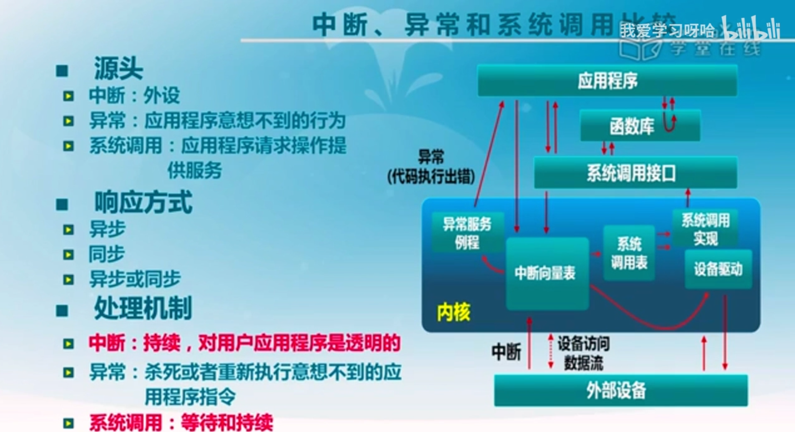
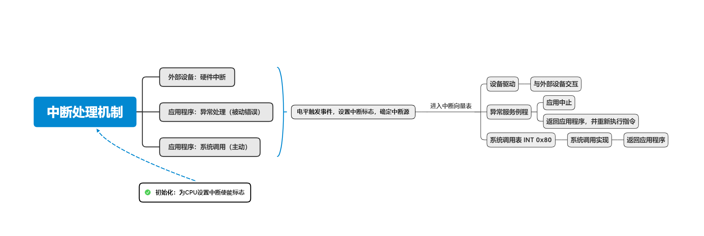

# 中断、异常与系统调用

* 中断：一般为响应硬件的请求（异步）

* 异常：应用程序出现错误，需要进行中止或者异常处理并重新执行错误的指令（同步）
* 系统调用：应用程序的主动行为，请求操作系统的服务（同步或异步）

--------

广义上，上述三种都需要**中断处理机制**

### 发生中断时（中断、异常、系统调用），中断处理机制做了什么？

###### 硬件处理：

* :star:在CPU**初始化**的时候需要设置中断使能标志（启用中断处理机制）
* 依据内部事件或外部事件设置中断标志，表示出现了一个中断
* 获取中断源的编号，依据**中断向量表**调用响应的服务例程

###### 软件处理：

* 现场保存，如寄存器、上下文（由编译器决定）
* 中断服务处理（服务例程）
* 清除中断标志（服务例程）
* 现场恢复

--------------------

### 中断嵌套

* 硬件中断服务例程可以被打断
* 异常服务例程可以被打断，可能出现硬件中断，如磁盘IO
* 异常服务例程可以嵌套，异常服务例程中的异常，如缺页