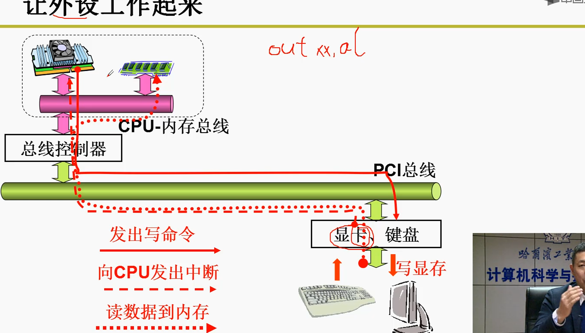
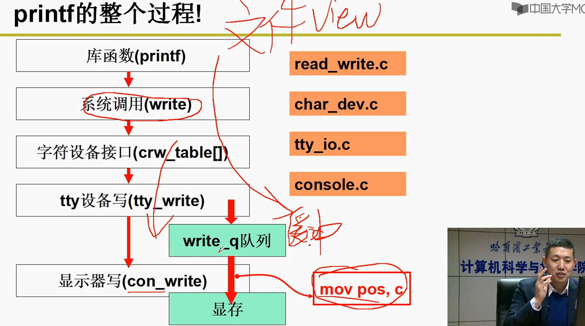
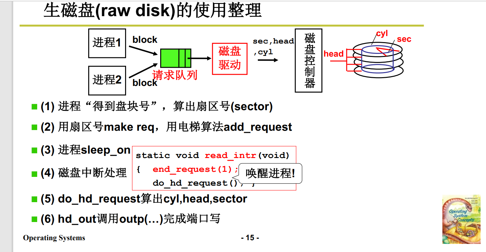
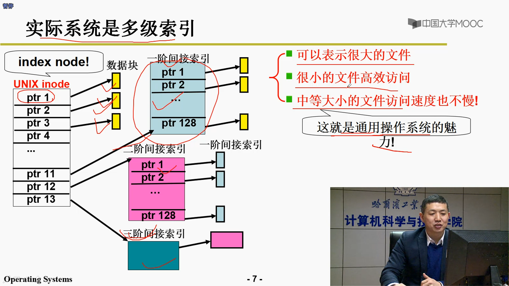
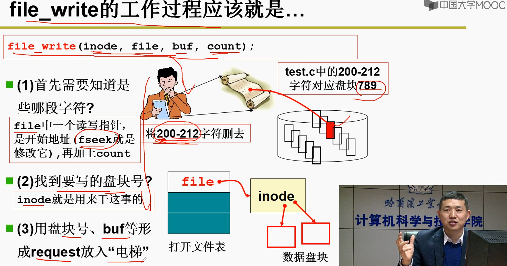
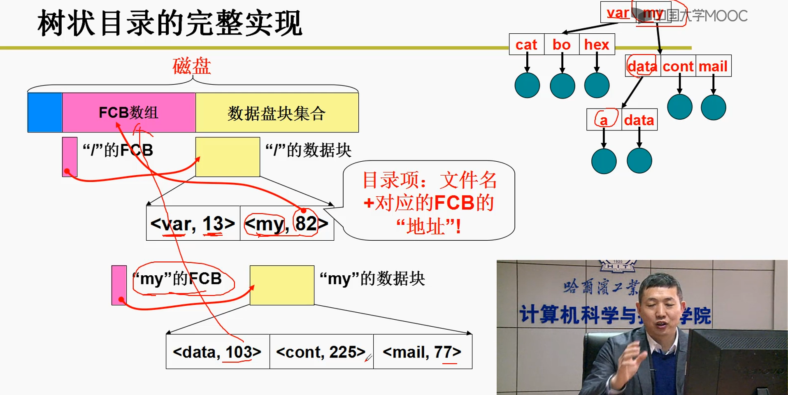
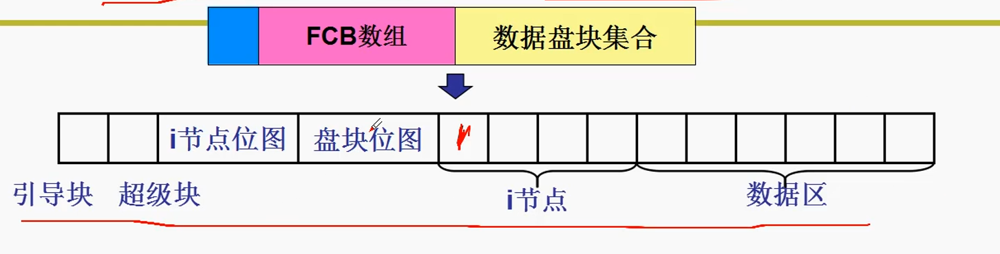
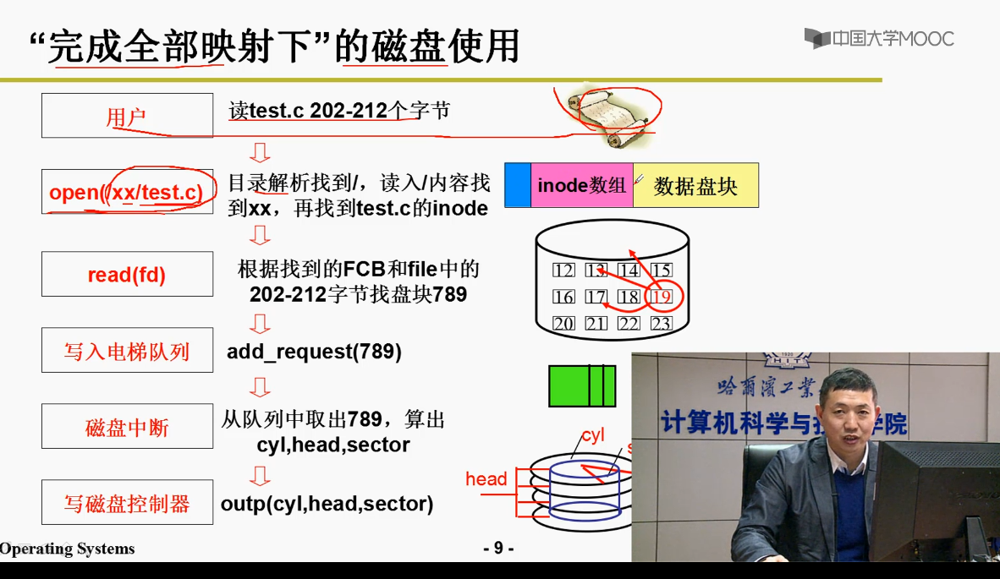

# 文件系统与外设

操作系统中，CPU如何控制键盘、显卡、显示器等外部IO设备？

实际上，操作外部的IO设备就是通过`OUT xx al`指令或者`mov xx al`（与内存统一编址的情况下）

1. 发出对外设的I/O指令
2. 外设完成后，对CPU发出中断指令
3. 读取数据到内存

为了统一对外设的操作，Linux提出了文件系统的视图，即将设备当成文件，通过统一的借口`open, write, read, close`来进行设备的操作。

---------

## 生磁盘如何使用？（从盘块号到硬盘读写）

## 文件是如何存储在硬盘上的？（文件字节流到盘块号的映射）

结合顺序结构和链式结构，**索引结构**。

索引结构即顺序存放实际链式分配的盘块号的索引

--------

---------------

## 如何从文件目录（树状结构）中找到文件对应的数据块？

* 根目录位置固定
* 目录项包括：文件名和对应FCB的`key, value`键值对
* 根据文件名可以找到对应的FCB
* 根据FCB可以找导`inode`，即文件中字符流到盘块号的映射表

1. 根目录信息放在`inode`数组中的第一项

2. 盘块<u>位图</u>：用0、1来表示磁盘对应盘块是否空闲
3. i节点位图：用0、1来表示文件系统中文件是否存在
4. 引导块：系统启动引导（固定）
5. 超级块：记录i节点位图和盘块位图的大小信息，从而推导出根目录的位置（i节点开始）

**mount**实际上就是读取超级块，从而获取分区中根目录的信息

