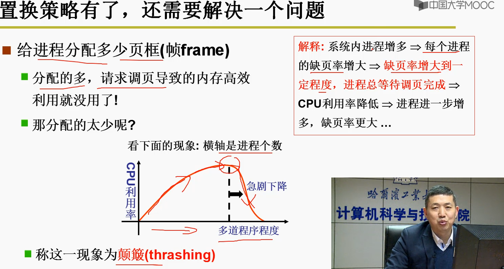

# 内存

> 2023年4月3日
>
> Rossetta

## 一、内存的分段与使用

汇编程序中，`jmp 40`的`40`是依赖段地址来进行跳转的，内存加载进程进行取指执行时，需要对内存进行分段。

* 段地址存放在LDT（Local Descriptor Table）中，与PCB（Process Control Block）放在一起
* 运行时重定位：从PCB中取出段地址，并进行基地址+偏移的操作

* 并非将整个程序一起放入内存中，而是需要对程序进行分段存储

用户可以单独考虑每个段（分治的思想）

此时，PCB中需要放的是**多个段的基地址**（LDT段表）

GDT表和LDT表的区别？

* GDT表存放操作系统的段地址
* LDT表存放进程中对应的段地址

* LDT表随着进程的切换而切换

------

## 二、内存分区和分页

当我们加载多个进程到内存中时，则需要对内存进行分区，使用物理内存进行分区会造成的问题如下：

内存碎片会导致内存的利用率降低

如果采用内存紧缩（复制到其他区域），会耗费大量时间，同时进程会不能运行，造成死机的现象

#### 采用分页（物理内存）

最大内存浪费只有4k（一页的内存）

在页中进行重定位：**页表**

内存管理单元（MMU）来执行`0x2240`到逻辑地址`0x02, 0x240`的转换，其中`4k = 2^12`

**偏移地址 -> 查页表 -> 获取物理地址（重定位）-> 取指执行**

#### 多页机制存在的问题？

设内存为32G，页表大小为4k，则有页数 = `4G / 4k = 2^32 / 2^12 = 2^20`页！！！

* 将不使用的空间从页表中删除 -> 页号不连续，不能偏移 -> 查找效率慢
* 保留页表项但是不使用 -> 页表项过多 -> 浪费空间

#### 如何解决？（多级页表与快表）

**即让页表连续，也让页表项变少**，类似于书籍的目录与分节目录（多层目录）

## 三、多级页表与快表

其中一级目录存放了`2^10`个章目录

其中二级目录存放了`2^10`个页

每个页中存放了`4k`的地址

共`2^10 * 2^10 * 4k = 2^32 = 4G `，然而，一级目录占用了`2^10 * 4Bytes = 4k`，二级目录只有三个用到了，即是`4k * 3 = 12k`，共`16k`，远小于之前所占用`4M`

#### 快表

快表等于把最近使用过的逻辑页和物理页的关系，存放在快表中，效率很快

多级页表 + 快表联合的方式提高了空间和时间上的效率。

为了提高效率，需要**提高快表的命中率**

当TLB快表为64时，为什么也能起效果？

程序的**空间局部性**

--------

## 四、段页结合的内存管理方式 - 虚拟内存

由程序中的逻辑地址如何访问物理内存中的真实地址？

1. 查LDT表，得到段地址
2. 段地址 + 逻辑地址 -> 虚拟地址
3. 根据虚拟地址得到虚拟页号和偏移
4. 查页表或者TLB，得到物理页号和偏移
5. 映射到物理地址上

#### 进程如何开始使用内存的？

1. 分配虚拟内存中的段，并建立段表
2. 分配物理内存中的页，并建立页表，建立虚拟内存到物理内存的映射
3. 进行查段表->查页表的重定向，从而访问到数据所在的真实物理地址

---------

* 实际操作系统中，地址的重定向由MMU（Memory Management Unit，内存管理单元）来完成
* fork来创建一个新的进程时：
  1. 分配新的连续地址，作为独立的虚拟地址空间，复制父进程的代码段、数据段、堆栈等数据，并创建PCB
  2. 为新进程设置上下文和环境，如**程序计数器、堆指针、栈指针**
  3. 将新进程添加到调度队列中，等待调度运行
  4. 分配物理页和页表时，先暂时与父进程指向同一块物理地址，待到真正需要使用时，才进行新的物理页分配，这种技术叫做**写时复制（Copy On Write）**。

---------

## 五、内存的换入换出

**为了实现虚拟内存，就应该有换入换出**

**Swap In**

* 只有当进程请求某一块内存的数据时，才需要从磁盘中将程序的数据**换入**到物理内存中，同时会触发**缺页中断**，并添加了虚拟内存到物理内存的映射。
* 每个进程拥有独立的`2^32 / 2^64`虚拟地址空间，是一个抽象的概念，但是进程初始的时候并不会直接分配全部的虚拟地址空间，在随着进程的运行过程中，虚拟地址空间可能是动态增长的。

**Swap Out**

* 并不是一直有新的页，需要淘汰内存中的物理页，换出到磁盘

* LRU算法（最近最少使用），即根据历史预测未来，将最近最少使用的页置换出去（**程序的局部性原则**）

* LRU算法需要维护与最近最少使用页相关的信息，如根据时间戳或者页码栈，代价太多，需要做近似实现

  

#### 颠簸现象

**颠簸现象**：进程过多的时候，导致每个进程所分到的物理页减小，故缺页率上升，进程浪费于缺页中断的时间太多，导致CPU的利用率降低，进程进一步增多，缺页率再次上升......

**应该根据进程的局部性原理分配合适数量的页框**