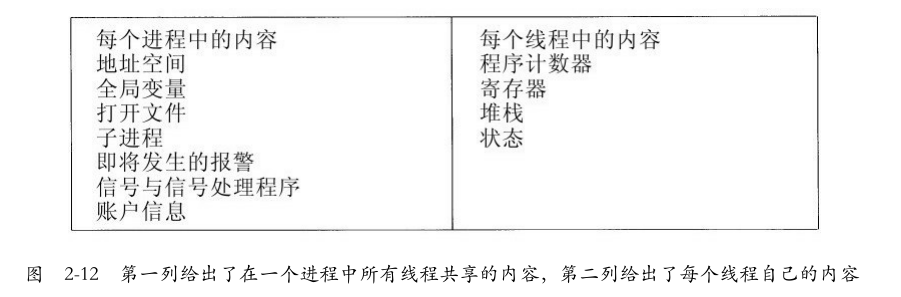
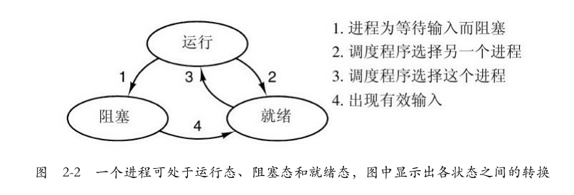
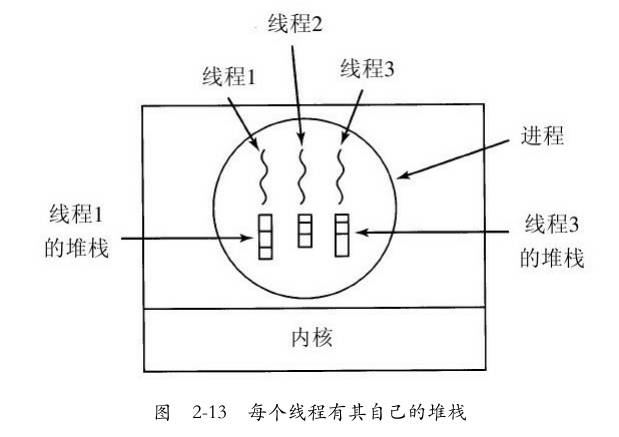
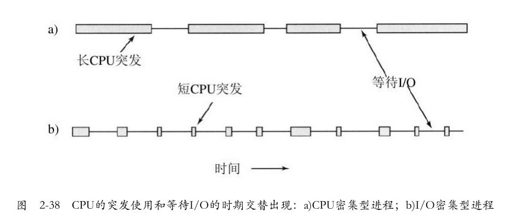

# 进程与线程

# 					——现代操作系统

> Date：2022年7月21日

## 1. 进程

### 1.1 进程模型

操作系统也是进程。一个瞬间只能运行一个进程，但是一秒钟可以运行很多个进程，进程之间具有**伪并行性**

todo

## 2. 线程

线程之间共享同样的内存空间，但是具有不同的堆栈和运行状态等信息。线程属于同一个进程，本质是为了提高进程的并行性，所以不同线程之间可以更改进程空间内的任意地址，故**可以读、写、甚至清除另一个线程的堆栈**





其中，被阻塞的线程/进程等待**某个释放它的事件**。以便等待某个外部事件的发生（如键盘的输入）或者等待其他线程来释放它。

**线程中独立堆栈的作用？** 保存某个还没有执行完成的线程的过程的（函数中的）<u>局部变量和返回地址</u>



* 线程之间的关系通常是平等的
* 在主线程中创建一个新线程时，新线程会在同样的地址空间中运行，只需要指定要运行的过程名（传入函数）`std::thread t(fn, ...args);`
* 一个线程可以等待一个线程退出，通过调用`join`函数。如在主线程指定`t.join()`，将主线程**阻塞**直到线程`t`执行完毕并退出，此后线程`t`不可再次被调用，等到线程`t`退出后再恢复主线程。
* 线程需要一个操作，让出CPU给其他线程，称之为`thread_yield`
* 某些调用允许线程等待另一个线程完成了某些调用，`thread_wait`

-----------

## 3.进程间通信

## 4.调度

> 当有多个线程或者进程竞争CPU时，CPU需要选择下一个执行的进程，完成选择工作的程序称之为调度程序（scheduler）

### 4.1 进程行为

某些I/O活动可以看做是计算，如CPU向视频RAM复制数据来更新屏幕时，因为使用了CPU，所以是计算

当一个进程==等待外部设备完成工作而被阻塞==时，才是I/O活动



上图中，柱状条表示CPU计算，横线代表等待I/O的时间

进程分为**计算密集型**和**I/O密集型**

随着CPU的发展，进程越来越多变成I/O密集型，如果要运行I/O密集型进程，应该让它尽快得到机会，以便发出磁盘请求并保持磁盘始终忙碌

### 4.2 何时调度

1. 当一个进程从运行状态切换到等待状态（例如，I/O请求，或者调用 wait 等待一个子进程的终止）
2. 当一个进程从运行状态切换到就绪状态（例如当出现中断时）
3. 当一个进程从等待状态切换到就绪状态（例如 I/O 完成）
4. 当一个进程终止时

其中，当调度**只能**发生在1和4中时，其调度方案只能是**非抢占**的，否则，称之为**抢占**的。因为发生2和3时，进程切换到就绪的状态，此时等价于进程被打断了，需要选择是否执行其他的进程，所以此时的调度称之为抢占。

#### 4.2.1 抢占式调度和非抢占式调度

* ==抢占式调度（Preemptive Scheduling）==是一种CPU调度技术，它通过将CPU的时隙划分给给定的进程来工作。给定的时间间隔可能能够完成整个过程，也可能无法完成。当进程的区间时间（burst time）大于**CPU周期**[^1]时，它将被放回到就绪队列（ready queue）中，并在下一个时机（chance）执行。当进程切换到就绪状态时，会使用这种调度方式。

* ==非抢占调度（Non-preemptive Scheduling）==是一种CPU调度技术，进程获取资源(CPU时间)并持有它，直到<u>进程终止或推送到等待状态</u>。进程不会被中断，直到它完成，然后处理器切换到另一个进程。

[^1]: CPU时钟周期规定为从内存中读取一个指令字的最短时间。通常来说，取指需要一个CPU时钟周期时间，**指令执行的不同阶段**[^2]需要的时间都是一个CPU时钟周期，1个指令周期=4个CPU周期=若干个时钟周期。
[^2]: 指令的执行包括了取指、分析指令、执行指令、形成下一条指令地址的4步操作

---------

## 5.无锁编程

在原子操作出现之前，对共享数据的读写可能得到不确定的结果，所以多线程并发编程时要对使用锁机制对共享数据的访问过程进行保护。但锁的申请释放增加了访问共享资源的消耗，且可能引起线程阻塞、锁竞争、死锁、优先级反转、难以调试等问题。

现在有了原子操作的支持，对单个基础数据类型的读、写访问可以不用锁保护了，但对于复杂数据类型比如链表，有可能出现多个核心在链表同一位置同时增删节点的情况，这将会导致操作失败或错序。所以**我们在对某节点操作前，需要先判断该节点的值是否跟预期的一致，如果一致则进行操作，不一致则更新期望值**，这几步操作依然需要实现为一个**RMW(Read-Modify-Write)**原子操作，这就是所谓的**CAS(Compare And Swap)**原子操作，它是无锁编程中最常用的操作。

既然无锁编程是为了解决锁机制带来的一些问题而出现的，那么无锁编程就可以理解为不使用锁机制就可保证多线程间原子变量同步的编程。无锁(lock-free)的实现只是将多条指令合并成了一条指令形成一个逻辑完备的最小单元，通过兼容CPU指令执行逻辑形成的一种多线程编程模型。

无锁编程是基于原子操作的，对基本原子类型的共享访问由load()与store()即可保证其并发同步，对抽象复杂类型的共享访问则需要更复杂的CAS来保证其并发同步，并发访问过程只是不使用锁机制了，但还是可以理解为有锁止行为的，其粒度很小，性能更高。对于某个无法实现为一个原子操作的并发访问过程还是需要借助锁机制来实现。

```c++
/**
 * 如果元素和expected的值相同，说明没有其他线程对其进行修改过，将元素修改为desired
 */
bool compare_exchange_strong(T& expected, T desired) 
{ 
    if( this->load() == expected ) { 
        this->store(desired); 
        return true; 
    } else {
        expected = this->load();
    	return false; 
    } 
}

std::atomic<int> value = 10;
int temp = value.load();

/*
 * ...
 */

value.compare_exchange_strong(temp, 20); //我们期望value为10，如果为10，将其修改为20
```

