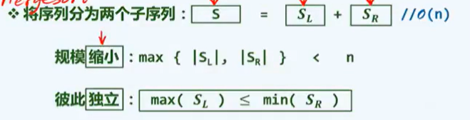
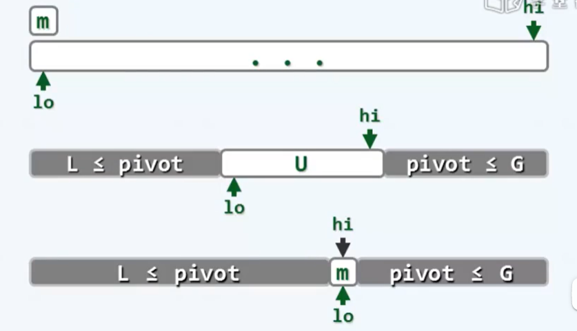
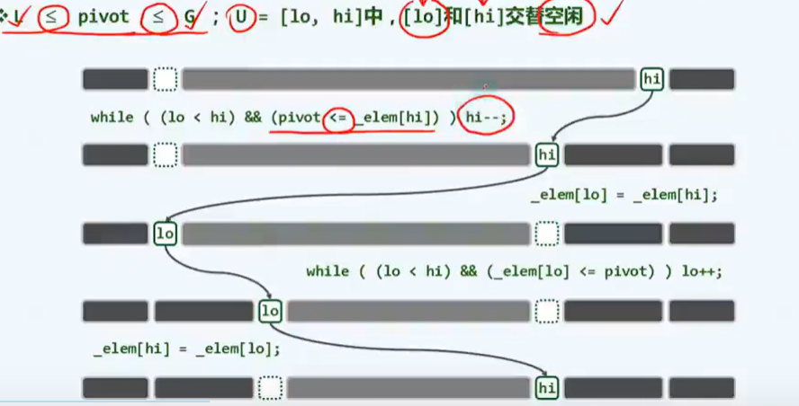

# 排序

> Date：2022年6月20日

## 1.快速排序quick sort - $O(n\log n)$

分而治之，与mergeSort类似，但是mergeSort在于怎么合并，而**quickSort在于如何分**

- 选择锚点 pivot，使得$L \leq pivot \leq G$，U为未分配的区域

- 交替空闲 （lo和hi位置的元素，交替与pivot比较，分别归入L或者G）

  