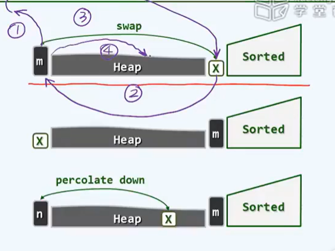

# 优先级队列

## 完全二叉堆

由向量实现的完全二叉树，成为**完全二叉堆**

```cpp
#define Parent(i) ((i-1)>>1)
#define LChild(i) (1+((i) << 1)) // 奇数
#define RChild(i) ((1+(i)) << 1) // 偶数
```

对于完全二叉树中的任意节点，满足如下关系
$$
fatherNode = i \\
leftChild = 2i + 1 \\
rightChild = 2i + 2 \\ 
lastInternal = \lfloor n\rfloor/2 - 1
$$
其中`lastInternal`是最后一个**非叶子节点**的索引


优先级队列的实现：由于优先级队列只需要维护最大元，所以以完全二叉堆进行实现，向量中的值代表了优先级，且满足**堆序性**，根节点是最大元：
$$
H[i] \leq H[Parent[i]]
$$

#### 1. 插入一个节点`insert-O(logn)`

`percolate up`上滤：

- 将待插入节点直接插入到向量的最末尾（结构性）
- 如果节点优先级大于其父节点的优先级，则交换，不断重复的过程称之为**上滤**（堆序性）


#### 2. 删除最大元节点`delMax-O(logn)`

`percolate down`下滤


- 将最大元删除
- 将末尾的元素移至队首
- e与孩子中的较大者换位，重复直到满足堆序性

#### 3. 批量建堆`heapification`

> 通过向量中的n个数据，将其调整为完全二叉堆，满足堆序性

从`lastInternal`开始，自下而上进行下滤


:white_check_mark: 效率 为：
$$
\sum height(i) = O(n)
$$
:x: 如果从上到下进行下滤，效率为：
$$
\sum depth(i) = o(n\log n)
$$

-----------

### 利用完全二叉堆改进选择排序--堆排序heapSort

1. 初始化 -- 建堆`heapify` $O(n)$
2. 迭代 -- `delMax` $O(\log n)$ ，取出堆顶并调整复原
3. 不变性 -- $Heap \leq Sorted$ ，待排序部分最大元素不超过已排序部分最大元素

算法复杂度$O(n\log n)$



1. 将堆顶和堆尾进行`swap`交换
2. 将交换后的堆顶进行下滤

--------------

## 左式堆 -- 用于merge两个堆

> 保持堆序性，附加新条件，在堆合并的过程中，只需要调整很少部分的节点 $O(\log n)$

新条件：单侧倾斜 （节点分布偏向左侧，合并操作只涉及右侧）

只保留了堆序性，而不保留结构性的完全二叉树结构

`null path length(npl)`表示空节点路径长度

- 首先引入所有外部节点（叶子节点），转为真二叉树
- `npl(x)`为x到外部节点的最近距离


**左倾：对任何内节点x，都有$npl(LChild(x)) \geq npl(RChild(x))$**

- 左倾性和堆序性相容且不矛盾
- 左式堆的子堆，必定是左式堆
- 左式堆倾向于，更多结点分布在左侧分支

**右式链：从节点出发，沿右侧分支前进**，算法复杂度不超过右侧链的长度

##### 合并算法


- 取a的右子树`a->rc`
- 将`a->rc`与`b`合并
- 比较npl，保持左倾性，有必要则交换
- 不断递归

##### 左式堆的删除和插入

删除：摘除顶部的最大元，将左右子树进行合并

插入：看成是一个树只有一个节点的合并操作

