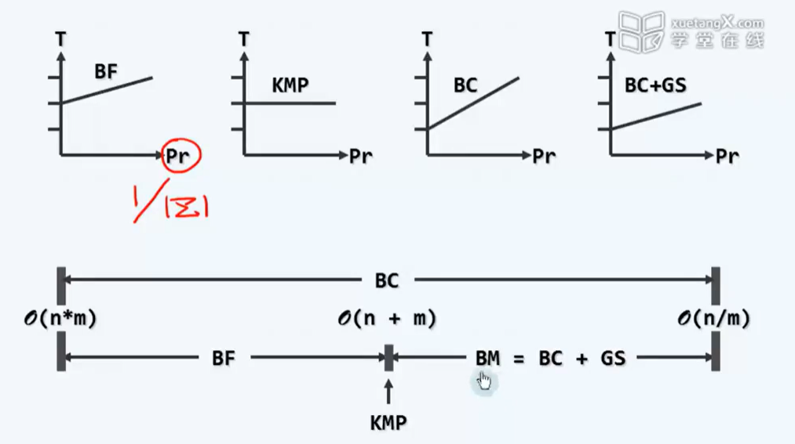

# 字符串

> Date：2022年6月18日

## 1、概要和约定

- `substr(i, k)`: s[i, i+k)
- `prefix(k)`: s[0, k)
- `suffix(k)`: s[n - k, n)

#### 串的模式匹配

- 文本T = "now is the time for all good people to come"
- 模式P = "people"

记$n = |T|, m= |P|$为串的长度，通常有$n \gg m$

**Pattern matching：**

1. detection：P是否出现？
2. :star:**location**：P第一次出现的位置？(主要讨论)
3. counting：P出现几次？
4. enumeration：各自出现在哪里？

#### 如何评价串匹配算法的性能？

随机文本，对成功和失败分别做测试

- 成功：在T中随机取出长度为m的子串作为P；分析平均复杂度
- 失败：采用随机的P；统计平均复杂度

----------------------

## 2、模式匹配算法

### 2.1 蛮力匹配 - $O(n \times m)$


```cpp
int match(string P, string T) {
    size_t n = T.size(), m = P.size();
    size_t i = 0, j = 0;
    while (i < n && j < m) {
        if (T[i] == P[j]) {
            ++i；
            ++j;
        } else {
            i -= (i - j); 
            j = 0;
        }
    }
    return i - j;    // 根据返回的起始位置是否合理来判断是否找到
}
```

----------

### 2.2 KMP算法 - $O(n)$

> 根据失败的子串前缀信息已知，避免了大量重复的比对


##### 制表查备

**下一个待匹配的位置只与模式P有关**

```cpp
int KMPMatch(char *P, char *T) {
    int *next = buildNext(P);    // 根据模式P制表
    int n = (int) strlen(T), i = 0;
    int m = (int) strlen(P), j = 0;
    while (j < m && i < n) {
        if (0 > j || T[i] == P[j]) { // j < 0为哨兵，此时代表j = 0时, next[0] = -1，负责进行j = -1时，i的前进
            i++; j++;    // 匹配
        } else {
            j = next[j];    // 根据next表确定下一个j的位置
        }
    }
    delete[] next;
    return i - j;
}
```

###### **如果构建next表？**


当在位置j发生字符不匹配时，对于模式P有一个长度为j的前缀`prefix(j)`，此前缀又有一个真前缀`prefix(j).prefix(t)`和真后缀`prefix(j).suffix(t)`是相同的，设其长度为t，存在$P[0, t) = P[j - t, j)$

为了保证**快速右移**和**避免回退**应该选取**t为尽可能的大，从而j-t尽可能的小**

:heavy_check_mark:**next(j)即是在P[0, j)中，最大自匹配的真前驱和真后继的长度t**，可采用递推的方式得到

对于next表存在：$next[j+1] \leq next[j] + 1$，当前仅当，`P[j] = P[next[j]]`时成立(下一个位置字符相同，代表最大真前驱和真后继共同长度t增加1)

- if `P[j] = P[next[j]]`, `next[j+1] = next[j] + 1`
- if `P[j] != P[next[j]]`，**如图所示，不断进行递推**，直到找到一对字符相同的位置`next[j]`和`[j]`(最坏达到哨兵)


```cpp
int *buildNext(char *P) {
    size_t m = strlen(P), j = 0; // 模式串P指针
    int *next = new int[m];
    int t = next[0] = -1;    // 设立哨兵，将next[0] = -1
    while (j < m - 1) {
        if (0 > t || P[j] == P[t])    //匹配
            next[++j] = ++t;
        else                        //失配
            t = next[t];
    }
    return next;
}
```

##### 改进版本

> next[j]位置上的元素应该和j位置上的元素不相同，防止多余的比较

如下图，next[j]一直都是字符0，重复比较了好几次


```cpp
int *buildNext(const char *P) {
    size_t m = strlen(P), j = 0;
    int *next = new int[m]; // next表
    int t = next[0] = -1;
    while (j < m - 1) {
        if ( 0 > t || P[j] == P[t] ) {
            j++;
            t++;
            next[j] = P[j] != P[t] ? t : next[t];  // 只有两个元素不同时，才填入t，否则取next[t]
        } else {
            t = next[t];
        }
    }
    return next;
}
```

------------

### 2.3 BM算法：坏字符 + 好后缀

> 更多的关注教训，使之更早的出现——匹配到字符前，需要多次失败的匹配，如何使失败的匹配次数更少？

**结论：模式串中，越靠后的字符如果是一个“坏字符”，即可以排除的模式串开头位置的个数，就越多，对算法优化越大。**


在**字符集远大于2**的情况下（两个字符相同的概率很低，所以**匹配到坏字符的概率很大**），如果所示，如果右边的是一个“坏字符”，则从以这个“坏字符”位置之前的位置为起始位置的模式串，必将匹配到这个“坏字符”，从而可以排除

- 以终为始：每一趟对比应该从末字符开始，从后往前

#### Bad-Character(构造bc表) - $O(n / m)$(最好情况) - $O(m \times n)$(最坏情况)

> 某趟扫描中（模式串中自后往前），一旦发现有“坏字符”，则模式串P相应的右移，启动新一轮的扫描

$$
T[i + j] = x \neq y = P[j]
$$

##### 如何进行右移？

> 既然x与y失配，需要在模式串中找到与“坏字符”y匹配的字符，并进行对齐，从而得到位移量
> 
> 可知，位移量shift只与模式串P有关

###### 普通情况


$$
bc[x] = rank[x] = j - shift \\ 
shift = j - bc[x]
$$
**<u>bc表仅代表字符x在模式串中的秩</u>**

为了避免回溯，选择位移量小的，即秩尽可能大，选择靠后的匹配字符

**如果模式串中没有字符X呢？**

采用哨兵-1，直接跳过这一段

###### 特殊情况

> 匹配字符X时，其秩过大，超过了j的位置，导致shift变成了负数


因为模式串必须要右移，此种情况下已经被抛弃，所以令`shift=1`，右移一个单位

##### 如何构造bc表？

```cpp
int *buildBC(char *P) {
    int *bc = new int[256]; // 与字符集同大小
    for (size_t i = 0; i < 256; ++i) 
        bc[i] = -1;    // 初始化，指向哨兵（通配符）
    for (size_t m = strlen(P), j = 0; j < m; ++j) {
        bc[P[j]] = j;    // 更新P[j]字符出现的位置 (画家算法：后来覆盖以往)
    }
    return bc;
}
```

如果P不包含T[i+j]，即可移动m个字符，最好情况下时间复杂度为$O(n / m)$

**单词匹配概率越小，BM算法性能越好**

最坏情况下，复杂度却又变为$O(m \times n)$


此时每次模式串需要循环$O(m)$，但是每次仅前进shift = 1，复杂度为$O(m) \times n$

如何改进？

#### Good-Suffix（构造GS表）- $O(n / m)$ ~ $O(n)$

> 仅采用bc表，没有利用好经验，即已经匹配的后缀

算法流程：

1. 构建GS表
2. 首字母对其，开始循环，**从后往前**进行第一次比对
3. 如果有Good-Suffix，则根据GS表进行跳转
4. 如果没有Good-Suffix，则根据bc策略进行跳转
5. 直至找到或者未找到

##### 如何构造GS表

todo

#### 各种算法的复杂度分析



----------

### 2.4 karp-Rabin算法

> 将长度为m的模式串**看做一个数**，即可实现一对一的线性时间匹配


