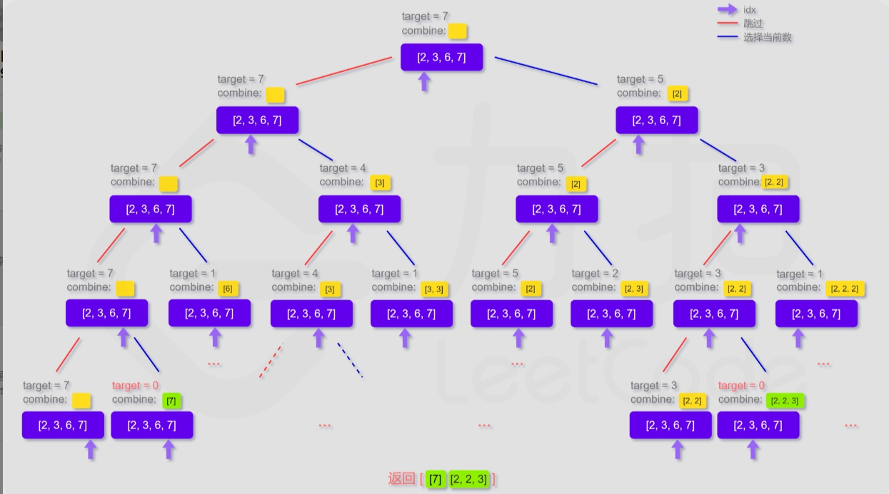
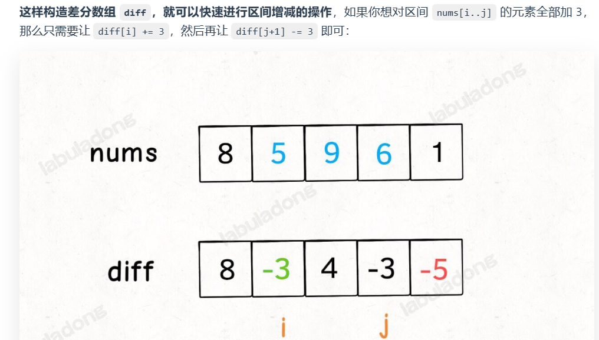
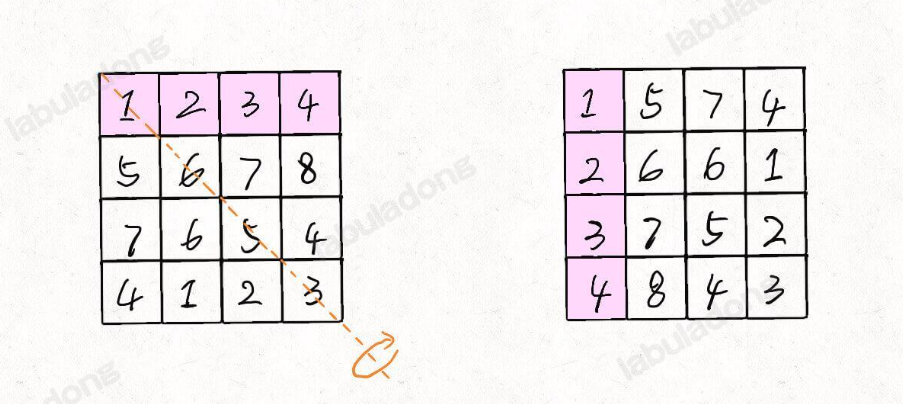
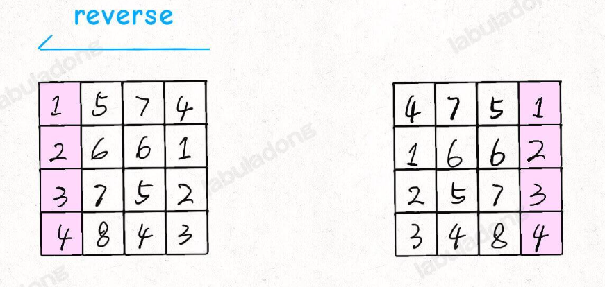
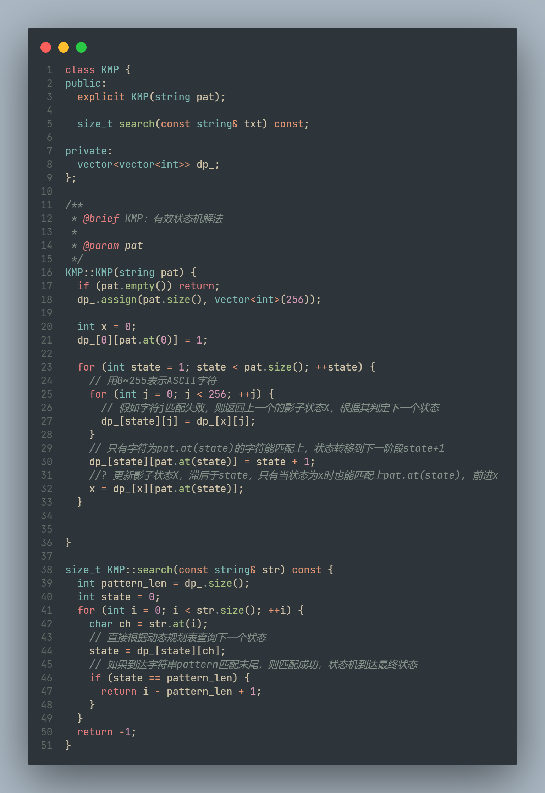
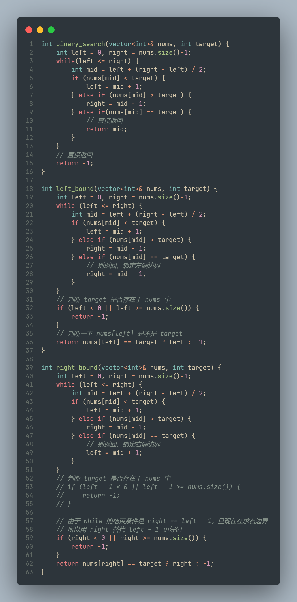

# leetcode刷题笔记

## 1.滑动窗口

* **算法思想**：就是有一个大小可变的窗口，左右两端方向一致的向前滑动（右端固定，左端滑动；左端固定，右端滑动）。可以想象成队列，一端在push元素，另一端在pop元素，如下所示：假设有数组[a b c d e f g h]一个大小为3的滑动窗口在其上滑动，则有:
  [a b c]
    [b c d]
      [c d e]
        [d e f]
          [e f g]
            [f g h]
* **适用范围**：一般是列表和字符串
* **求解问题**：找字符串或者列表中的最优值，如**最长递增子字符串**...
* **算法步骤**：
  1. 初始化窗口的左右指针，令`left = right = 0`，初始化一个结果，一般令其取最大，如字符串的长度
  2. 开始递增右指针，扩大窗口的范围并找到一个解
  3. 开始递增左指针，减小窗口的范围并优化这个解，需要更新结果，直到窗口中无解
  4. 循环第2-第3步，直到`right`指针到达有边界

* **算法模板**：

```cpp
string seq;
int left = 0, right = 0, res = seq.size();
string slide_win = seq[left, right];
while (right < seq.size()) {
  // 如果在当前滑窗内找到一个可行解
  if (avaliable(slide_win)) {
    // 在解可行的情况下进行优化，更新res，并缩小滑窗范围
    while (avaliable(slide_win)) {
      update(res);
      left += 1;
    }
    right += 1; // 优化完成，扩大滑窗范围，继续找寻解
  }
}
```

* **实际例题**：
  1. 4、无重复字符的最长子串
  2. 1234、替换子串得到平衡字符串

-------

## 2. 回溯算法

**对于寻找所有可行解的问题，都可以通过回溯算法进行求解**

leetcode第39题，组合总数

给定一个目标数target和一个数组candidates，求candidates中所有能组成target的数列表的集合，注意，candidates中的所有数可被重复利用。



```c++
void dfs(vector<int>& candicates, int i, int target, vector<int>& path, vector<vector<int>>& res) {
    if (target < 0) return;
    if (target == 0) {
        res.push_back(path);
        path.clear();
    }
    dfs(candicates, i + 1, target, path, res);	// 不用当前位置为i的数 左子树
    if (target - candicates[i] >= 0) {
        path.push_back(candicates[i]);
        dfs(candicates, i, target - candicates[i], path, res);	// 使用当前位置为i的数 右子树
        path.pop_back();
    }
}
```


-----------------

## 3. 链表

* 虚拟头节点dummy：**当你需要创造一条新链表的时候，可以使用虚拟头结点简化边界情况的处理**。
* 双指针，快慢指针
* 注意避免空指针的问题，如果要访问`p->next`，要保证`p`不是空指针

* 反转链表的两种方法：递归、迭代
* 链表的递归用于，从链表的最后开始处理，可以递归压栈到最后

## 4. 双指针

链表、数组

* 定义一个左指针left和右指针left
* 适用：已排序的数组，就地删除重复值，就地删除指定值

## 5. 数组

* 前缀和数组：用一个数组记录前缀和，减小每次sum进行查询，将复杂度从`O(n)`转为`O(1)`，适用于**频繁的查询累加和**
* 差分和数组：如下图所示，对`[i, j]`范围的数据同时相加，只需要对差分数组的`i`和`j+1`进行相加就行，适用于**频繁对一段数据进行同时加减**



* 二维数组的顺时针旋转：先进行二维数组的转置，在按行进行reverse**（leetcode48）**





* 二维数组的螺旋遍历

  * 设置`left_bound, right_bound, upper_bound, lower_bound`
  * 设置一个数组`{0, 1}, {1, 0}, {0, -1}, {-1, 0}`来表示上边界、右边界、下边界、左边界的移动步长，并进行判断


#### KMP算法（字符串匹配）（动态规划）



#### 二分搜索



## 6.二叉树

#### 二叉树遍历模型

```cpp
void traverse(TreeNode* root) {
    if (root == nullptr) {
        return;
    }
    // 前序位置
    traverse(root->left);
    // 中序位置
    traverse(root->right);
    // 后序位置
}
```

* 快速排序是二叉树的前序遍历（找分界点，分成子问题）

* 归并排序是二叉树的后序遍历（从最小的子树开始排序）

动归/DFS/回溯算法都可以看做二叉树问题的扩展，只是它们的关注点不同：

- 动态规划算法属于分解问题的思路，它的关注点在整棵「子树」。

```cpp
// 由子问题解决总问题
int count(TreeNode* root) {
    if (root == NULL) {
        return 0;
    }
    //我这个节点关心的是我的两个子树的节点总数分别是多少
    int leftCount = count(root->left);
    int rightCount = count(root->right);
    //后序位置，左右子树节点数加上自己就是整棵树的节点数
    return leftCount + rightCount + 1;
}
```

- 回溯算法属于遍历的思路，它的关注点在节点间的「树枝」。

```cpp
void traverse(TreeNode* root) {
  if (root == nullptr) return;
  printf("从节点 %s 进入节点 %s", root, root->left);
  traverse(root->left);
  printf("从节点 %s 回到节点 %s", root->left, root);

  printf("从节点 %s 进入节点 %s", root, root->right);
  traverse(root->right);
  printf("从节点 %s 回到节点 %s", root->right, root);
}

void backtrack()
{
    // 做选择
    ...

    // 进入下一层决策树
    backtrack(...);

    // 撤销刚才做的选择
    ...
}
```

- DFS 算法属于遍历的思路，它的关注点在单个「节点」。

```cpp
void dfs(TreeNode* root) {
    if (root == nullptr) return;
    // 遍历过的每个节点的值加一
    root->val++;
    dfs(root->left);
    dfs(root->right);
}
```

------------

#### 二叉树遍历（前中后）

是否可以通过遍历一遍二叉树得到答案？——通过`traverse`+传入外部变量的模式进行遍历

```c++
void traverse(TreeNode* root) {
    if (root == nullptr) return;
    // 前序（注重于树的节点）
    traverse(root->left);
    // 中序
    traverse(root->right);
    // 后序（注重于从左右子树获得的结果）
}
```

#### 二叉树递归（分解问题）

是否可以通过定义一个递归函数，从子问题（子树）的答案中求解得到答案？——写出递归函数并充分利用函数的返回值
