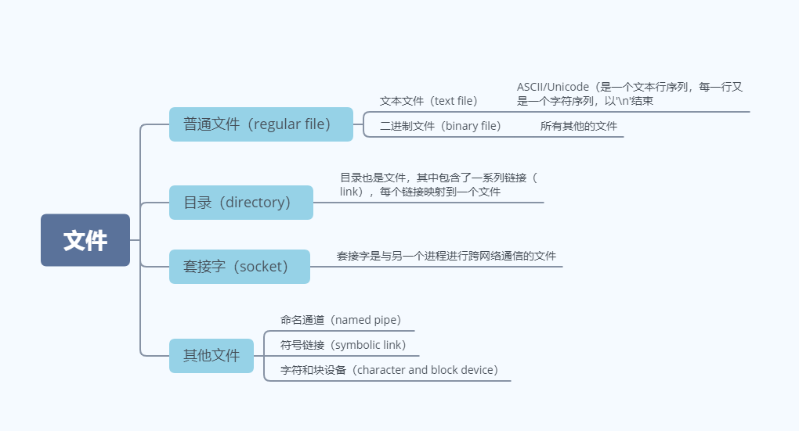
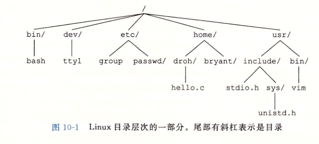
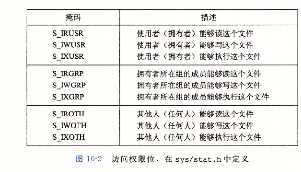
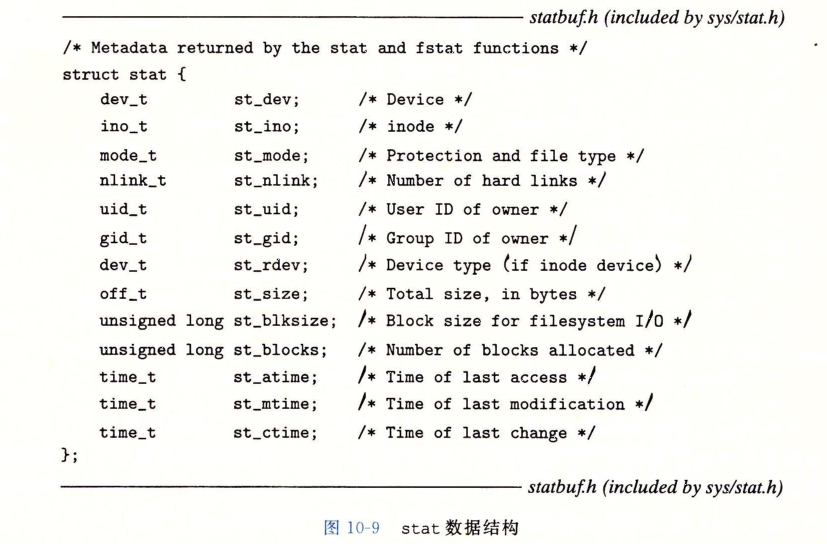
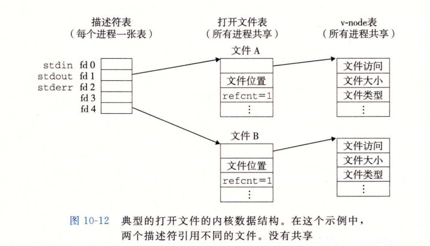
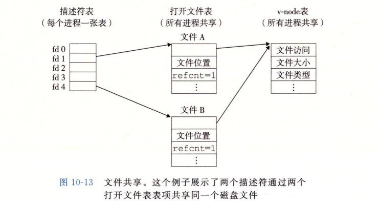
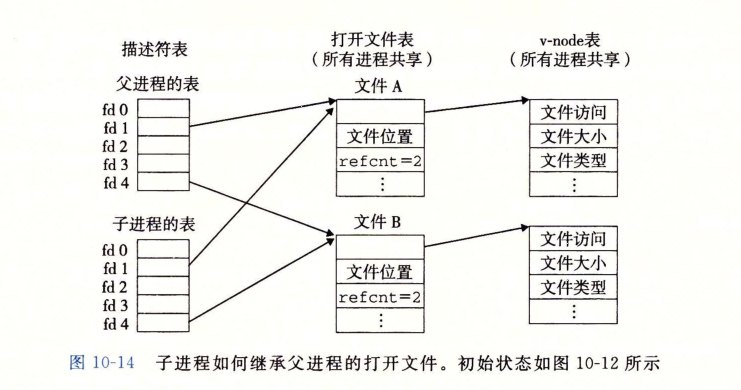
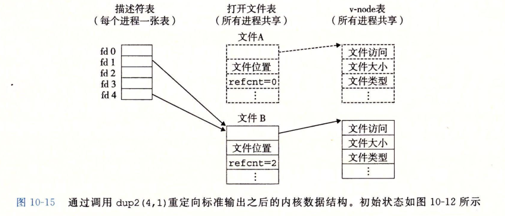

# 系统级IO

> date：2022年7月2日

输入/输出（I/O）是在主存和外部设备（例如磁盘驱动器、终端和网络）之间复制数据的过程。


## 1. Unix I/O

> Linux文件以字节序列的形式存放，包括I/O设备都被模型化为文件，输入和输出作为相应文件的读和写来执行。
>
> 这种将设备映射为文件的方式，使得Unix I/O所有的输入和输出有统一且一致的方式

- 打开文件。应用程序通过内核打开相应的文件，来宣告访问一个I/O设备。内核返回一个**小的非负整数**，称之为`文件描述符(file descriptor, fd)`

- Linux shell创建的进程都包括了三个打开的文件，在头文件`<unistd.h>`中有相对的定义

  - 标准输入，`fd=0`，`STDIN_FILENO`

  - 标准输出，`fd=1`，`STDOUT_FILENO`
  - 标准错误，`fd=2`，`STDERR_FILENO`

- 改变当前文件的位置。对于每个打开的文件，内核保存着一个文件位置`k`，初始为0，表示为**从文件开头起始的字节偏移量**，可以显示的通过`seek`函数来设置当前文件位置

- 读写文件。从文件复制`n>0`个字节到内存（读）或者从内存复制`n>0`个字节到文件中（写）

  - `read`：从文件中复制`n`个字节，并将文件位置变成`k+n`，当k到达文件的末尾`k >= m(文件字节数)`，会触发end-of-file(EOF)

  - `write`：从内存中复制`n`个字节到一个文件，从当前文件位置开始，然后更新`k`

-  关闭文件。应用完成了对文件的访问后，通知内核关闭这个文件。

  - 内核释放打开文件时创建的数据结构
  - 将描述符恢复成可用的描述符池中
  - 当进程终止时，内核会关闭所有打开的的文件并释放它们的内存资源

------

## 2. 文件

> Linux文件都有一个文件类型表示它在系统中的角色



#### Linux目录层次结构



- 当前工作目录（current working directory）：**是进程上下文的一部分，用来确定进程在目录层次结构中的位置**

------

## 3. 打开和关闭文件

> 进程通过调用open函数来**打开**一个已存在的文件或者**创建**一个新文件
>
> 通过close函数**关闭**一个文件

```c
#include <sys/types.h>
#include <sys/stat.h>
#include <fcntl.h>

int open(char *filename, int flags, mode_t mode);
```

- filename：文件名，`open`函数将文件名转为文件描述符，并返回它，描述符总是进程中没有打开的最小文件描述符

- flags：指明进程如何访问这个文件

  - `O_CREAT`：如果不存在，则创建一个截断的文件（即空文件）
  - `O_TRUNC`：如果文件已经存在，就截断它
  - `O_RDWR`：可读可写

  - `O_WRONLY`：仅可写
  - `O_RDONLY`：仅可读
  - `O_APPEND`：在每次写操作前，设置文件到文件的结尾处

  可以通过位或操作来设置多个访问flag，如：

  ```c
  int fd = open("foo.txt", O_WRONLY | O_APPEND, 0);
  ```

- mode：设置文件的访问权限。`umask`是进程上下文的一部分，将文件访问权限设置为`mode & ~umask`



传递一个文件描述符给close函数关闭文件

```c
#include <unistd.h>

int close(int fd);
```

---------

## 4. 读和写文件

```c
#include <unistd.h>

// 从文件fd中读取n个字节的数据到内存中的缓冲区buf
ssize_t read(int fd, void *buf, size_t n); // 成功返回读字节数，若为EOF则为0，若失败则为-1
	
// 从内存buf向文件fd写入n个字节数据
ssize_t write(int fd, const void *buf, size_t n); // 成功返回写的字节数，若失败则返回-1

```

Tip：

1. 通过`lseek`函数，应用程序可以显式的修改当前文件的位置k

2. `size_t`和`ssize_t`有什么不同？

在`x86-64`系统中，`size_t`被定义为`unsigned long`，而`ssize_t`被定义为`long`，即read和write函数会返回一个有符号数，因为出错了必须返回-1

3. 某些情况下，read和write传送的字节比要求的更少，称之为不足值（short count）
   1. 读时遇到了EOF
   2. 从终端读取文本行，这时返回的不足值表示文本行的大小
   3. 读和写socket，内部缓冲约束和较长的网络延迟会导致read和write返回不足值，或者是对Linux pipe的调用read和write也会导致不足值

--------

## 5. RIO包——健壮的读写

> RIO（Robust I/O，健壮的I/O），会自动的处理上文中所述的不足值。

- 无缓冲的输入输出函数。直接在内存和文件中传输数据，而没有应用级缓冲，在**网络和和本地二进制数据的读写**中十分有用
- 带缓冲的输入输出函数。高效的从文件中读取文本行和二进制数据，内容缓冲在应用级缓冲区内，且线程安全

### 5.1 无缓冲的输入输出函数

```cpp
ssize_t rio_readn(int fd, void *usrbuf, size_t n);
sszie_t rio_written(int fd, void *usrbuf, size_t n);
```

其中`rio_readn`从fd文件中读取最多n个字节到内存`usrbuf`中，当遇到`EOF`时会返回不足值

其中`rio_written`从内存中写入n个字节到文件fd中，不会返回不足值

```cpp
ssize_t rio_readn(int fd, void *usrbuf, size_t n) {
  size_t nleft = n;	// 剩下的待读取数据
  ssize_t nread;	// 已经读取的数据
  char *bufp = usrbuf;
  
  while (nleft > 0) {
    if ((nread = read(fd, bufp, nleft)) < 0) {
      if (errno == EINTR)	/* Interrupted by sig handler return */
        nread = 0;	/* read again */
      else
        return -1;	/* set errno by read */
    } else if (nread == 0) {
      break;	/* EOF */
    }
    nleft -= nread;
    bufp += nread;
  }
  return (n - nleft);		// read
}

/********************************************************************/

ssize_t rio_written(int fd, void *usrbuf, size_t n) {
  size_t nleft = n;
  ssize_t nwritten;
  char *bufp = usrbuf;
  
  while (nleft > 0) {
    if ((nwritten = write(fd, bufp, nleft)) <= 0) {
      if (errno = EINTR) /* Interrupted by sig handler return */
        nwritten = 0;
      else 
        return -1;
    }
    nleft -= nwritten;
    bufp += nwritten;
  }
  return n;
}
```


### 5.2 带缓冲的输入输出函数

```cpp
void rio_readinitb(rio_t *rp, int fd);	// 将描述符fd和地址rp处一个rio_t的读缓冲区关联起来，作为输入

/* 当缓冲区为空时，会自动调用read重新填满缓冲区 */
// 通过缓冲区rp读取一行数据（包括换行符），并复制到内存位置usrbuf，并用'\0'字符来结束这个文本行，最多读取maxlen-1个字节，余下的一个字符留给结尾的NULL字符
ssize_t rio_readlineb(rio_t *rp, void *usrbuf, size_t maxlen);  

// 通过读缓冲区传送原始字节，最多读取n个字节到内存位置usrbuf
ssize_t rio_readnb(rio_t *rp, void *usrbuf, size_t n);	
```

带缓冲的输入输出函数可以交叉使用，但是不应该和无缓冲的输入输出函数交叉使用

```cpp
#define RIO_BUFSIZE 8192
struct rio_t {
  int rio_fd;
  int rio_cnt;
  char *rio_bufptr;	// 指向下个未读字节
  char rio_buf[RIO_BUFSIZE];
}

static ssize_t rio_read(rio_t *rp, char *usrbuf, size_t n);	//Unix read函数带缓冲的版本，通过缓冲区来解决read不足值的问题，当缓冲区不为空时，从中读取min(n, rio_cnt)个字节到usrbuf中

static ssize_t rio_read(rio_t *rp, char *usrbuf, size_t n) {
  int cnt;
  
  // 填满缓冲区
  while (rp->rio_cnt <= 0) { /* refill rio buffer if empty */
    rp->rio_cnt = read(rp->rio_fd, rp->rio_buf, sizeof(rp->rio_buf));
    if (rp->rio_cnt < 0) {
      if (errno != EINTR)
        return -1;
    } else if (rp->rio_cnt == 0) /* EOF */
      return 0;
    else 
      rp->rio_bufptr = rp->rio_buf;	/* Reset buffer ptr */
  }
  
  /* 拷贝min(n, rp->rio_cnt)个字节从rio缓冲区到内存中 */
  cnt = n;
  if (rp->rio_cnt < n) {
    cnt  = rp->rio_cnt;
  }
  memcpy(usrbuf, rp->rio_bufptr, cnt);
  rp->rio_bufptr += cnt;
  rp->rio_cnt -= cnt;
  return cnt;
}
```

`rio_read` 和 `Unix read`具有一样的行为，如

- 返回读得字节数

- 错误返回-1
- 一定条件下会返回不足值

下列两个函数`rio_readlineb`和`rio_readnb`则通过`rio_read`来实现

```cpp
ssize_t rio_readlineb(rio_t *rp, void *usrbuf, size_t maxlen) {
  int n, rc;
  char c, *bufp = usrbuf;
  
  // 按顺序read每个字符
  for (n = 1; n < maxlen; n++) {
    if ((rc = rio_read(rp, &c, 1)) == 1) {
      *bufp++ = c;
      if (c == '\n') {
        n++;
        break;
      }
    } else if (rc == 0) {
      if (n == 1) return 0; /* EOF, no data read */
      else break;						/* EOF, some data was read */
    } else 
      return -1;						/* Error */
  }
  *bufp = 0; 								// 最后一个字符串填充'\0'
  return n - 1;
}

/***************************************************************/

ssize_t rio_readnb(rio_t *rp, void *usrbuf, size_t n) {
  size_t nleft = n;
  ssize_t nread;
  char *bufp = usrbuf;
  
  while (nleft > 0) {
    if ((nread = rio_read(rp, bufp, nleft)) < 0)
      return -1;		// errno set by read() 
    else if (nread == 0)
      break;				// EOF
    nleft -= nread;
    bufp += nread;
  } 
  return n - nleft;			
}
```

------------

## 6. 读取文件元数据

> 调用stat和fstat函数能够检索到**关于文件的信息**，也叫作**元数据（metadata）**

```cpp
#include <unistd.h>
#include <sys/stat.h>

int stat(const char *filename, struct stat *buf);		// 通过文件名获取其元数据
int fstat(int fd, struct stat *buf);	// 通过文件描述符获取其元数据
```



Linux在头文件<sys/stat.h>中定义了宏来stat信息，如st_mode成员中：

- S_ISREG(m) —— 判断是否是普通文件

- S_ISDIR(m) —— 判断是否是目录文件

- S_ISSOCK(m) —— 判断是否是套接字文件

```cpp
if (S_ISREG(stat.st_mode)) {
  // do something...
}
```

## 7. 读取目录内容

> 目录也是文件，可以用readdir系列函数来读取目录内容

```cpp
#include <sys/types.h>
#include <dirent.h>

struct dirent {
  ino_t d_ino;			// inode number
  char d_name[256];	// filename
}

DIR *opendir(const char *name);	// 返回一个指向目录流的指针，流是对条目有序列表的抽象

struct dirent *readdir(DIR *dirp);	// dirent *指向一个目录项
```

-------

## 8. 共享文件

> 内核用三种不同的数据结构来表示打开的文件

- 描述符表（descriptor table）。每个进程有**独立**的描述符表，表中每个表项指向**文件表中的一个表项**

- 文件表（file table）。打开的文件集合由一张文件表来表示的，所有的进程**共享**这张表。表中条目包含了**当前在文件中的位置k、引用计数（当前指向该表项描述符表项数）、指向v-node表中对应表项的指针**。
- v-node表（v-node table）。所有进程之间**共享**，包含了**stat结构的大多数信息**，包括st_mode和st_size等成员。



#### 如果打开了两次文件？

**每个描述符有它自己的文件位置，对不同描述符的读操作，可以从一个文件的不同位置开始**

如下图，对一个文件进行了两次`open`



#### 子进程如何共享文件？

从图10-12来进行一次`fork`，生成一个子进程，则如下图所示：



我们可以知道：

1. 子进程有独立的描述符表，且是父进程描述符表的副本
2. 子进程和父进程共享相同的打开文件表集合，共享**相同的文件位置**
3. 在内核删除对应的文件表表项之前，父子进程都必须关闭它们的描述符

------

## 9. I/O重定向

> Linux提供了I/O重定向操作符，允许用户将磁盘文件和标准输入输出联系起来。

```shell
ls > foo.txt
```

通过dup2函数进行重定向

```cpp
#include <unistd.h>

int dup2(int oldfd, int newfd);	 // 通过复制并覆盖描述符表项的内容，来进行重定向。如果newfd已经打开了，会在复制之前关闭newfd
```

从图10-12来进行一次重定向`dup2(4, 1)`，如下图所示：



上图中，可以得到

1. `fd=1`的标准输出重定向到原来`fd=4`的文件表项
2. 文件A的文件表项和v-node表项都被删除了
3. 文件B的文件表项引用计数`refcnt`增加1
4. 此后，任何写到标准输出的数据都将被重定向到文件B

---------

## 10. 标准I/O

C语言定义了一组高级输入输出函数，称之为标准I/O库，提供了Unix I/O的较高级别替代。

库（libc）提供了标准I/O函数，带缓冲

1. 文件读写函数（fopen和fclose）
2. 字节读写函数（fread和fwrite）
3. 字符串读写函数（fgets和fputs）
4. 格式化输入输出函数（printf和scanf）

------------------

## 11. 如何选择是用标准I/O还是Unix I/O

1. 尽可能使用标准I/O（stat除外，标准I/O没有提高相应的高级接口
2. 不要使用`scanf`或`rio_readlineb`读取二进制文件，它们被专门设计用来读取文本。
3. 对网络套接字`socket`的I/O使用RIO函数，程序通过读写`socket`描述符来与进行进程间通信

程序能在同一个流上执行输入和输出，但标准I/O流的有其==限制==：

1. 跟在输出函数后的输入函数，需要通过`fflush`来刷新缓冲区或者通过`fseek`、`fsetpos`、`rewind`调用Unix I/O函数`lseek`来重置当前文件位置
2. 跟在输入函数后的输出函数，需要通过`fseek`、`fsetpos`、`rewind`来重制文件位置，否则不能调用输出函数在一个输入函数后，除非输入函数遇到`EOF`

因此，对`socket`使用`lseek`是**非法的**

满足第一个限制只需要在输入操作前刷新缓冲区；但是满足第二限制需要建立两个流，会导致一些问题

```cpp
FILE *fpin, *fpout

fpin = fdopen(sockfd, "r");
fpout = fdopen(sockfd, "w");

fclose(fpin);
fclose(fpout);	// 错误，fpin和fpout都指向同一个socket描述符，重复关闭
```

**因此，建议使用RIO包来进行socket的读写**

-----

## 12. 小结

Linux提供了少量的基于Unix I/O模型的系统级函数，它们允许应用程序打开、关闭、读和写文件，提取文件的元数据，以及执行I/O重定向。Linux的读和写操作会出现不足值，应用程序必须能正确地预计和处理这种情况。应用程序不应直接调用Unix I/O函数，而应该使用RIO包，RIO包通过反复执行读写操作，直到传送完所有的请求数据，自动处理不足值。
Linux内核使用三个相关的数据结构来表示打开的文件。描述符表中的表项指向打开文件表中的表项，而打开文件表中的表项又指向v-node表中的表项。每个进程都有它自己单独的描述符表，而所有的进程共享同一个打开文件表和v-node表。理解这些结构的一般组成就能使我们清楚地理解文件共享和I/O重定向。
标准I/O库是基于Unix I/O实现的，并提供了一组强大的高级I/O例程。对于大多数应用程序而言，标准I/O更简单，是优于Unix I/O的选择。然而，因为对标准I/O和网络文件的一些相互不兼容的限制，Unix I/O比之标准I/O更该适用于网络应用程序。
