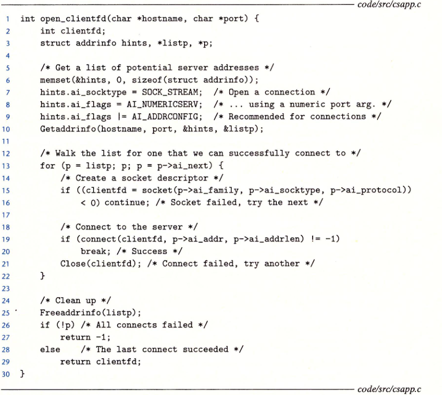

# 网络编程

> date：2022年7月12日

## 1.网络请求

**路由器**：连接局域网的特殊计算机

**适配器**：路由器对于其连接的局域网的端口，叫做适配器

主机A（LAN1）发送一串数据字节到运行在主机B上（LAN2)的服务器端，经过**8个基本步骤**：

1. **请求**：主机A上的客户端进行一个系统调用，告诉操作系统发起网络数据传送请求，将客户端的虚拟地址空间复制到内核缓冲区中
2. **封装**：主机A上的协议软件在数据前附加包头（TCP头、IP头、MAC头）和帧头，多层封装后形成一个LAN1帧（帧头用于寻址路由器，包头用于寻址主机）。
3. **发送到到自身所在的局域网**：LAN1适配器将该帧复制到网络上
4. **由路由器发送出去**：当帧到达路由器时，路由器的LAN1适配器从电缆上读取它，并将它传送到协议软件
5. **在广域网中经路由器多级转发**：路由器从互联网包头（IP）中提取出目的互联网络地址，并用它作为路由表的索引，转发向LAN2。此时，帧头由LAN1换为LAN2
6. **接收方局域网获取**：路由器的LAN2适配器将该帧复制到网络上
7. **接收**：当此帧到达主机B时，它的适配器从电缆上读到此帧，并将它传送到协议软件
8. **解封装**：主机B上的协议软件剥落包头和帧头。当服务器进行读取数据时，将这些数据传送到服务器虚拟地址空间

---------

## 2.域名系统


DNS(Domain Name System)定义了域名和IP地址之间的映射关系，是一个数据库。

DNS数据库由上百万条主机条目结构(host entry structure)组成，每条定义了一组域名和一组IP地址之间的映射

可以通过`nslookup`命令来查看域名和IP之间的映射关系


- localhost是**回送地址**，表示本机，为本机中同时运行服务器和客户端提供了便利的调试方式，可以使用`hostname -i`显示实际域名
- 多个域名可以映射一个IP地址
- 一个域名可以映射多个IP地址

--------

## 3.套接字

进程间的通信是点对点的，通过套接字socket来完成。

socket是连接的一个端点，有其相应的socket地址，用“地址：端口”来表示，如`localhost:33`

一般情况下，socket中的端口是内核自动分配，成为**临时端口**，某些知名服务器的端口是固定的，如web服务器使用端口80，电子邮件使用服务器端口25

一个连接由服务端和客户端的socket地址唯一确定。这对套接字地址叫做**套接字对（socket pair）**，表示为
$$
(client\_addr : client\_port, service\_addr : service\_port)
$$


-----------

## 4.套接字接口

> 套接字接口（socket interface）是一组函数，它们和Unix I/O函数结合起来，用以创建网络应用

下图为网络应用进行通信时所需要调用的套接字接口函数


从Linux程序角度来看，套接字是一个有相应描述符的打开文件。其中`in`表示`internet`互联网络


#### socket函数——创建一个套接字描述符

```cpp
#include <sys/socket.h>
#include <sys/types.h>

int socket(int domain, int type, int protocol);

int main() {
    int clientfd = socket(AF_INET, SOCK_STREAM, 0);	// AF_INET表示32位IP地址，SOCK_STREAM表示这个套接字是连接的一个端点
}
```

#### connect函数——建立和服务器的连接

```cpp
#include <sys/socket.h>

int connect(int clientfd, const struct sockaddr *addr, socklen_t addrlen);
```

连接成功的话会得到一个套接字对
$$
(x:y, addr.sin\_addr:addr.sin\_port)
$$
其中$x$表示客户端的IP地址，$y$表示临时端口

#### bind、listen、accept函数——服务器用于和客户端建立连接

```cpp
#include <sys/socket.h>

// 将addr中的服务器套接字地址(rossetta.top:80)和套接字描述符sockfd联系起来
int bind(int sockfd, const struct sockaddr *addr, socketlen_t addrlen);

// 客户端是发起请求连接的主动实体，其套接字为主动套接字。socket函数创建的fd对应于主动套接字，而listen函数告诉内核，描述符sockfd是被服务器使用的
int listen(int sockfd, int backlog);

// accept等待来自客户端的请求到达监听套接字listenfd，并在addr填写客户端的套接字地址，返回一个已连接描述符（connected descriptor），用于通信
int accept(int listenfd, struct sockaddr *addr, int *addrlen);
```

listen函数将sockfd从一个主动套接字转为监听套接字（listening socket），可以接受客户端的连接请求。

backlog参数暗示内核在开始拒绝连接请求之前，队列中要排队的未完成的连接请求的数量。

监听描述符只创建一次，存在于服务器的整个声明周期，而已连接描述符是客户端与服务器之间已建立的端点，每次服务器接受连接请求时都会创建一次。


##### 为什么要区分listening fd和connected fd？

为了建立并发服务器。当一个连接请求到来时，我们可以创建一个新进程(fork)，通过connected fd和客户端通信

#### getaddrinfo、getnameinfo——主机和服务的转换

实现了**二进制套接字地址结构**和**主机名、主机地址、服务名和端口号的字符串表示**之间的相互转化

##### 1.getaddrinfo

将主机名、主机地址、服务名和端口号的字符串转化为套接字地址结构

```cpp
#include <sys/types.h>
#include <sys/socket.h>
#include <netdb.h>

int getaddrinfo(const char *host, const char *service, const struct addrinfo *hints, struct addrinfo **result);	// 成功则返回0,否则返回错误代码

void freeaddrinfo(struct addrinfo *result);	// 释放result结构链表

const char *gai_strerror(int errcode);

```


- host: 提供域名或者点分十进制IP地址
- service: 提供协议或者端口号 http / port

- hints: 用于控制返回的result
- result: 一个指向addrinfo链表的指针（一个域名可能对应多个addrinfo）

##### 2.getnameinfo

将一个套接字结构转换成相应的主机和服务名字符串

```cpp
#include <sys/socket.h>
#include <netdb.h>

int getnameinfo(const struct sockaddr *sa, socklen_t salen, char *host, size_t hostlen, char *service, size_t servlen, int flags);
```

- sa指向大小为salen字节的套接字地址结构
- host指向大小为hostlen字节的缓冲区
- service指向大小为servlen的缓冲区

- sa被转换为host和service并复制到对应的缓冲区

- flags是一个位掩码，能够修改默认的行为


1. 初始化hints结构，使`getaddrinfo`返回我们想要的地址
2. 通过`getaddrinfo`获取地址信息
3. 遍历listp指向的addrinfo链表，并通过`getnameinfo`将套接字地址`p->ai_addr`转换为点分十进制地址字符串，并显示在屏幕上
4. 通过`freeaddrinfo`释放listp指向的链表

--------

#### open_clientfd、open_listenfd——套接字接口的辅助函数

将socket、listen等函数经过高一层的包装，方便使用

```cpp
int open_clientfd(char *hostname, char *port);	// 建立与服务器的连接，运行与主机上

int open_listenfd(char *port);	// 服务器创建一个监听描述符，并准备接受连接请求
```



