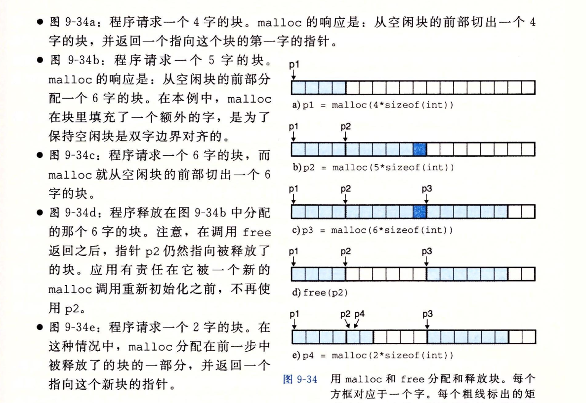

# 虚拟内存

date：2022年05月17日

虚拟内存三重功能：

- 作为磁盘地址空间的缓存，只保留了活动的区域，根据需要在主存和磁盘之间传送数据
- 为进程提供了一致的地址空间，简化了内存管理
- 保护进程的地址空间不被其他进程破坏

## 1. 物理和虚拟地址

物理地址：计算机的主存被组织为一个M字节的连续地址空间数组。每个字节都有一个唯一的物理地址，从0~M-1直接访问主存，这种简单的方式叫做物理寻址

虚拟地址：CPU通过一个**虚拟地址（Virtual Address，VA）**来间接地访问主存，这个虚拟地址在被传送到主存时先回转换成物理地址，称为**地址翻译（address translation）**。CPU利用芯片上的内存管理单元（Memory Management Unit，MMU）以及存放在主存中的**查询表**来动态翻译虚拟地址


---

## 2. 地址空间

在一个带虚拟内存你的系统中，CPU从一个有$N=2^n$个地址的地址空间中生成虚拟地址，**虚拟地址空间**为

$$
\{0, 1, 2, 3, \cdots N-1\}
$$

**物理地址空间**对应系统中物理内存的M个字节：

$$
\{0, 1, 2, \cdots , M-1\}
$$

**虚拟内存允许每个数据对象有多个独立的地址，每个地址都选自一个不同的地址空间。**

注意数据对象（字节）和它们的属性（地址）之间的关系和区别。

主存中每个字节都有一个选自虚拟地址空间的虚拟地址和一个选自物理地址空间的物理地址。

---

## 3. 虚拟内存作为缓存的工具

虚拟地址可以理解为到地址空间数组的索引。

磁盘和主存之间通过划分为块的传输单元来传输数据，虚拟内存系统将虚拟内存分割为**虚拟页（Virtual Page，VP）**的大小固定的块，每个虚拟页的大小为$P = 2^p$，同理物理内存也被分割为**物理页（Physical Page，PP）**，大小也为$P$字节，物理页也叫作**页帧（page frame）**

**虚拟页（存储在磁盘上）包括：**

- 未分配的：未分配的块/页没有任何数据与之相连，没有占用磁盘空间
- 缓存的：已缓存在物理内存中的已经分配的页
- 未缓存的：未缓存在物理内存中的已分配页


### 3.1 DRAM缓存的组织结构

DRAM缓存表示**虚拟内存系统的缓存，他在主存中缓存虚拟页。**

因为主存对于磁盘大的不命中处罚和访问第一个字节的开销，虚拟页往往很大，为4KB~2MB，且DRAM缓存是全相联的（S=1，只有一组），任何虚拟页可以放置在任何的物理页中。采用了复杂的替换策略算法。且因为对磁盘的访问时间很长，DRAM缓存总是使用写回而不是直写。

在磁盘和DRAM缓存中传送页的过程叫做**页面调度**（paging）

### 3.2 页表

虚拟内存系统需要确定：

- 一个虚拟页是否被缓存在主存中
- 虚拟页被缓存在哪个物理页中（命中）
- 或者虚拟页在磁盘中的哪个位置（不命中）并在物理内存中选择一个牺牲页并替换掉它

上述功能由操作系统、MMU（内存管理单元）、页表联合提供。

**页表（page table）**存放于**物理内存中**，将虚拟页映射到物理页，**每次需要将一个虚拟地址转换为物理地址时，会读取页表**


虚拟地址空间的每个页都根据偏移量对应了一个**页表条目（PTE，page table entry）**。

**页表中的每一个条目**包含了一个有效位（valid bit）和n位地址段。

- 有效位为1，表示缓存的虚拟页，地址表示相应的物理页的起始位置
- 有效位为0，地址位不为null，表示未缓存的虚拟页，地址表示虚拟页在磁盘上的起始位置
- 有效位为0，地址位为null，表示未分配的虚拟页

因为DRAM缓存是**全相联的**，所以任意物理页都可以包含任意虚拟页

注：全相联缓存没有组索引，会加大需要搜索标志位的数量，只适合容量较低缓存区域，如TLB快表

### 3.3 页命中

根据上图9-4可知，当读取一个VP2时

1. 地址翻译硬件将虚拟地址作为一个索引来定位PTE2
2. 页表中对应的PTE2设置了有效位，虚拟页已缓存，所以页表中存储的是物理页地址
3. 根据页表中的物理页地址定位到物理内存中的VP2


### 3.4 缺页

**缺页（page fault）**即DRAM缓存不命中，如上图读取一个VP3

1. 根据VP3的虚拟地址访问页表，发现对应的PTE3有效位为0，未被缓存，触发一个**缺页异常**
2. 缺页异常调用了内核的缺页异常处理程序，该程序会选择一个牺牲页VP4，同时更新牺牲页的页表条目PTE4
3. 复制磁盘中的虚拟页到内存中的物理页，并更新页表条目PTE3，随后返回
4. 重新启动导致缺页异常的指令

### 3.5 分配虚拟页

调用malloc函数，在磁盘中创建空间并更新PTE5，使它指向磁盘中创建的这个新页面

### 3.6 局部性

局部性原则保证了在任意时刻，程序将趋向于在一个较小的活动页面（active page）集合上面工作，这个集合叫做**工作集（working set）**。

在初始开销（将工作集页面调度到内存中）后，接下来的对工作集的引用将会导致命中，而不会产生额外的磁盘流量。

页面不断发生换进换出的行为叫做**抖动（thrashing）**

---

## 4. 虚拟内存作为内存管理的工具

实际上，操作系统**为每个进程提供了一个单独的页表，所以有一个独立的虚拟地址空间。**


- **简化链接。**独立的地址空间允许每个进程的内存映像**使用相同的基本格式**，而不管实际的代码和数据实际存放在物理内存的何处。如64位地址空间中，代码段总是从0x400000开始等。
- **简化加载**。容易向内存中加载可执行文件和共享对象文件。Linux加载器加载.data和.text（数据段和代码段）时，将它们标记为**未被缓存的**。对应的页表条目中地址位指向了目标文件的合适位置（将一组连续的内存页映射到一个文件中的任意位置的表示法叫做**内存映射（memory mapping）**，可以通过mmap系统调用接口使应用程序自己做内存映射），当程序执行时，虚拟内存会按照需要自动的调入数据页。
- **简化共享**。独立地址空间为操作系统提供了一个管理用户进程和操作系统自身之间共享的一套机制。操作系统创建页表，**将相应的虚拟页映射到相同的物理页面**，使进程间共享这部分代码，见上图PP7
- **简化内存分配。**虚拟内存为向用户进程提供一个简单地分配额外内存的机制。当内存申请额外的堆空间时，如malloc，操作系统将会分配一段**连续的虚拟内存页面并映射到随机的物理页面**。

---

## 5. 虚拟内存作为内存保护的工具

因为每次CPU生成一个地址时，需要通过页表来翻译虚拟地址，从而可以对PTE**添加一些额外的许可**来控制对一个虚拟页面的访问。


对每个PTE添加三个许可位：SUP表示进制是否运行在超级用户模式下才可以访问该页。

当一些指令违反了上述的保护条件，就会触发一个保护故障并启用内核的异常处理程序，归为**“段错误（segmentation fault”**

---

## 6. 地址翻译


1. 根据页表基址寄存器(PTBR)得到当前的页表
2. 根据$n-p$位的虚拟页号(VPN)确定页表条目(PTE)
3. 如果有效位为1，将页表条目中的的物理地址前$m-p$位物理页号(PPN)和虚拟页偏移量(VPO)串联，得到相应的物理地址
4. 物理页偏移和虚拟页偏移都是$P$字节，因此是相同的

### 6.1 结合高速缓存和虚拟内存

**不同于内存，在高速缓存SRAM中，一般采用物理地址直接访问**

---

### 6.2 利用TLB加速地址翻译

**目的：为了防止每次访问查询PTE的开销**，在内存管理单元（MMU）中包含了一个**关于PTE的缓存**，称为**快表**（Translation Lookaside Buffer，TLB）


**快表**具有高度相连度，通常为全相联（组S=1），组中每一行都保存一个PTE，标记和索引来自于VPN的位，因为**地址翻译都是在MMU上完成的**，所以非常快。

**TLB通过VPN进行虚拟寻址，寻找TLB中的条目，得到PPN，将PPN和VPO串联得到物理地址**

1️⃣ CPU产生一个虚拟地址

2️⃣3️⃣ MMU从TLB中取出相应的PTE

4️⃣ MMU将这个虚拟地址翻译成一个物理地址，并发送到高速缓存/主存

5️⃣ 高速缓存/主存将所请求的数据字返回给CPU


### 6.3 多级页表

> **目的：用来压缩页表，防止驻留在内存中的页表过大**

1. 一级页表中一个PTE指向虚拟内存中的一个较大的内存区域（如4MB），称之为**片（chunk）**，片包含若干个页。如果一级页表PTE映射的片中，**至少一个页**被分配，相应的PTE就指向二级页表
2. 二级页表中每个PTE映射一个4KB的虚拟内存**页**，依次递推最终指向物理地址


优势：

- 当一级页表中一个PTE未分配，则不存在二级页表，节省空间
- 只有一级页表总需要存在于主存中，只有最经常使用的二级页表才会存在于主存中

同理，K级页表的翻译方式是相同的。

**TLB通过将k个层次上不同的页表条目PTE缓存起来，加快了页表的访问速度。**

### 6.4 实例分析：端到端的地址翻译

见csapp p574

---

## 7. 案例研究：Intel Core i7/Linux内存系统

### 7.1 core i7地址翻译


### 7.2 Linux虚拟内存系统


**内核虚拟内存区域中:**

内核虚拟内存中包含内核中的代码和数据结构,某些区域被映射到**共享的**物理页面.如内核的代码和全局数据结构.

同时,将一部分虚拟内存映射到一组连续的物理内存,为内核提供了一种便利的方法来访问物理内存的任何位置. 例如访问页表, 在设备上执行内存映射的I/O操作,设备被映射到特定的物理位置时.

---------------

#### 1. Linux虚拟内存区域

虚拟内存中,不同的**段(area)**(如代码段,数据段,堆,共享库段,用户栈...), 是分配了的虚拟内存的连续**片(chunk)**的集合.


一个具体区域的区域结构包含了以下字段:

- `vm_start`: 指向这个区域的起始处
- `vm_end`: 指向这个区域的结束处
- `vm_prot`: 描述这个区域内包含的所有页的读写许可权限
- `vm_flags`: 描述这个区域内的页面是与其他进程共享的, 还是这个进程私有的
- `vm_next`: 指向链表中的下一个区域结构

#### 2. Linux缺页异常处理

> 假设翻译虚拟地址A, 触发了缺页异常处理程序, 包含以下步骤:

1. 查询虚拟地址是否合法
   1. 搜索区域结构的链表,将A和区域结构中的`vm_start`和`vm_end`进行标胶
   2. 如果指令不合法触发段错误(segmentation fault)

2. 试图访问的内存是否合法
   1. 判断进程是否有权限
   2. 如果没有权限,触发一个保护异常

3. 如果虚拟地址和访问内存皆合法,则
   1. 选择一个牺牲页面,并交换出去
   2. 换入新的页面,并更新页表
   3. CPU重新启动引起缺页的程序,再次发送A地址到MMU,此时会正常翻译

-----------

## 8. 内存映射

> Linux通过将一个虚拟内存区域和一个磁盘上的**对象(object)**关联起来, 以初始化这个虚拟内存区域的内容, 这个过程称之为**内存映射(memory mapping)**

其中, 虚拟内存可以映射的对象包含:

- Linux文件系统中的普通文件

​	文件区(section)被分成页大小的片, 每一片包含一个虚拟页面的初始内容. 按需进行页面调度, 所以这些虚拟页面没有实际进入到物理内存中, 直到CPU第一次引用页面. 如果区域比文件大, 则通过填充零来补全区域的剩余部分

- 匿名文件

​	由内核创建的全为二进制零的文件. CPU引用这样一个区域的虚拟页面时, 将物理内存中的一个被修改过的牺牲页面置换出来, 用二进制零覆盖并更新页表, 将页面标记为驻留在内存中. 映射到匿名文件的区域中的页面有时也叫作**请求二进制零的页(demand-zero page)**

**一旦一个虚拟页面被初始化了, 它就在一个由内核维护的专门的交换文件(swap file)之间换来换去, 交换文件也叫作交换空间(swap space), 交换空间限制了当前运行着的进程能够分配的虚拟页面的总数**

---------------

### 8.1 再看共享对象

一个对象可以被映射到虚拟内存的一个区域, 要么作为**共享对象**, 要么作为**私有对象**

对共享对象所在区域(**共享区域**)做任何的写操作, 都<u>会</u>影响其他映射这个共享对象的进程, 同时<u>反映在磁盘中的原始对象中</u>

对私有对象区域(**私有区域**)做的改变, 对于其他进程来说是<u>不可见的</u>, 并且进程对区域所做的任何写操作<u>不会反映在磁盘中的对象中</u>


开始时, 两个进程共享这个私有对象的物理副本, 私有区域的页表条目标记位**写时复制(copy on write)**

当有一个进程试图进行写操作时, 会触发保护故障, 故障处理程序会创建一个页面的新副本, 更新页表条目指向这个新副本, 并恢复这个页面的可写权限, 故障处理程序返回时CPU重新执行写操作

---------

### 8.2 再看fork函数

fork被当前进程调用时, 内核会为新进程创建各种数据结构, 并给它分配一个唯一的PID

为了给新进程创建虚拟内存, 它创建了当前进程的`mm_struct`, 区域结构和页表的原样副本, 将两个进程中的每个页面标记为只读, 并将两个进程中的每个区域结构标记为私有的**写时复制**

fork在新进程中返回时, 新进程现在的虚拟内存刚好和调用fork时存在的虚拟内存相同. 当这两个进程中的任意一个进程写操作时, 写时复制机制就会创建新页面, 因此, 为每个进程保持了私有地址空间的抽象概念. 

--------

### 8.3 再看execve函数

当调用一个`execve`函数时, 如`execve("a.out", NULL, NULL)`, 加载并运行a.out需要以下几个步骤:

- 删除已存在的用户区域
- 映射私有区域
- 映射共享区域
- 设置程序计数器


### 8.4 使用mmap函数的用户级内存映射

> Linux可以通过mmap函数来创建新的虚拟内存区域, 并将对象映射到这些区域中

```cpp
#include <unistd.h>
#include <sys/mman.h>

void *mmap(void *start, size_t length, int prot, int flags, in fd, off_t offset);
```

```cpp
#include <unistd.h>
#include <sys/mman.h>

// 通过munmap函数删除虚拟内存的区域
int munmap(void *start, size_t length);
```

--------------

## 9. 动态内存分配

> 在运行时，使用**动态内存分配器**来分配需要的额外虚拟内存，而不是使用mmap和munmap函数来创建和删除虚拟内存区域
>
> 动态内存分配器维护着**堆（heap）**，堆为链式结构

堆是一个请求二进制零的区域，紧接着未初始化的数据区域后开始，并向上生长（更高的地址），堆顶有一个`break`指针


- 显示分配器（explicit allocator），要求应用显示地释放所有已分配的块（block/chunk) `C/C++`
  - malloc和free
  - new和delete
- 隐式分配器（implicit allocator），也称之为垃圾收集器（garbage collector） `Java, Python`

---------

### 9.1 malloc和free函数

```cpp
#include <stdlib.h>

void *malloc(size_t size);
// 若成功返回被分配块的指针，失败返回NULL
```

返回的数据块需要**数据对齐**

32位模式中，malloc返回的块地址总是**8的倍数**

64位模式中，malloc返回的块地址总是**16的倍数**

#### calloc和realloc函数

`calloc`是一个基于`malloc`的瘦包装函数，其中`malloc`不初始化已分配的内存，而`calloc`会将已分配的内存初始化为零。

`realloc`函数则改变一个已分配块的大小

```cpp
#include <unistd.h>

void *sbrk(intptr_t incr); // 通过将内核指针brk增加incr来扩展和收缩堆，incr可以是负数（通过free来释放）
```



### 9.2 为什么要使用动态内存分配

> 经常直到程序运行时才知道数据结构的大小时

### 9.3 分配器的要求和目标

要求：

- 处理任意要求序列：即在任意的分配请求和释放请求序列内，每个释放请求必须对应一个已分配的块，**分配器不可以假设分配和释放请求的顺序**
- 立即响应请求：立即响应分配请求
- 只使用堆
- 对齐块：分配的内存空间必须满足对齐要求，使得它们可以保存任何类型的数据对象
- 不修改已分配的块：分配器只能操作或者改变空闲块

目标：

- 最大化吞吐率（每个单位时间内完成的请求数）

- 最大化内存利用率

---------

### 9.4 碎片

> 碎片（fragmentation）发生于有未使用的内存，却不能用来满足分配请求时，会造成内存利用率降低。
>
> 有两种形式的碎片，即内部碎片（internal fragmentation）和外部碎片（external fragmentation）

**有效载荷：**一个应用程序请求了P字节的空间，则有效载荷（payload）就是P字节

- 内部碎片：当已分配块的大小大于其有效载荷时，如对齐现象造成的多分配

- 外部碎片：当空闲内存合计满足一个分配请求，但是没有一个单独的空闲块足够大来出来这个请求时

-------

### 9.5 实现问题

为了平衡内存利用率和吞吐率，需要考虑以下问题：

- 组织：空闲块如何组织和记录？
- 放置：如何选择一个合适的空闲块来放置一个新分配的块？
- 分割：将新分配的块放入空闲块后，如何处理空闲块的剩余部分？
- 合并：如何处理一个刚被释放的块？

--------

### 9.6 隐式空闲链表


大多数分配器需要数据结构来允许区分块边界，并区分已分配块和空闲块。分配器将这些信息嵌入到块本身。

一个块由一个字的头部、有效载荷、以及一些可能的额外填充数组。

其中头部记录了包含了块的大小（包括了有效载荷和填充部分）


--------

### 9.7 放置已分配的块

> 当一个应用申请k字节的块时，分配器会搜索空闲链表找到一个足够大的可以放置的空闲空间。这种执行搜索的方式叫做**放置策略（placement policy）**

- 首次适配（first fit）：从头开始搜索，寻找第一个适配块
- 下一次适配（next fit）：从上一次查询的地方开始，寻找第一个适配块
- 最佳适配（best fit）：检查每个空闲块，选择适合所需请求大小的<u>最小</u>空闲块

----

### 9.8 分割空闲块

> 一旦找到一个空闲块，需要决定分配这个空闲块中的多少空间

- 全部分配：容易造成碎片
- 将空闲块分配为两部分：一部分作为分配块，剩下的作为新的空闲块

------------

### 9.9 获取额外的堆内存

> 如果找不到空闲块怎么办？

- 合并物理上相邻的空闲块（见9.10）
- 调用sbrk函数向内核请求额外的堆内存，插入到空闲链表中

-------

### 9.10 合并空闲块

> 如果新释放了一部分空间，且与一个空闲块相邻。会造成**假碎片**现象
>
> 分配器需要合并假碎片，防止相邻的空闲块不可用的情况

**合并（coalescing）**

- 立即合并：在每个块被释放时，就合并所有相邻块
- :heavy_check_mark:推迟合并：直到某个分配请求失败时，扫描整个堆，合并所有的空闲块

--------

### 9.11 带边界标记的合并

> 当当前块的头部指向下一个块的头部，可以之间检查下一个指针，所指向的块是否空闲，进行简单地块大小相加
>
> 如何合并前面的块？

**边界标记（boundary tag）**

在每个块的结尾添加一个**脚部（footer）**，为头部的一个副本，分配器通过检查脚部判断前面一个块的起始位置和状态


其中a表示已分配的，f表示空闲的

-------

### 9.12 设计一个分配器

略

-------

### 9.13 显式空闲列表

> 块分配和堆块的总数呈线性关系，所以对于通用分配器，隐式空闲列表是不适合的

将空闲块组织呈某种形式的显式数据结构。空闲块的主体中存放数据结构的指针，如下图将堆组织成一个双向空闲链表


---------

## 10. 垃圾收集

>  垃圾收集器（garbage collector）是一种动态内存分配器，它自动释放程序不再需要的已分配块。

mark&sweep

----------

## 11. C程序中常见的与内存有关的错误

### 11.1 间接引用坏指针

```cpp
scanf("%d", &val); // right
scanf("%d", val); // false
```

### 11.2 读未初始化的内存

```cpp
int *sum(int *x, int n) {
	int *y = (int *)malloc(sizeof(int));	
	for (int i = 0; i < n; ++i) {
        y += x[i];	// y没有初始化
    }
    return y;
}
```

### 11.3 允许栈缓冲区溢出

```cpp
void bufoverflow() {
	char buf[64];
    gets(buf); 	// 传递一个任意大小的buf到栈中，会引发栈溢出错误
}
```

### 11.4 sizeof(int *)和sizeof(int)是不同的

```cpp
/* 创建一个指向数组的指针数组 */
int **makeArray(int n, int m) {
    int i;
    int **A = (int **)malloc(n * sizeof(int));	// 错误，应该是sizeof(int *)
    for (i = 0; i < n; ++i) {
        A[i] = (int *)malloc(m * sizeof(int));
    }
    return A;
}
```

### 11.5 错位错误，内存访问越界

```cpp
int **makeArray(int n, int m) {
    int i;
    int **A = (int **)malloc(n * sizeof(int *));	
    for (i = 0; i <= n; ++i) {		// 错误，访问到了n+1个元素，为未分配的块
        A[i] = (int *)malloc(m * sizeof(int));
    }
    return A;
}
```

### 11.6 引用指针而不是其所指的对象

```cpp
int *binheapDelete(int **binheap, int *size) {
    int *packet = binheap[0];
    
    binheap[0] = binheap[*size - 1];
    *size--;	// 应该是(*size)--
    heapify(binheap, *size, 0);
    return(packet);
}
```

### 11.7 指针递增或递减的单位以其指向的对象为标准

```cpp
int *search(int *p, int val) {
    while (*p && *p != val) {
        p += sizeof(int);	// 错误，应该是p++，表示指向下一个int
    }
    return p;
}
```

### 11.8 引用不存在的变量

```cpp
int *stackref() {
    int val;
    return &val;	// 错，不能取局部变量的地址，其在函数结束后从栈内释放
}
```

### 11.9 引用空闲堆块中的数据

```cpp
itn *heapref(int n, int m) {
    int i;
    int *x, *y;
    x = (int *)malloc(n * sizeof(int));
    
    free(x);
    y = (int *)malloc(m * sizeof(int));
    for (i = 0; i < m; i++) {
        y[i] = x[i]++; //错误，x已经被释放了，不能引用
    }
}
```

### 11.10 内存泄漏

```cpp
void leak(int n) {
    int *x = (int *)malloc(n * sizeof(int));
    return; // 错误，x为动态分配的内存，但是没有进行垃圾回收
}
```

---

## 12. 总结

虚拟内存是对主存的一个抽象。支持虚拟内存的处理器通过使用一种叫做虚拟寻址的间接形式来引用主存。处理器产生一个虚拟地址，在被发送到主存之前，这个地址被翻译成一个物理地址。从虚拟地址空间到物理地址空间的地址翻译要求硬件和软件的紧密合作。专门的硬件通过使用页表来翻译虚拟地址，而页表的内容是由操作系统提供的。

虚拟内存提供三个重要的功能。

1. 它在主存中自动缓存最近使用的存放磁盘上的虚拟地址空间的内容。虚拟内存缓存中的块叫做页。对磁盘上页的引用会触发缺页，缺页将控制转移到操作系统中的一个缺页处理程序。缺页处理程序将页面从磁盘复制到主存缓存，如果必要，将写回被驱逐的页。

2. 虚拟内存简化了内存管理，进而又简化了链接、在进程间共享数据、进程的内存分配以及程序加载。

3. 虚拟内存通过在每条页表条目中加人保护位，从而了简化了内存保护。

地址翻译的过程必须和系统中所有的硬件缓存的操作集成在一起。大多数页表条目位于L1高速缓存中，但是一个称为TLB的页表条目的片上高速缓存，通常会消除访问在L1上的页表条目的开销。

现代系统通过将虚拟内存片和磁盘上的文件片关联起来，来初始化虚拟内存片，这个过程称为内存映射。内存映射为共享数据、创建新的进程以及加载程序提供了一种高效的机制。应用可以使用`mmap`函数来手工地创建和删除虚拟地址空间的区域。然而，大多数程序依赖于动态内存分配器，例如`malloc`,它管理虚拟地址空间区域内一个称为堆的区域。动态内存分配器是一个感觉像系统级程序的应用级程序，它直接操作内存，而无需类型系统的很多帮助。分配器有两种类型。显式分配器要求应用显式地释放它们的内存块。隐式分配器（垃圾收集器）自动释放任何未使用的和不可达的块。

对于C程序员来说，管理和使用虚拟内存是一件困难和容易出错的任务。常见的错误示例包括：

- 间接引用坏指针
- 读取未初始化的内存
- 允许栈缓冲区溢出
- 假设指针和它们指向的对象大小相同
- 引用指针而不是它所指向的对象
- 误解指针运算
- 引用不存在的变量
- 以及引起内存泄漏
