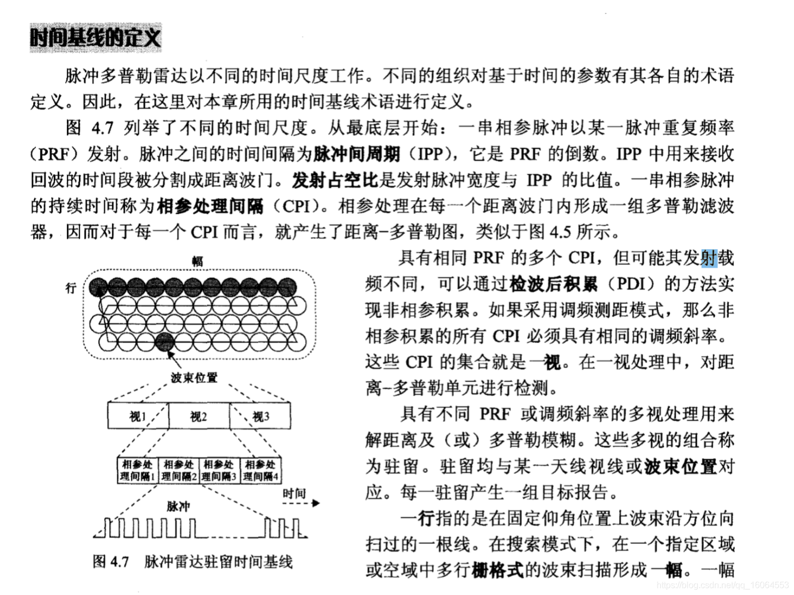
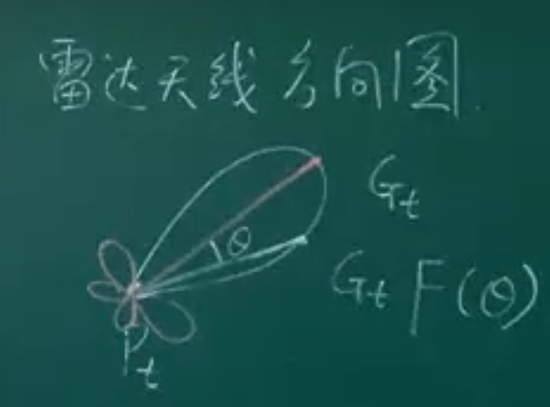
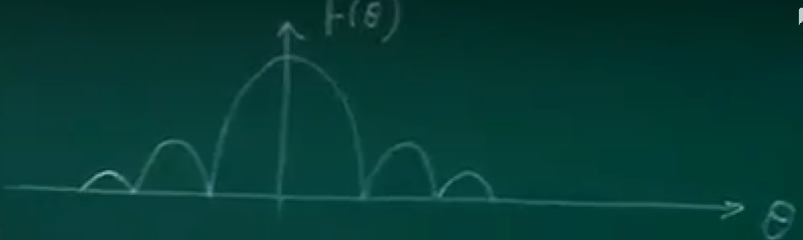

# 信号处理基础概念

> Date：2022年10月8日

#### 1.Paserval定理

信号从时域映射到频域**能量不变**（范数不变），称之为保范映射

#### 2.卷积

​	信号处理中如何出现卷积的。假设B是一个系统，其t时刻的输入为x(t)，输出为y(t)，系统的响应函数为h(t)，按理说，输出与输入的关系应该为
$$
Y(t)=h(t)\cdot x(t)
$$
然而，实际的情况是，系统的输出不仅与系统在t时刻的响应有关，还与它在t时刻之前的响应有关，不过系统有个衰减过程，所以$t_1 (t_1 < t)$时刻的输入对输出的影响通常可以表示为$x(t)\cdot h(t-t1)$，这个过程可能是离散的，也可能是连续的，所以**时刻的输出应该为t时刻之前系统响应函数在各个时刻响应的叠加，这就是卷积**，用数学公式表示就是
$$
y(s)=\int x(t)\cdot h(s-t)dt
$$
离散情况下就是级数了。

一维卷积的情况下，计算卷积只需要将其中一个信号进行取反再右移t，即为时间t上的卷积，在对所有的时间t进行积分，得到最终的卷积结果

==时域卷积 = 频域相乘==

简单来说，卷积是一种重叠关系，也就是说，所得到的结果反映了两个卷积函数的重叠部分。所以，用一个已知频段的函数卷积另一个频段很宽的函数，也就是对后者进行了滤波，后者跟前者重叠的频段才能很好地通过这个filter.

#### 3.快时间和慢时间

单脉冲：对于单雷达来说，发射脉冲时是不进行接收的，一个脉冲内发射脉冲后的时间对回波进行采样，这就是快时间采样频率，一般大于奈奎斯特采样频率即$Fs >= 2 \cdot F$，其中$F$为信号的频率。

多脉冲：脉冲雷达一般发射的是连续的脉冲序列，一个脉冲序列中不同的脉冲之间的间隔称之为**脉冲重复间隔（PRI）**，**脉冲重复频率（PRF = 1 / PRI）**就是慢时间的采样频率。

#### 4.相参处理间隔CPI

#### 5.dB单位之间的关系和换算

* dB是一个比值单位，功率比为$10\lg \frac{a}{b}$
* dBw和dBm是一个绝对值单位，其中dBw的$b$为1$W$，而dBm的$b$为1$mW$

$$
13dB = 10^{\frac{13}{10}}dB = 10^{1.3}dB \\
10000 = 10\lg{10000} = 30dB
$$

dB单位的转换经验, $+10dB = \times 10倍$
$$
0dB = 1倍 \\
10dB = 10倍 \\
20dB = 100倍 \\ 
30dB = 1000倍 \\
$$
$+3dB = \times 2倍$
$$
3dB = 2倍 \\ 
6dB = 4倍 \\
9dB = 8倍 \\ 
43dB = 10000 \times 2  = 20000倍 \\
43dBm = 10000 \times 2 \times 1mW = 20W
$$
Tips：

1. 一般来说dB之间的计算只有加减，没有乘除

2. dBm和dBm之间的减法表示比较，单位为dB，如从20dBm到-10dBm之间衰减了30dB，即$20dBm - (-10dBm) = 30dB$
3. dBm和dB之间可以加减，如A为10dBm，A衰减了30dB，则B为-20dBm

#### 6.无模糊测量距离

最大不模糊距离$R_{max}$是指，**当雷达发出的一个脉冲遇到该距离处的目标物产生的后向散射波返回到雷达时，下一个雷达脉冲刚好发出**。也就是说，雷达波传播到位于最大不模糊距离处的目标物，然后其回波再返回雷达所用的时间刚好是两个脉冲之间的时间间隔。
$$
R_{max} = \frac{PRT}{2} \times c
$$

#### 7.雷达的分类

| 雷达种类               | 用途                                                         |
| ---------------------- | ------------------------------------------------------------ |
| 连续波雷达             | 测速（多普勒频移）                                           |
| 调频连续波雷达（FMCW） | 测距（通过频率变化参照）、测速                               |
| 脉冲雷达               | 测距                                                         |
| 脉冲多普勒雷达         | 测距、测速（通过脉冲相位变化，执行I/Q解调获得）              |
| 脉冲压缩雷达           | 测距、测速（发射调制脉冲，达到大脉宽时宽积，和FMCW类似）     |
| 捷变频雷达             | 抗阻塞干扰和杂波抑制                                         |
| 相控阵雷达             | 相控阵雷达天线具有几百甚至几千个独立的辐射单元。馈送到每个辐射单元信号的幅度、相位可以分别独立控制，从而可以获得任何所需要的辐射方向形状（方向图）。 |
| 合成孔径雷达（SAR）    | 成像。机载或者星载，通过电磁波对地球表面进行成像             |

#### 8.工作带宽和瞬时带宽

带宽：信号功率谱-3dB的频率范围

工作带宽：雷达可能工作的频率范围，如VH波段雷达，C波段，S波段雷达

瞬时带宽：雷达信号的带宽，一般几MHz~几百MHz，其瞬时频率计算$f = \frac{1}{2\pi}\frac{\mathrm{d}\varphi}{\mathrm{d}t}$，其中$\varphi$为信号的相位。

#### 9.雷达天线

**天线方向图**是雷达各向异性天线（有方向性天线）相对于各向同性天线（无方向性天线）在雷达<u>极坐标下</u>各方向的功率增益。

有方向性天线为了将功率集中在目标所在的方向，牺牲副瓣来成全主瓣增益。

上图称之为雷达天线方向图，包括主瓣和一对第一副瓣、一对第二副瓣，在雷达天线方向图的主瓣上，越原理主瓣中心方向，所得到的天线增益就越小，称之为主瓣单调性。

如何衡量一个主瓣天线波束宽度？**半功率波束宽度**$\theta_{3dB}$，其中$20\lg\frac{\sqrt{2}}{2} = 10\lg\frac{1}{2} = -3dB$，上式中，幅度/电压为原来的$\frac{\sqrt{2}}{2}(0.707)$，功率为原来的$\frac{1}{2}$

实际上，天线的方向图是一个立体的，其半功率波束宽度包括了$\theta_{\alpha}$和$\theta_{\beta}$，共同决定了天线增益，其波束宽度越窄，功率越集中，天线增益越高。

#### 10.多普勒效应测速

$$
\Delta f = f_t - f_r = \frac{2v_r}{\lambda}
$$

其中：

1. 只能测径向速度，如果有一个目标绕雷达做匀速圆周运动（径向速度为0），无法测出其速度
2. 目标靠近雷达时，其多普勒频移为正数，可以判断目标速度方向

#### 11.雷达成像

* SAR（合成孔径雷达），装载在移动平台上（飞机、卫星），对地面进行成像
* ISAR（逆合成孔径雷达），装载在相对静止的平台上，对目标进行成像（类似于拍照）