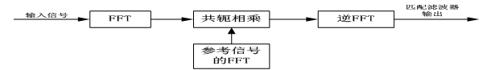
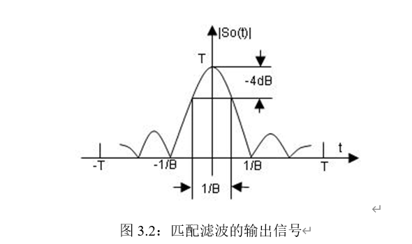
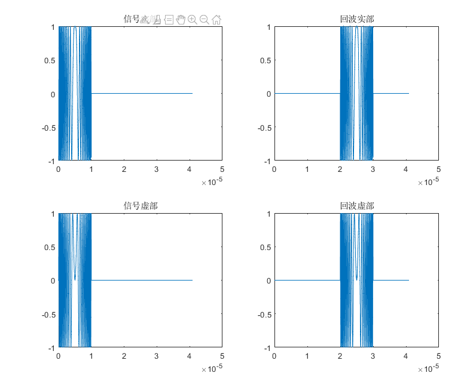
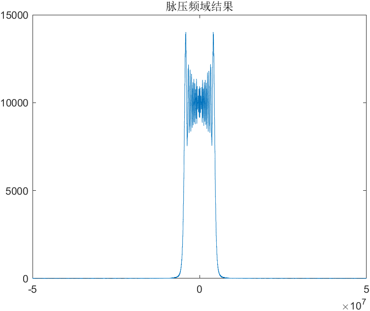
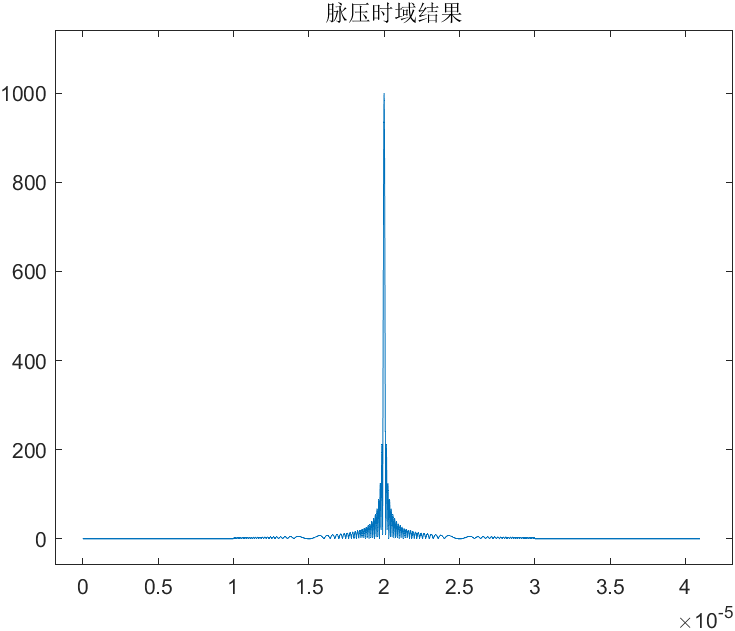

# 脉冲压缩

> Date：2022年10月8日

## 一、原理

脉冲压缩即匹配滤波，通过对PD雷达的脉冲回波信号进行进行时域卷积（频域共轭相乘）得到脉冲压缩后的信号，提高信号的增益

匹配滤波系统的函数为
$$
h(t) = s^*(t_0 - t)
$$
其中，$t_0$为系统为了物理可实现所添加的时延，实际在仿真中可忽略，即
$$
h(t) = s^*(-t)
$$
故匹配滤波有
$$
y(t) = h(t) * s(t) \\
Y(f) = H(f) \cdot S(f)	\\
\\
H(f) = conj(fft(s(t)))
$$

如上图所示，匹配滤波后的压缩脉宽为$\tau_{1} = 1/B$，使得时宽带宽积为$\tau_{1} \cdot B = 1$，相比于原来的脉宽$\tau_{0}$，其压缩比$D = \frac{\tau_0}{\tau_1} = \tau_0 \cdot B$

## 二、匹配滤波器的物理意义

​	从相频特性上看，匹配滤波器的**相频特性和输入信号正好完全相反**。这样，通过匹配滤波器后，信号的相位为0，正好能实现信号时域上的相干叠加。而噪声的相位是随机的，只能实现非相干叠加。这样在时域上保证了输出信噪比的最大。

​    实际上，在信号与系统的幅频特性与相频特性中，幅频特性更多地表征了频率特性，而相频特性更多地表征了时间特性。匹配滤波器无论是从时域还是从频域，都充分保证了信号尽可能大地通过，噪声尽可能小地通过，因此能获得最大信噪比的输出。

## 三、结果

脉冲压缩的代码见：[pc.mlx](D:\CodeSpace\MATLAB\pc.mlx)

