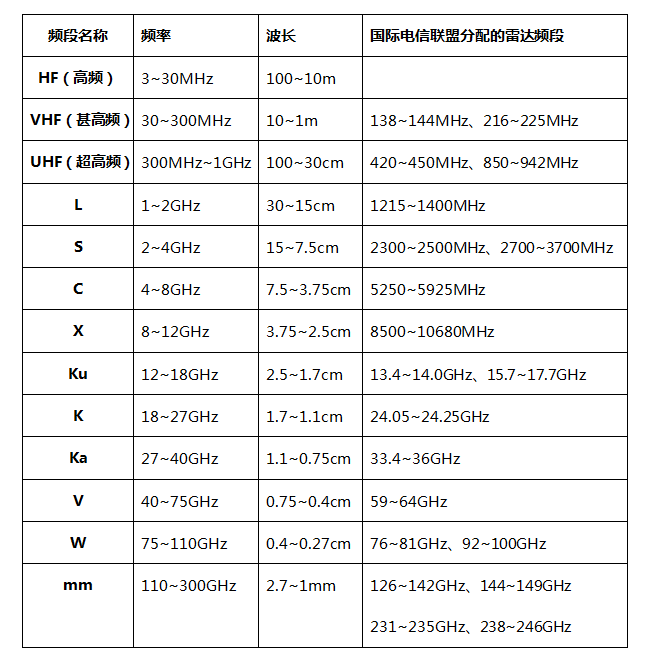
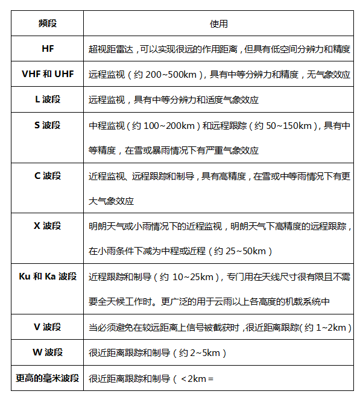

# 雷达原理

> Date：2022-11-11
>
> Author：Rossetta

## 一、绪论

### 1.1 雷达基本方程（单基地，无空间损耗）

$$
P_r = \frac{P_tG_tG_r\sigma\lambda^2}{(4\pi)^3R^4}   \qquad while \quad P_r = S_{imin}
$$

上式中，表示接收功率刚好等于接收机灵敏度时，此时$R$为最大探测距离，其中，$P_t$为发射功率，$G_t$为发射天线增益，$G_r$为接收天线增益，存在$G_r = \frac{4\pi A_r}{\lambda^2}, G_t = \frac{4\pi A_t}{\lambda^2}$，式中$A_r$为接受天线有效面积，$\sigma$为目标散射截面积RCS，全部采用**国际标准化单位计算（真值）**

其中，最大作用探测距离为
$$
R_{max} = [\frac{P_tG_tG_r\sigma\lambda^2}{(4\pi)^3P_r}]^\frac{1}{4}
$$
如何提高最大探测距离？提高发射功率或者使接收机的灵敏度提高（即减小$S_{imin}$）

真值与分贝值之间的转换见[dB单位之间的关系和换算](./信号处理基础概念.md)

Tips:

* 收发共用天线$G_t = G_r$，发射机和接收机分时复用天线，常见于脉冲雷达，不能是连续波雷达（信号不连续）

### 1.2 雷达工作频率、应用与发展

**常用工作频率：220MHz~35GHz**

