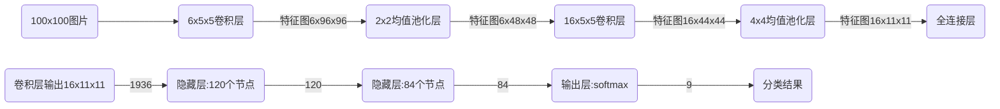

# 一种基于卷积神经网络的雷达干扰识别算法

作者：刘国满、聂旭娜

时间：2021年11月19日

----------------

## 一、摘要

问题：

* 基于特征参数的识别方法受噪声影响大

* 参数特征提取只发生在某一脉冲重复周期内，难以识别一些具有时序关系的干扰信号。

方法：

* 利用两个卷积神经网络级联，基于信号的伪$Wigner-Ville$分布
* 利用单周期时频图像完成干扰预分类，多周期合成时频图像完成干扰细分类

------------------------

## 二、干扰数据生成和时频特性分析

**短时傅里叶变换受窗长限制，无法得到良好的时频分辨率，<u>采用$Wigner-Ville$分布得到时频图</u>**

优点：具有真边缘性、平移不变性

缺点：对多分量信号存在**交叉项**干扰，进行加窗处理解决，对$\tau$加窗得到伪$Wigner-Ville$分布，对$t\text {和}\tau$加窗得到平滑伪$Wigner-Ville$分布

综合分辨率、交叉项、计算耗时等因素选择（c）伪$Wigner-Ville$分布，公式如下：
$$
S_{pwvD_s}(t, \omega) = \int ^{+\infin}_{-\infin}h(\tau)s(t + \frac \tau 2)s^*(t-\frac \tau 2)e^{-j\omega\tau} \mathrm{d} \tau
$$
其中，$h(\tau)$是窗函数-汉宁窗，$t$代表时间，$\tau$代表时间积累量。

### 生成干扰数据并进行伪$Wigner-Ville$变换

在下列参数列表范围中选择12组参数，分别在干信比0~10 dB下，间隔1dB获取5个干扰样本
每种干扰信号可以获得12 * 5 * 11 = 660个干扰样本，在进行伪$Wigner-Ville$变换，经去噪处理和信号检测生成最终数据集。

**不同干扰与目标混合信号PWVD时频图像如下：**

-------------------------

## 三、分类器结构设计

### （1）、卷积神经网络结构

### （2）、针对拖引干扰无法根据单周期进行区分的问题

初始拖引时刻会被误判为无干扰，拖引后期会被误判为单假目标干扰。

初次判断时，将单个PRI内的拖引干扰、单假目标干扰、无干扰3种情况分为一大类。

第一个卷积神经网络处理后，如果干扰类型是单周期可识别则直接输出结果，否则将间隔一定时长的两个PRI（脉冲重复间隔）内的时频图像合成一张，送入第二个神经网络进行识别。

根据三种拖引干扰合成时频图像的时延、频移特征，对第二个神经网络进行训练。

--------------------

## 三、仿真结果分析

### （1）、识别正确率测试

采用混淆矩阵进行分析

### （2）、鲁棒性测试

### （3）、计算复杂度评估

### （4）、干信比测试

