# 计算机网络概述

## 一、因特网概述

* 网络：由若干个**节点**和连接这些节点的**链路**组成的

* 因特网：全球最大的互联网**（Internet）**
* 互联网：大型互相通过路由器连接的网络，即**网络的网络（Networks of Networks）**

## 二、三种交换方式

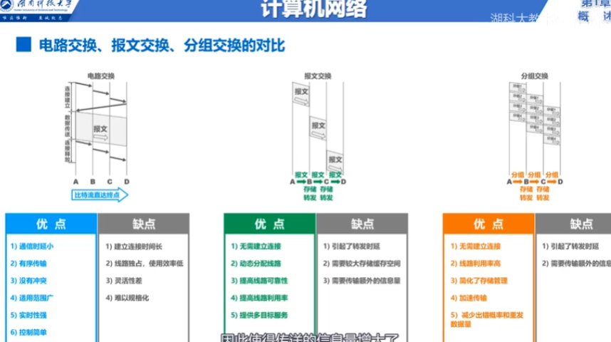

## 三、计算机网络的8个指标

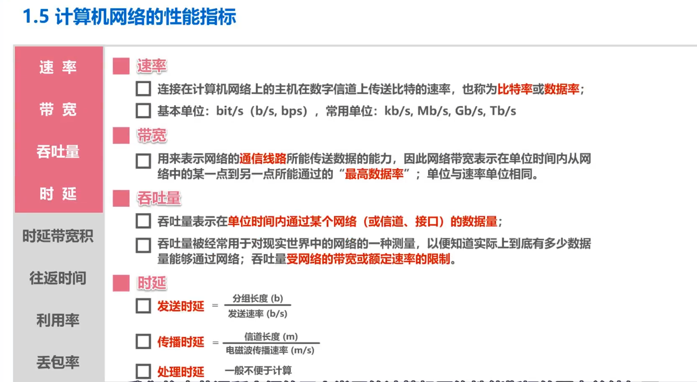

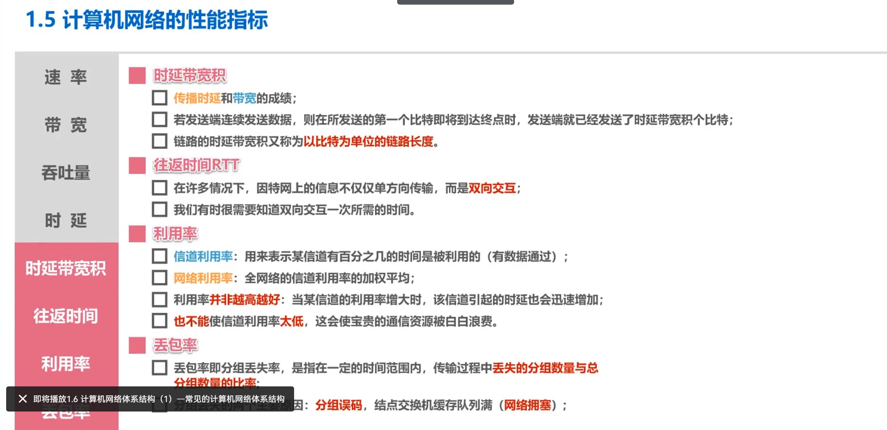

## 四、计算机网络体系结构

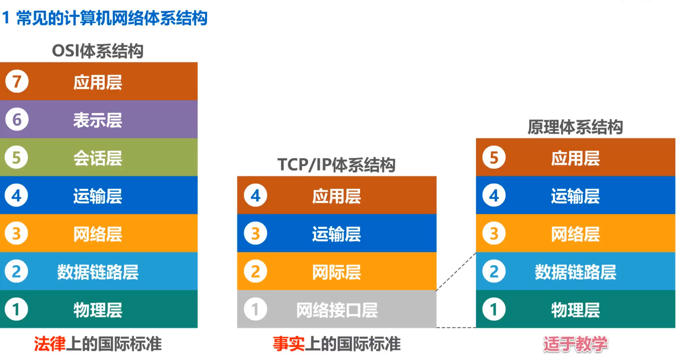

## 五、不同的分层之间解决了什么问题？

## 六、互联网中信息传输实例

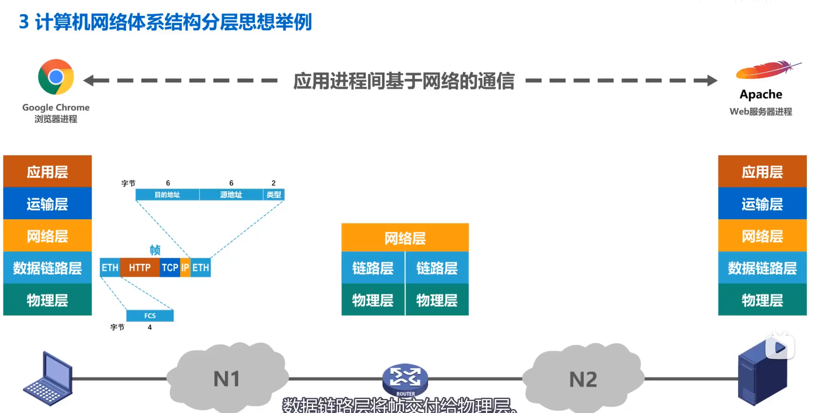

#### 客户端：

1. 应用层：封装HTTP报文
2. 运输层：给HTTP报文加上TCP头部
3. 网络层：给TCP报文加上IP头部
4. 数据链路层：加上帧头和帧尾ETH
5. 物理层：将帧看做是比特流，并加上前导码

#### 路由器：

1. 物理层：去除前导码，取出帧交给链路层
2. 链路层：去除帧头帧尾，去除IP报文交给网络层
3. 网络层：进行路由的查表，找到下一个转发的网络地址
4. 链路层：将IP报文再次进行帧头帧尾的封装，交个物理层
5. 物理层：加上前导码，发送出去

**Tips：路由器最高只涉及到网络层，即IP的查表转发**

#### 服务器：

1. 物理层：去除前导码，取出帧交给链路层
2. 链路层：去除帧头帧尾，取出IP报文交给网络层
3. 网络层：去除IP头部，取出TCP报文交给运输层
4. 运输层：去除TCP头部，取出HTTP报文交给应用层
5. 应用层：根据接收到的HTTP报文进行响应

## 七、专用术语

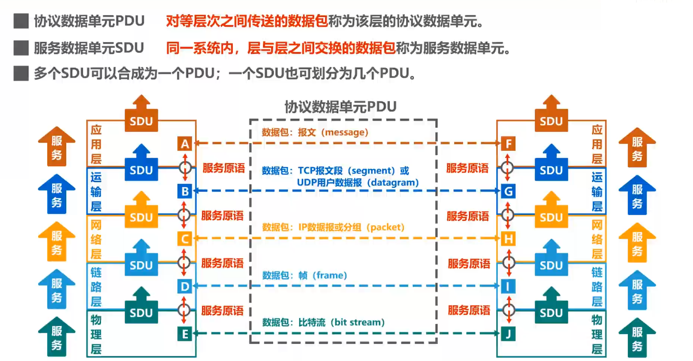

## 八、各层的作用范围

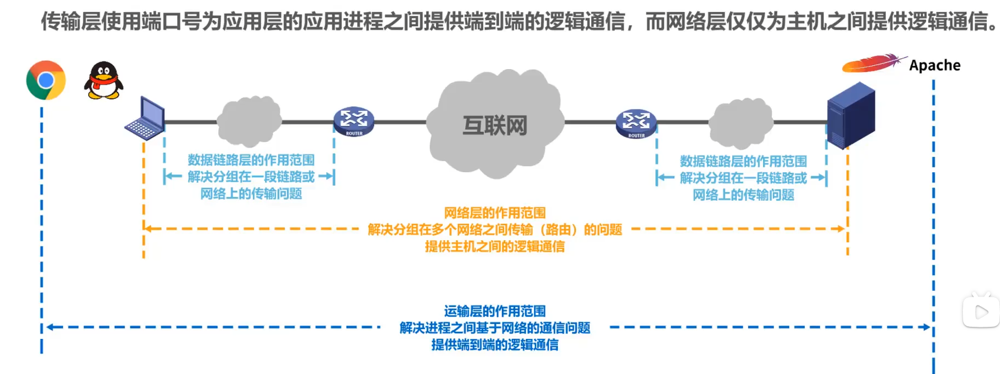

## 九、TCP/IP协议栈

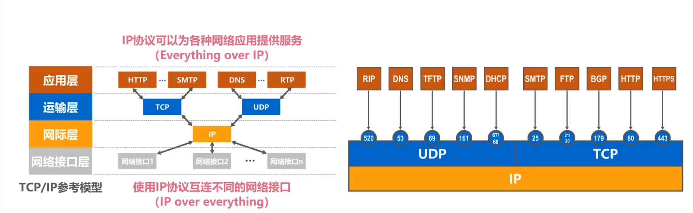

## 十、时延计算（发送时延+传播时延）

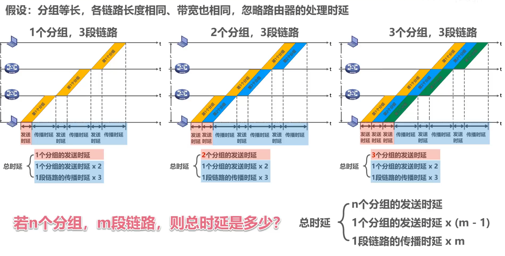

#### 局域网内传输，不经过路由器

1. 多bit发送情况下，发送时延为$n \times D_s$, 传播时延为$D_t = distance / V_t$，即传播距离除以传播速率(光纤$2 \times 10^8 m/s$)

#### 经过路由器的互联网发送

1. 路由器可以在接收一个bit的同时进行转发bit，所以多个bit的转发时延等价于1个bit的发送时延，如上图3
2. 在互联网中，有$m$段链路，假设有$m - 1$个路由器进行转发，则只有$m-1$个分组的转发（发送）时延
3. 初始将$n$个分组发送到网络中，需要$n$个分组的发送时延
4. $n$个分组在网络中传输，需要$m$个链路的传播时延

## 十一、电路交换、分组交换、报文交换各自的过程

### 电路交换

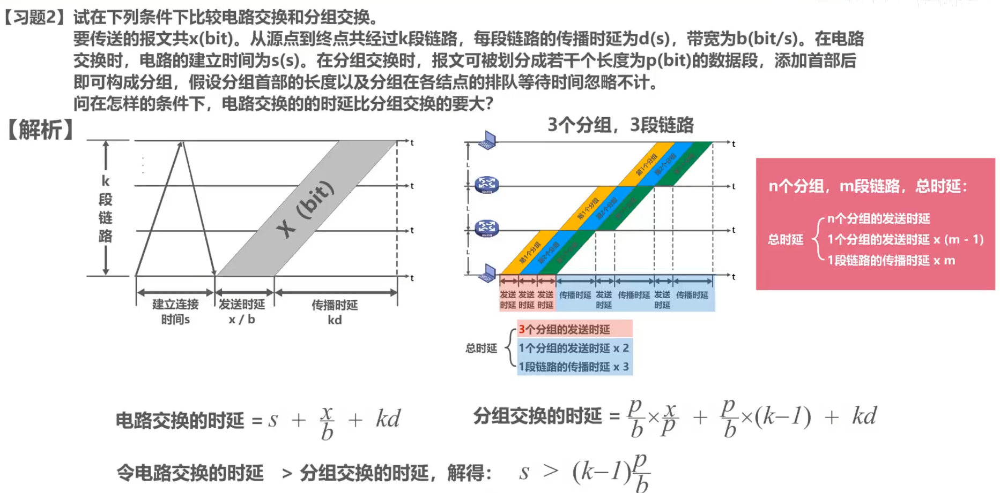

由上图可以得出：

* 电路交换首先需要建立连接，建立之后有唯一的一条通路，所以不需要路由器进行转发，既没有了转发时延
* 电路交换的总时延 = 建立连接 + 发送时延 + 传播时延（忽略了处理的时延情况下）

### 报文交换

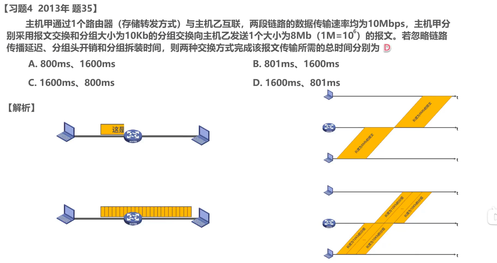

由上图可以得出：

* 分组交换时，路由器可以在接收到一个分组的同时转发之前所接收到的分组，所以实际转发时延只有$1（路由器数）\times 分组发送时延$

* 报文交换时，需要接收到整个报文时进行存储转发，所以转发时延会远大于分组交换时的转发时延

**不考虑其他条件的情况下**，如果多级路由器需要进行转发，分组的大小越小，即意味着转发时延越小

