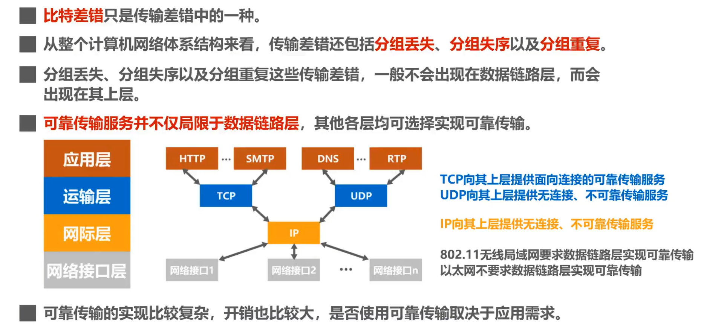
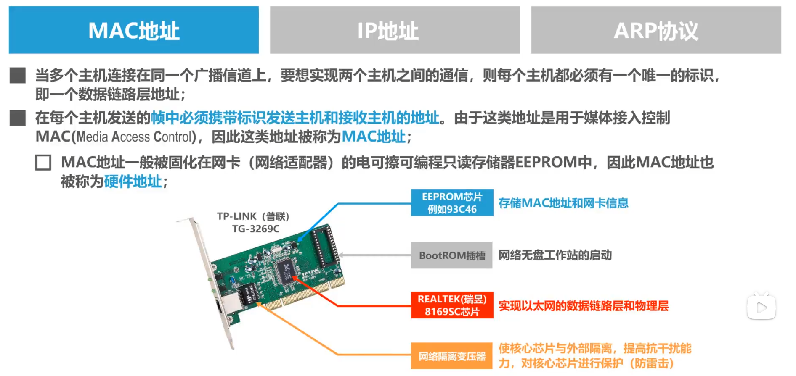
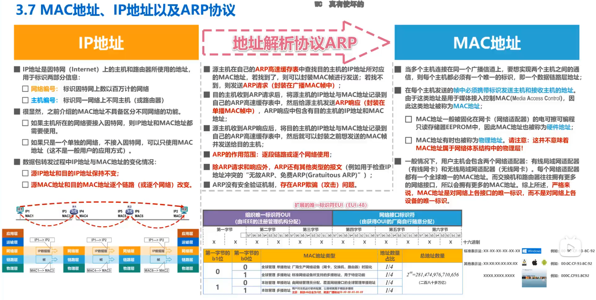

# 数据链路层

## 一、数据链路层在做什么？

忽略了物理层中比特率的传输问题，将数据看做**帧**，解决帧如何在链路中传输的问题。

链路：不同节点之间的连接，可以是计算机之间，也可以是路由器和计算机、路由器和路由器之间

### 三个重要问题

* 封装成帧：添加帧头、帧尾
* 差错检测：帧尾FCS为通过**检错算法**得出的检错码
* 可靠传输：保证收到发送方发送的数据

#### 封装成帧

帧头帧尾的作用之一就是帧的定界（PPP帧，帧头和帧尾有标志位来标志帧的开始和结束）

以太网v2帧通过在物理层添加前导码来进行帧的定界

##### 如何区分帧的标志位与帧中的数据？

高级数据链路控制协议（HDLC）每隔5个1插入一个0，保证了帧头和帧尾的唯一性。

为了提高帧的传输效率，应提高帧的数据长度，同时规定了最大数据传输单元（MTU）。

#### 差错检测

比特在传输过程中出现了错误（**比特错误）**。**使用差错检测码**来检测数据在传输过程中是否产生了比特差错。

1. 奇偶校验：只能检测数据奇性或者偶性不变的情况，误码率较高
2. CRC循环冗余检测：通过生成多项式得出检错码（取余数），误码率较低，适合于硬件实现

由于检错码只能检错，不能定位具体错误的位置，所以不能进行纠错。

##### 差错类型

* 比特差错（数据链路层）

* 分组丢失
* 分组失序
* 分组重复

#### 可靠传输

当差错检测到了误码，如何进行**纠正/丢弃？（可靠传输/不可靠传输）**

一般情况下：

* 有线链路误码率较低，只需要不可靠传输

* 无线链路误码率较高，需要数据链路层提供可靠传输服务

##### 可靠传输的实现机制

###### 1. 停止等待协议（Stop and Wait） 

发送方发送完数据之后进行等待，接收端回送一个确认报文之后，发送端再进行下一次的发送，如果一段时间没有接收到确认报文，会进行超时重传（**ARQ，自动请求重传**）

**确认与否认**：在接收端进行差错检测，并返回响应的`ACK`或者`NAK`回送表示是否收到正确信息

缺点：只能处理误码问题，无法处理发送报文丢失问题

**超时重传**：如果接收方没有收到报文，则让发送方进行重传

缺点：只能处理发送报文丢失问题，无法处理回送的`ACK`报文丢失

**确认丢失**：如下图所示，当确认丢失的时候需要进行重传（此时发送端不知道`DATA0`是否丢失或者是回送的确认报文`ACK`丢失，需要进行重传），为防止接收方重复接收，需要对重传的`DATA0`进行编号。

缺点：如果有发送报文超时但是接收端都收到了，就会回送2个同数`DATA0`的`ACK`报文，为了防止重复接收，也需要对`ACK`报文进行编号

**确认迟到**：确认报文迟到时，会触发超时重传，同时接收端会回送两个确认报文，此时为了避免接收到重复的确认报文，需要对确认报文进行编号

**总结**：

* 检测到误码时，可以发送`NAK`信号（误码率较高），或者直接等待超时重传（误码率较低）
* 为了让接收方识别数据分组是否重复，需要给数据分组编号
* 为了让发送方识别`ACK`分组是否重复，需要给`ACK`分组编号（数据链路层一般不会出现**确认迟到**的情况，数据链路层实现**停止-等待（Stop and Wait）**协议时可以不用给`ACK`分组进行编号
* 重传时间应该选择为<u>略大于”从发送方到接收方的平均往返时间“</u>

* 由上图可见，如果`RTT`往返时延远大于`T_D`数据帧发送时延时，**信道利用率过低**，于是就有了后退N帧协议$GBN$和选择重传协议$SR$ 

----------

###### 2.回退N帧协议(Go Back N)

回送的确认号为最后一个收到的数据的序号，减少了确认报文的发送数量

**总结：**

* 回退N帧在流水线传输（连续发送N帧，不需要等待确认报文）的基础上，利用发送窗口来限制发送方连续发送数据分组的数量，是一种连续的**ARQ**协议
* 在协议工作过程中发送窗口和接收窗口不断向前滑动，又称为**滑动窗口协议**
* 由于回退N帧协议的特性，当通信线路质量不好，需要大量的回退N帧时，其信道利用率不比停止等待协议高
* 由于回退N帧的接收窗口$W_R$只能等于1，因此接收方只能按照顺序接收正确到达的数据分组，一个数据的误码会导致其余后续多个数据分组不能被正确接收，因此引出了**选择重传协议(SR)**

------------

###### 3.选择重传协议（Selective Request）

接收窗口应该大于1，可以接收失序到达同时无误码且序号在接收窗口的数据分组，等待所缺分组收齐后再一并送交上层。

为了进行**选择重传**，需要对每个收到的进行确认，而不是GBN的累积确认

如果按序接收到了一个报文，就让窗口向前进行滑动

如上图所示，2号没有接收到，则窗口不能向前滑动，同时2号触发了超时重传，接收方等待2号收齐之后再进行向前滑动。发送方3，4，5则收到了确认报文，不进行重传。

## 二、点对点协议PPP

----------

## 三、媒体接入控制

* 有线：PPPoE、交换式局域网

* 无线：由于其广播天性，仍然使用共享式局域网

-------------

## 四、MAC地址、IP地址和ARP协议

MAC（Media Access Control）地址用于媒体接入控制，用于局域网内不同主机的标识。

MAC地址个数取决于网卡的个数。

### IEEE 802局域网的MAC地址格式

 **路由器和交换机等设备每个端口都有一个MAC单播地址，而个人设备根据网卡决定有几个单播地址**

如果第一个字节不能被2整除，则为多播组MAC地址，如`01`, `03`, `07`

多播帧的处理方式如下：

在网络传输的过程中，报文在不同子网中IP地址是不变的`192.168.3.2 --> 192.168.4.2`，而MAC地址随着子网的改变而改变。

### 地址解析ARP协议（Address Resolving Protocol）	

通过广播的形式进行。

* 查ARP表
* 如果没有对应的IP地址和MAC地址，发送ARP查询报文，封装成帧（广播）
* 对应的设备回送ARP响应报文，封装成帧（单播）

## 五、集线器和交换机的区别

简而言之，集线器是共享型网络总线，需要接收方来根据目的MAC地址来判断是否接收当前帧；同时，如果多个主机同时通信时，需要通过CSDM-CA协议来解决碰撞问题，所以**逐渐被淘汰**。

交换机发送为单播模式，且不会发生碰撞。

----------

## 六、以太网交换机自学习和交换帧的流程

------

## 七、环形拓扑网络的弊端和生成树算法协议STP

----------

## 八、虚拟局域网VLAN

**如果使用多个交换机进行互相连接，则得到一个巨大的广播域，具有<u>很多弊端</u>**

#### 如何分割广播域？

* 路由器（路由器默认不对广播数据包进行转发，在交换机之间连接一个路由器，可以限制其广播范围
* 虚拟局域网

#### 虚拟局域网是什么？

同一个**VLAN**之间可以进行广播通信，不同的**VLAN**之间不能进行广播通信。

#### VLAN的实现机制

