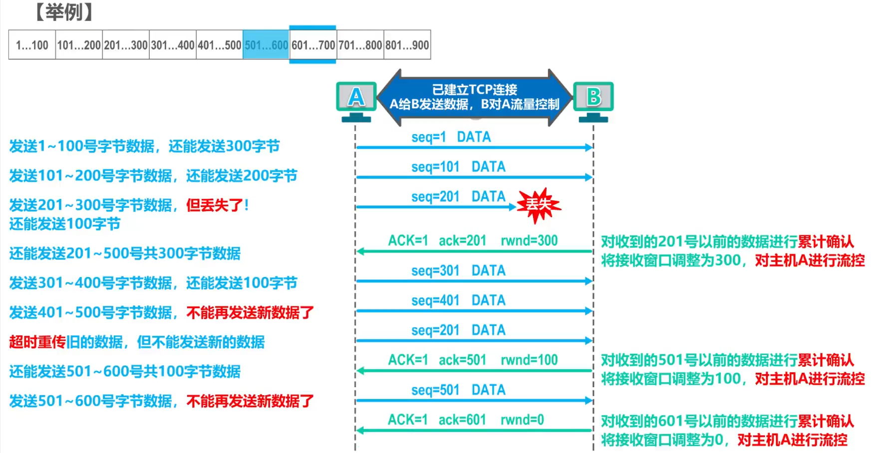
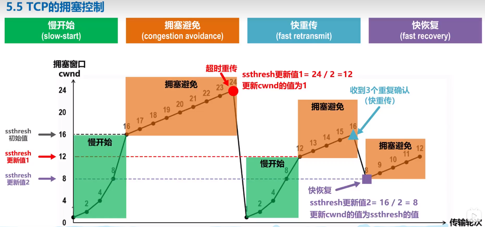
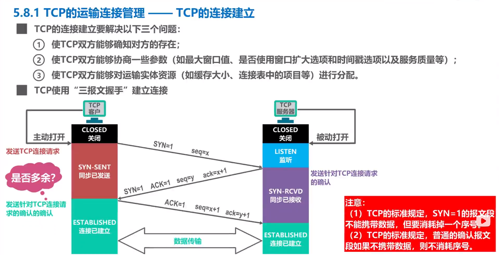

# 传输层

## 一、概述

 

## 二、端口号、复用和分用

-----------------

## 三、TCP和UDP对比

 

## 四、TCP

### 1. 流量控制

如果发送方的数据发送过快，**接收方**可能来不及接收，就会造成数据的丢失

流量控制（flow control）即**让发送方的发送速率不要太快，让接收方来得及接收**

#### 举例说明

* 即使接收窗口为0，接收方也必须接收**零窗口报文段、确认报文段、携带有紧急数据的报文段**

* 零窗口探测报文段也有重传计时器

----------

### 2. 拥塞控制

如果对某一资源进行**过度请求**，需求超过供应，则会导致网络性能下降。**即拥塞（congestion）**

**发送方**来控制拥塞窗口（`cwnd`）的大小，并动态变化。

#### 慢开始（slow-start）

* 慢开始在开始阶段`cwnd`呈指数型增长，当大于慢开始门限`ssthresh`时，转为使用拥塞避免算法。

#### 拥塞避免（congestion avoidance）

* 每次接收成功则`cwnd`进行加1
* 如果超时重传，则
  * 将`ssthresh`更新为当前`cwnd`的一半
  * 将`cwnd`置为1，并重新进行慢开始算法

---------

**如果某个包发生了丢失，触发了超时重传，<u>并不一定是发生了拥塞</u>，则为了提高TCP的性能，又提出了快重传和快恢复算法**

#### 快重传（fast retransmit）

尽快进行重传而不是等待超时重传计时器来重传，接收方如果没有收到正确顺序的报文，则立马发送确认重传信号。

#### 快恢复（fast recovery）

发送方一旦收到了3个重复确认，则判断丢失了某个报文段。此时，**不启动慢开始**，而是执行**快恢复**算法。即：

* 将慢开始门限值调整为当前`cwnd`的一半
* 将`cwnd`调整为当前的**一半**

--------------------

### 3.  超时重传时间的选择

超时重传时间（RTO）应该略大于往返时间（RTT）。

如果RTO设置过小，会增加不必要的重传，增加网络效率。如果RTO设置过大，会使网络空闲时间增大，降低了传输效率。

**复杂网络环境下，RTT是不确定的**，需要进行统计估算，计算加权平均往返时间（$RTT_s$）

 

**往返时间的RTT测量比较复杂**

故超时重传时，将新的RTO设置为旧的RTO的2倍。

----------------

### 4. TCP可靠传输的实现

**TCP基于以字节为单位的滑动窗口来实现可靠传输**

假定发送窗口`swnd`仅仅取决于接收窗口`rwnd`的控制（实际上，由接收窗口和拥塞窗口共同控制）

* 发送窗口的后沿取决于是否收到了新的确认，如果收到了新的确认，则后沿进行前移
* 发送窗口的前沿取决于是否收到了新的确认和接收方通知的`rwnd`大小控制

### 5. TCP运输连接的建立

要解决以下三个问题：

* 使TCP双方能够确知对方的存在
* 使TCP双方能够协商一些参数，如最大窗口值，是否使用窗口扩大选项和服务质量等
* 使TCP双方能够对运输实体资源（缓存大小、连接表中的条目）进行分配

#### 三次握手的过程

1. TCP连接请求报文段`SYN = 1`，不能携带数据，消耗序号`seq`

2. TCP连接请求确认报文段`SYN = 1, ACK = 1`，不能携带数据，消耗序号`seq`

3. 普通确认报文段`ACK = 1`，可以携带数据，如果不携带数据则不消耗序号`seq`

* `seq = x`为客户端的初始序号，`seq = y`为服务器端的初始序号
* 每次回送确认时，`ack = seq + 1`为收到的序列号+1

#### 为什么是三次握手？

如果是两次握手，则**服务器端**收到了TCP连接请求后，会回送一个TCP连接确认，并直接进入`ESTABLISHED`状态；但是回送的TCP连接确认**有可能丢失**，导致**客户端**无法收到且无法进入`ESTABLISHED`状态。

如果**服务器端**接收到了一个先前的滞留的TCP请求连接报文，且**客户端**处于关闭状态，则**服务器端**会单方面的建立连接为`ESTABLISHED`状态，浪费了网络资源。

#### 如果在三次握手过程中丢包？

1. **客户端发送的SYN包丢失**：在三次握手的第一步，客户端发送一个SYN包（SYN=1），用于请求建立连接。如果这个SYN包在传输过程中丢失，服务器无法收到客户端的请求。此时，服务器将无法识别客户端的存在，不会发送确认消息。
2. **服务器发送的SYN+ACK包丢失**：在三次握手的第二步，服务器收到客户端的SYN包后，向客户端发送一个SYN+ACK包（SYN=1，ACK=1），表示确认客户端的请求，并发起自己的请求。如果这个SYN+ACK包在传输过程中丢失，客户端无法收到服务器的确认消息。此时，客户端不会发送最后一步的确认消息。
3. **客户端发送的ACK包丢失**：在三次握手的第三步，客户端收到服务器的SYN+ACK包后，向服务器发送一个ACK包（ACK=1），表示确认服务器的请求。如果这个ACK包在传输过程中丢失，服务器无法收到客户端的确认消息。此时，服务器将一直等待客户端的确认，无法建立完全的连接。

当服务器在SYN-RCVD状态下超时时，会发送一个**RST包（复位包）**给客户端，该RST包通知客户端连接建立失败，并将服务器的状态恢复为监听状态。客户端收到RST包后会知道连接建立失败，并关闭连接。

需要注意的是，超时时间的设定和行为可能因TCP的实现和配置而有所不同。通常情况下，服务器会使用一定的超时时间来等待客户端的ACK包，如果超时后仍然没有收到ACK包，则认为连接建立失败，并将状态恢复为监听状态。

### 6. TCP运输连接的释放

#### 四次挥手的过程

1. `FIN = 1, ACK = 1`表示TCP连接释放请求报文，占用一个序号，`seq = u`表示客户端发送的最后一个字节序号+1，`ack = v`表示客户端最后一个收到的字节序号+1。之后客户端进入`FIN-WAIT-1`状态并等待服务器的响应。
2. `ACK = 1`表示一个普通的确认，断开连接，其中`seq = v`表示服务器已发送的序号+1，与客户端`ack = v`对应。`ack = u+1`表示对TCP连接释放请求报文的响应，因为请求连接断开的第1次握手报文占据了一个序号，所以为`u+1`。之后服务器端进入`CLOSE-WAIT`状态，并传输剩余的数据。

剩余数据传输完成后：

3. `FIN = 1, ACK = 1`为服务器发送的TCP连接释放报文，其中`seq = w`表示已发送的序号+1，同时`ack = u+1`仍和之前值对应。之后服务器进入`LAST-ACK`状态。
4. `ACK = 1`表示客户端响应连接断开报文的普通确认报文，因为请求连接断开的第3次握手报文占据了一个序号，所以为`ack = w+1`。发送完后<u>客户端接收到报文后进入`TIME-WAIT`状态</u>。

#### 为什么要有TIME-WAIT状态？

如果第4次挥手后，客户端直接关闭进入`CLOSED`状态，且第4次挥手的确认报文丢失，则服务器端会一直处于`LAST-ACK`状态，超时重发第三次挥手的TCP连接释放报文，客户端无法响应，导致服务器端无法关闭。

#### 连接时如何识别故障？——保活计时器

  

-----------------------

### 7. TCP报文的首部格式

* 序号`seq`：当前发送的数据的第一个字节号，溢出则回到0

* 确认号`ack`：接收成功的数据最后一个字节号+1，表示对之前收到数据的确认，同时也是期望对方下一个发送的序列号，溢出则回到0

* 数据偏移：以**4字节**为单位，需要保证TCP头部的字节数是4的倍数。用来指出TCP报文段的数据载荷部分离起始处TCP报文段的距离有多远，即TCP报文首部长度。20~60字节，$(0101)_2 - (1111)_2$

* 保留：6bit，保留使用，置为0

* 窗口：发送本报文端的发送方的接收窗口大小，用于流量控制。接收方的发送窗口在接收窗口和拥塞窗口中取小者。

* 标志位

  * URG，紧急指针标志位，1代表紧急指针（紧急数据的长度）可用，紧急数据插队并立即进行发送
  * ACK，取值为1时，确认号`ack`字段才有用，连接建立后，所有ACK都应该置为1
  * PSH，立即发送标志位，置为1时，TCP应该立即把数据交付给上层而不是等待缓冲区满
  * RST，复位标志位，置为1时，重置错误的连接，或者拒绝错误的连接

  * SYN，在TCP连接时用于同步序号
  * FIN，用于断开TCP连接

* 校验和：用于校验数据是否正确

* 紧急指针：指出紧急数据的长度

* 选项：最大报文段长度MSS选项、窗口扩大选项、时间戳选项、选择确认选项

* 填充：保证TCP头部能够被4字节整除

----------------

#### TCP的有限状态机

---------

#### TCP连接的实现

