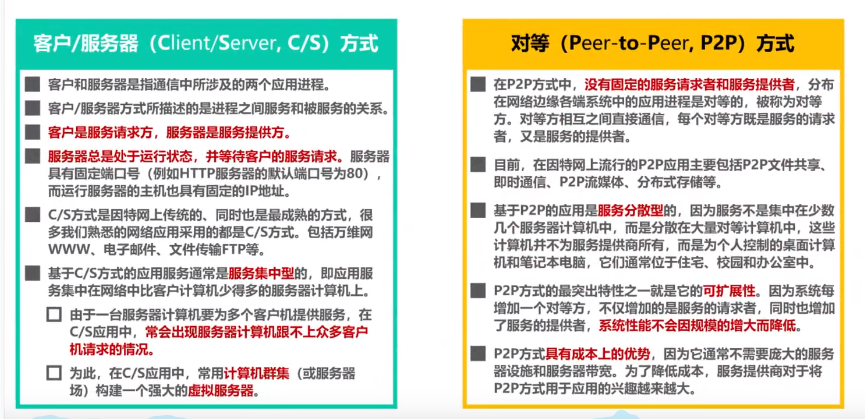
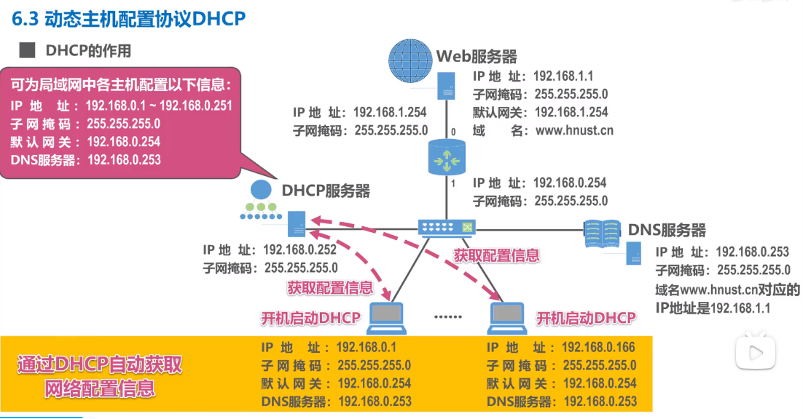
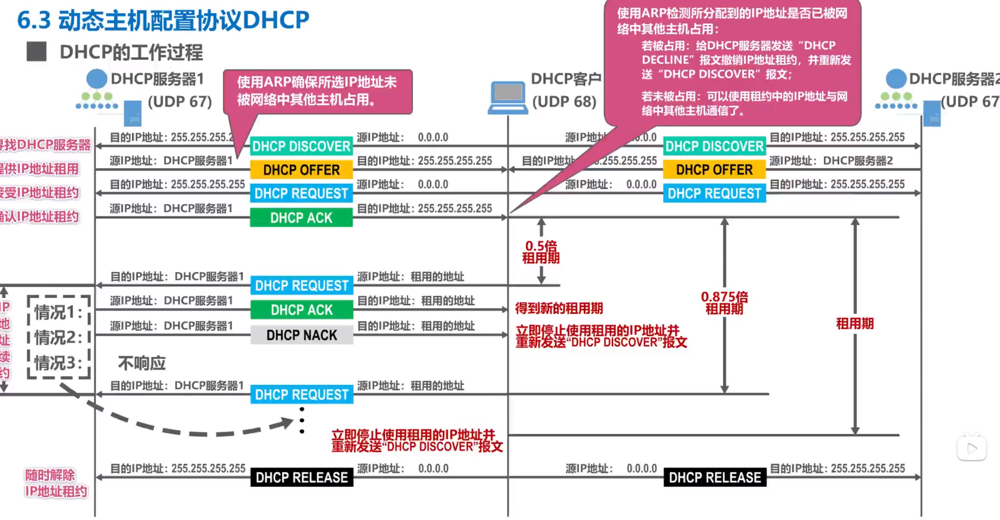
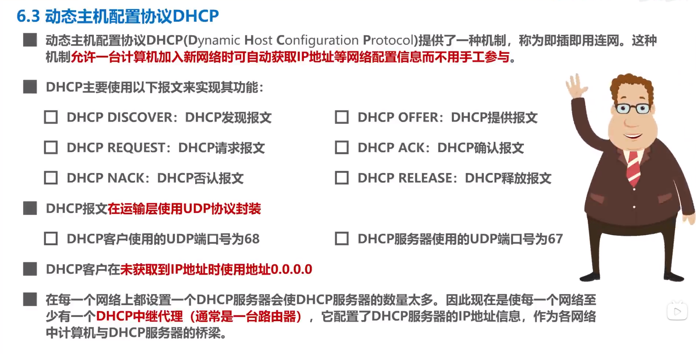
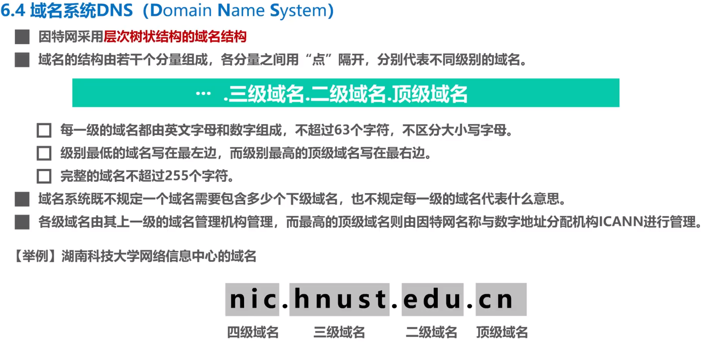
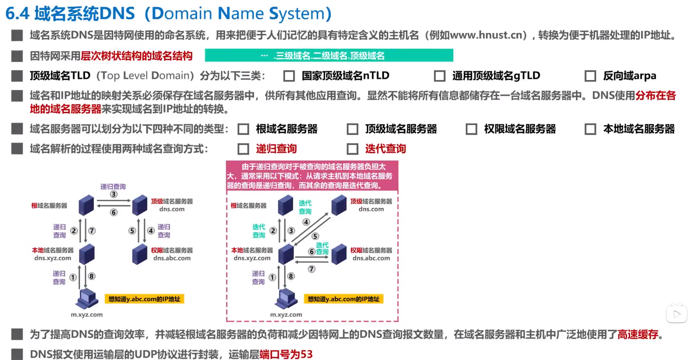
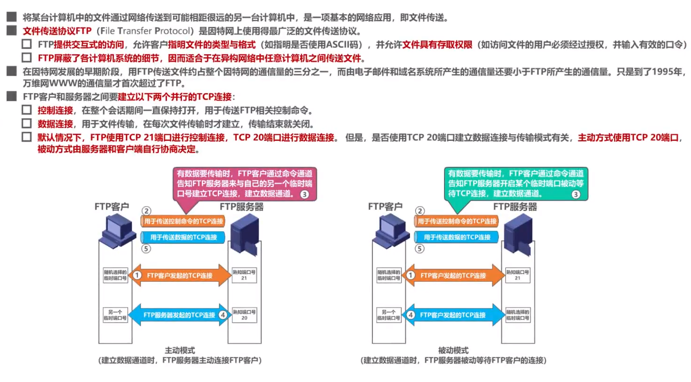
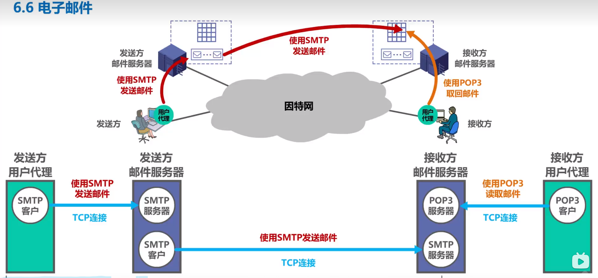
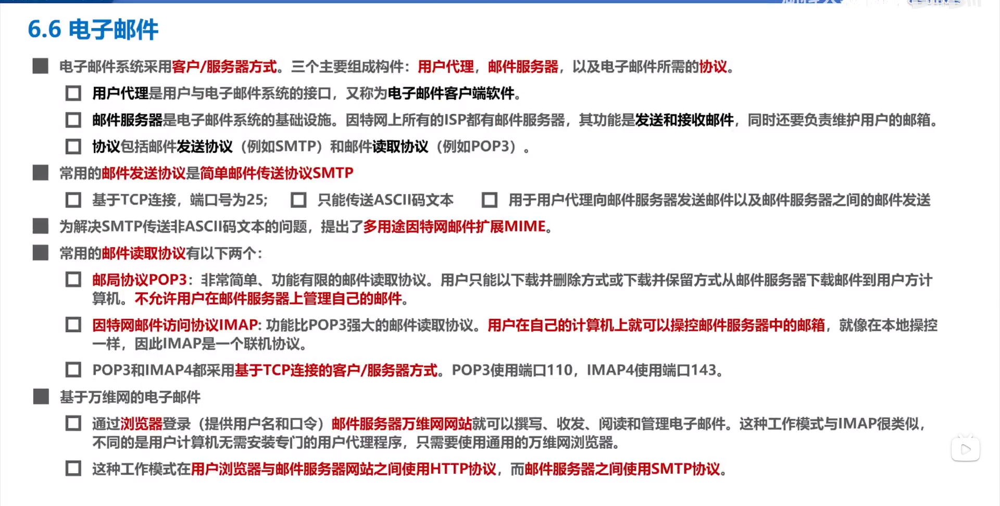
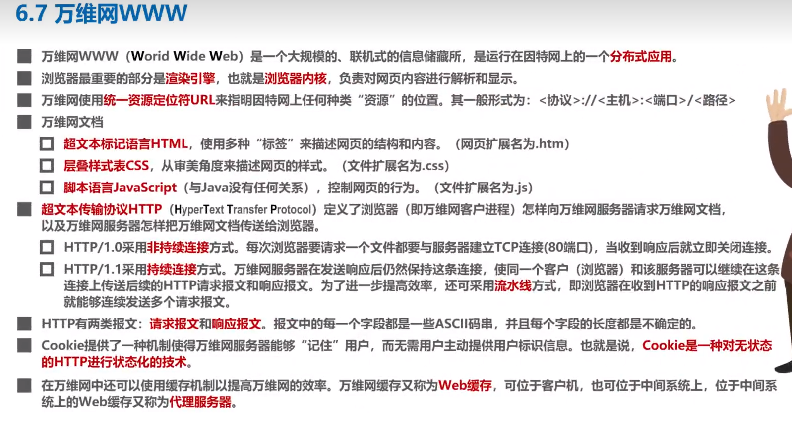

# 应用层

## 一、客户/服务器方式（C/S方式）和对等方式（P2P）

* client / server

* peer 2 peer

---------

## 二、动态主机配置协议DHCP

**DHCP通信都是通过广播地址，因为此时还没有配置好IP地址。通过事务ID来标识不同的主机。**

------------------

## 三、域名系统（DNS）

-------------------

## 四、文件传送协议（FTP，File Transfer Protocol）

## 五、电子邮件

* 用户代理（电子邮件客户端）
* 邮件服务器、
* 协议
  * 发送协议：SMTP
  * 读取协议：POP3、IMAP

-----------

## 六、万维网（WWW）

* **万维网（World Wide Web）**并非某种特殊的计算机网络，而是一个大规模的、联机式的信息储藏所，是**运行在因特网上的一个分布式应用**
* 万维网利用网页之间的超链接将不同网站的网页链接成一张逻辑上的信息网

