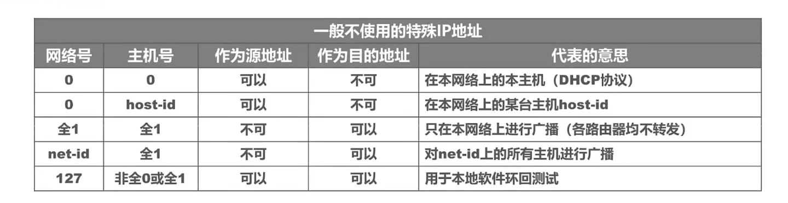
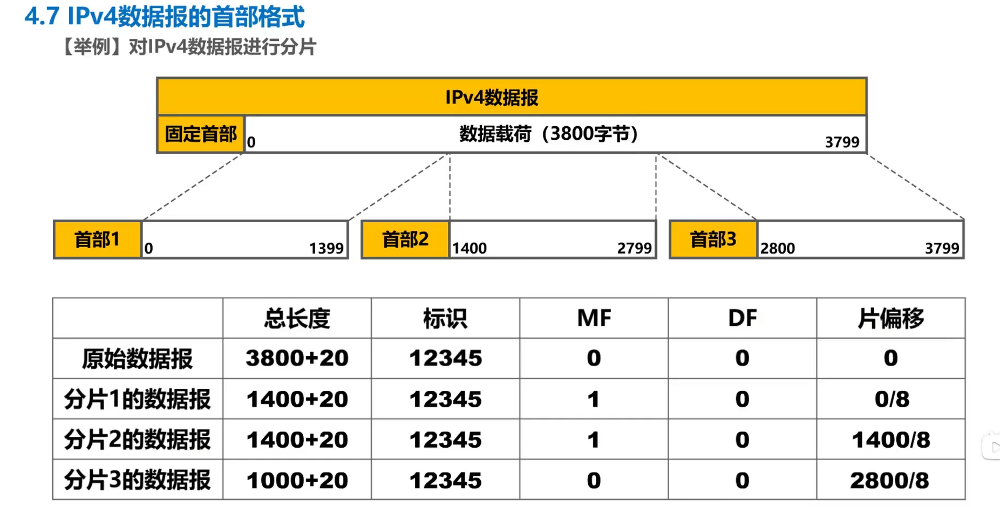
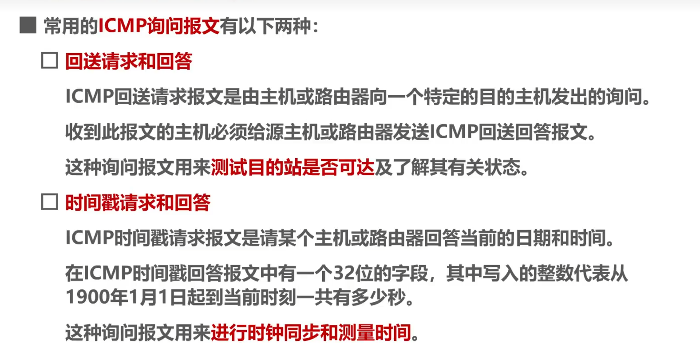

# 第四章、网络层

> 2023年5月21日
>
> Rossetta

## 一、网络层概述

---------

## 二、IPv4地址

* `192.168.6.0`为网络地址，不能分配给路由器接口或各主机
* `192.168.6.255`为广播地址，不能分配给路由器接口或各主机

A类地址范围为<u>1</u>.0.0.0 ~ <u>126</u>.0.0.0，其中网络号`01111111（127）`作为本地环回测试地址，不作指派，环回地址范围为<u>127</u>.0.0.1 ~ <u>127</u>.255.255.254

-------------

#### 路由聚合 - 构造超网，减小路由表的占用

* 如果子网中主机号占用了n位，如192.168.6.0/24中，n = 8，其可用的主机IP地址为192.168.6.1 ~ 192.168.6.254，共$2^n - 2 = 2^8 - 2 = 254$，需要一个路由器接口位置，占用了一个主机IP地址，实际上最多能分配给253台主机。

* 一台路由器可以连接多个子网，同时在每个子网中占据一个IP地址作为路由接口地址。

* 如果两个路由器相连，则需要在子网中占据2个IP地址，以此类推

* 最长前缀匹配：如果进行路由查表转发时，有多个匹配项，选取最长前缀的子网进行转发，如`192.168.6.1/22  >  192.168.6.0/20`

---------

#### IP地址的实际转发操作

**根据子网掩码来判断源地址和目的地址是否处于同一个子网，如是，则说明为直接交付，否则为间接交付**

## 三、静态IP配置和可能的路由环路问题

为了**防止网络路由环路**的措施：

* TTL生存时间
* 黑洞路由

-------

## 四、路由选择协议

* 静态路由配置

* 动态路由配置

**因特网中如何选择合适的下一跳路由器？**

#### 内部网关协议（内部路由协议）IGP

##### 路由信息协议RIP

##### 开放最短路径优先OSPF

##### 边界网关协议BGP

值得一提的是，各路由选择协议之间通过不同的通信协议进行数据交换

- RIP：UDP
- OSPF：IP
- BGP：TCP

-----------

## 五、IP数据报的首部格式

* 版本：4代表IPv4，6代表IPv6
* 区分服务：利用字段的不同数值来提供不同等级的服务质量，一般情况下不使用
* 总长度：表示IP数据包的总长度，首部长度+载荷长度
* 标识（16bit）：同个数据包的各分片数据报应该具有相同的标识（大包号）
* 标志（3bit）：每个比特位提供了不同的分片信息
* 片偏移（13bit）：指出分片数据报的数据载荷部分偏移在原数据的位置多少个单位，**一个单位为8字节**

**标志、标识、片偏移用于在数据包超过了MTU（以太网1500字节）时进行IP层的分片。**

#### IP分片实例

* 生存时间（8bit，TTL）：以“跳数”为单位，不为0则转发，否则丢弃，可以防止形成路由环路
* 协议（8bit）：指明IPv4数据报是何种协议数据单元 

* 首部检验和（16bit）：用来检测首部是否在传输过程中出现差错。比CRC检验码简单，成为因特网检验和。每经过一个路由器，其首部的字段如生存时间、标志、片偏移都可能发生变化，所以IPv4需要重新计算首部检验和；但IPv6鉴于IP层本身不提供可靠传输，不再计算首部校验和，从而更快的转发数据报

分片策略：由于分片偏移量需要能够被8字节整除，所以将第一个分片设置为776，偏移为0；第二个分片设置为1480 - 776 = 704，偏移为776 / 8 = 97

-----------

解：（1）以太网帧中首部占14字节（目的MAC地址6B、源MAC地址6B、类型2B），同时IP头部的目的IP地址之前占16字节，故取30字节的偏移即为目的IP地址。默认网关MAC地址即为目的MAC地址，即开始的6个字节。

（2）如图所示，需要修改的有生存时间、首部检验和；如果分片，还会修改总长度、标志、片偏移

-----------

## 六、网际控制报文协议ICMP

### ICMP差错报文

IP报文由于某种原因没有送到目的地，回送一个ICMP控制信息（**差错报告**）

* 终点不可达 - 找不到目标主机
* 源点抑制 - 拥塞丢弃报文
* 时间超过 - TTL变为0丢弃
* 参数问题 - 传输中出现误码
* 改变路由（重定向）- 发现了更优的路由路径

#### 不发送ICMP差错报文的情况

----------

### ICMP询问报文

### 运用ICMP的实例

1. PING 分组网间探测
2. 跟踪路由traceroute，命令`tracetr`

跟踪路由的实现原理：不同的递增TTL，发送一个封装了ICMP回送请求的IP报文，在到达某个路由器时，其TTL会减为0，此时会向源主机回送一个ICMP时间超过差错报文，从而得知了各路由器的信息。

--------------

## 七、虚拟专用网VPN和网络地址转换NAT

### VPN虚拟专用网

#### 私有地址和公有地址

IPv4地址不够用，在局域网中，一般使用的是**私有地址**，**通过一个具有公有局域网地址的路由器与因特网进行通信**

**因特网中的路由器，对于目的地址为私有地址的数据报，不进行转发。**

### 网络地址转换

为了缓解IPv4地址耗尽，能使大量内部专用地址的专用网络用户共享少量的外部全球地址来访问因特网上的主机和资源。

