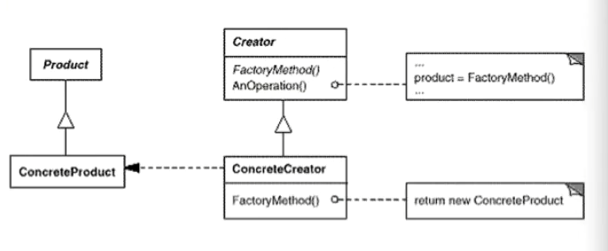

# 设计模式总结

## 设计模式的八个原则

1. 依赖倒置原则：高层次的代码（稳定）不应该依赖低层次的代码（变化）、抽象的代码不应该依赖具体的代码。
2. 开放封闭原则：类模块应该开放扩展的，而其原先的代码尽量封闭不可改变。
3. 单一职责原则：一个类应该仅有一个变化的原因，该变化隐含了它的职责，职责太多时会导致扩展时对代码东拉西扯，造成混乱。
4. 替换原则：子类必须能够替换它的基类（IS-A），继承可以表达类型抽象。
5. 接口隔离原则：接口应该小而完备，不该强迫用户使用多余的方法。
6. 优先使用组合而不是继承：继承通常会让子类和父类的耦合度增加、组合的方式只要求组件具备良好定义的接口。
7. 封装变化点：
8. 针对接口编程，而不是针对实现编程。

## 23种设计模式

#### 组件协作模式：实现框架与应用之间的松耦合

* **Template method**：将早绑定改为**晚绑定**，一定的算法流程中，将某些步骤用虚函数，等待调用者后面再实现（`Library、Application`）

* **Strategy**：将`switch case / if else`通过继承和虚函数实现，即**扩展要好于改变源码**（扩展，子类化）（`TaxStrategy、CNStrategy`），应对算法层面对未来需求的变化

* **Observer / Event**：定义一种**一对多的依赖关系**，当被观察者（一）改变时，所有观察者（多）得到通知。被观察者需要建立一种机制来**通知**观察者，将实现细节取代为一种**通知机制**（依赖倒置原则）。一般观察者需要继承通知机制，并重写通知时调用的方法，并传入被观察者中，当被观察者改变状态时，逐个通过通知机制的基类来通知观察者。从而实现解耦合（`ProgressBar -> IProgress, ConsoleNotifier -> IProgress, (观察者 继承于 通知机制)`)

#### 单一职责模式：防止过度继承带来的类膨胀

* **Decorator**：某些时刻，过多使用继承会导致**由于继承所带来的静态特质（你必须实现继承的接口）**，使得这种扩展的方式丧失灵活性，且造成子类膨胀。通过**组合而非继承**的模式，`Decorator`（装饰器）实现了运行时**动态扩展对象功能**的能力（意为扩展）。在实现方式上，`Decorator`既继承了`Component`（抽象基类）的所有接口，同时内部又有一个`Component`指针用于动态的调用方法。基类及其子类为主体类（`Stream、FileStream、NetworkStream`）；`DecoratorStream`则表示对主体类的扩展基类，以组合的方式实现；具体的扩展类则需要继承自`DecoratorStream`（`CryptoStream、BufferStream`），因此`DecoratorStream`需要继承`Stream`符合接口规范。

* **Bridge**：将抽象部分（业务功能）与实现部分（平台实现pimpl）分离，使它们可以独立的变化。如果有多个维度的变化，将每个维度实现定义成一个抽象基类，并在主体类中包含他们的pimpl指针。Bridge是比多继承更好的解决方案，多继承违反了单一职责原则且复用性较差。

#### 对象创建模式：避免new创建对象带来的紧耦合（依赖具体类）

* **Factory Method**：多态new，通过继承工厂基类来实现不同的对象工厂，从而将对象的创建变为运行时依赖，实际上为多态的new构造对象。Factory Method使得一个类的具体实例化延迟，构建对象这一行为是**稳定的**，对象的类型为**变化的**。

* **Abstract Factory**：在工厂方法的基础上，对一<u>系列</u>同组对象的创建，放在同一个工厂内（Abstract Factory/Family Factory），以达到保证一系列对象之间的关联性，防止创建过多的工厂。但是难以应对新对象的变动（即工厂的系列对象增加了）

* **Prototype**（原型模式）：通过克隆自己构造对象（拷贝构造函数）。如果创建对象需要很复杂的中间状态，可以考虑用原型方法来保持对象的状态，直接clone，而工厂方法则是不需要考虑复杂状态，通过简单的构造能够将对象创建出来。

* **Builder：**分步骤构建一个复杂的对象，将一个同流程**（稳定的）**构建的不同部分**（变化的）**进行虚函数实现，继承者可以具体实现构建某一部分的虚函数。即类似于Template Method的构造对象版本。一般来说，构造函数不能调用虚函数（静态调用），所以需要额外在`Init`函数中进行初始化。一般情况下，将`ObjectBuilder`和`Object`相分离，`ObjectBuilder`一般提供一个`GetResult`方法来返回构建好的`Object`指针。

#### 对象性能模式：为了保证对象的性能，防止面向对象所可能带来的性能问题

* Singleton：实例构造器声明为protected或者private，保证单个实例，由单一函数进行实例化全局一份（局部静态变量写法保证了线程安全）

* Flyweight（享元模式）：运用**共享**的方式来有效的支持大量细粒度的对象（如string），类似于各种对象池的思想，即内存池、线程池；如果存在则返回，如果不存在才新建；一般来说创建出来的对象都是只读的。

#### 接口隔离模式：防止接口之间的依赖所带来的问题，添加一层间接（稳定）隔离互相紧密的接口——间接的设计思想：操作系统、虚拟机、中间件

* Facade（门面模式）：为子系统中的一组接口提供一种稳定一致的界面，提供了一种高层接口，使得子系统更容易进行复用（**系统内与系统内隔离**）。

* Proxy（代理模式）：为其他对象提供一种代理以控制（隔离、使用接口）对这个对象的访问。如创建某些对象需要很大代价、或需要安全控制、或需要进程外的访问、或需要分布式系统处理等等，则加一个中间层接口。通过创建`Proxy`（保持透明），实际上`Proxy`中实现了对`RealSubject`的很多额外工作。

* Mediator（中介者）：多个对象相互交联，对象之间会维持一种复杂的引用关系，如果遇到需求更改，这种直接的引用关系会导致不断的变化。**使用中介对象来管理对象之间的关联关系**，避免紧耦合，从而更好的抵御变化。将对象之间的交互改为运行时依赖，达到可以独立的改变他们之间的交互的关系，可看作是依赖倒置原则在多个目标中的体现，即具体应该依赖于抽象。**（系统内部组件的隔离）**

* Adaptor（适配器）：现有的接口迁移到新的环境 中，满足“迁移的变化”；`Adapter`继承`Target`（新接口）表示遵循其定义的规范，同时内部包含一个`Adaptee`（旧接口）表示包含旧接口并进行转换过程。

#### 状态变化模式：

* Memento：
* State：

#### 数据结构：

* Composite：
* Iterator：
* Chain of Responsibility：

#### 行为变化：

* Command：
* Visitor：

#### 领域问题：

* Interpreter：

